<details>
<summary>Module Introduction & Starting Project</summary>

**Practice Project : Advanced Concepts**

*Working with Components, State, Styling, Refs, & Portals*

- Build a "Project Management" Web App
- Build, Style, Configure, & Re-Use *Components*
- Manage State
- Access DOM Elements & Browsers APIs with *Refs*
- Manage JSX Rendering Positions with *Portals*

Now it's time to add some configuration by **npm install** 

```javascript
user@aziz MINGW64 /d/course/udemy/react/Section9/01-starting-project
$ npm install
npm warn deprecated inflight@1.0.6: This module is not supported, and leaks memory. Do not use it. Check out lru-cache if you want a good and tested way to coalesce async requests by a key value, which is much more comprehensive and powerful.
npm warn deprecated @humanwhocodes/config-array@0.13.0: Use @eslint/config-array instead
npm warn deprecated rimraf@3.0.2: Rimraf versions prior to v4 are no longer supported
npm warn deprecated glob@7.2.3: Old versions of glob are not supported, and contain widely publicized security vulnerabilities, which have been fixed in the current version. Please update. Support for old versions may be purchased (at exorbitant rates) by contacting i@izs.me
npm warn deprecated @humanwhocodes/object-schema@2.0.3: Use @eslint/object-schema instead
npm warn deprecated eslint@8.57.1: This version is no longer supported. Please see https://eslint.org/version-support for other options.

added 327 packages, and audited 328 packages in 23s

124 packages are looking for funding
  run `npm fund` for details

2 moderate severity vulnerabilities

To address all issues (including breaking changes), run:
  npm audit fix --force

Run `npm audit` for details.
```

</details>

<details>
<summary>Adding a "Projects Sidebar" Component</summary>

In this section we would like to create folder called **components**. And create new file called *ProjectsSidebar.jsx* and the codes are :

```javascript
export default function ProjectsSidebar() {
    return (
        <aside>
            <h2>Your Project</h2>
            <div>
                <button>
                    + Add Project
                </button>
            </div>
            <ul>

            </ul>
        </aside>
    );
}

```

Also in *App.jsx* file we can modify the codes into :

```javascript
import ProjectsSidebar from "./components/ProjectsSidebar.jsx";

function App() {
  return (
    <main>
      <ProjectsSidebar />
    </main>
  );
}

export default App;

```

When we run and see on the browser, the style is still plan. 

And in the next lecture we are going to style it.

</details>

<details>
<summary>Styling the Sidebar & Button with Talwind CSS</summary>

In **App.jsx** and **ProjectsSidebar.jsx** file we add Talwind CSS

```javascript
import ProjectsSidebar from "./components/ProjectsSidebar.jsx";

function App() {
  return (
    <main className="h-screen my-8 ">
      <ProjectsSidebar />
    </main>
  );
}

export default App;

```

```javascript
export default function ProjectsSidebar() {
    return (
        <aside className="w-1/3 px-8 py-16 bg-stone-900 text-stone-50 md:w-72 rounded-r-xl">
            <h2 className="mb-8 font-bold uppercase md:text-xl text-stone-200">Your Project</h2>
            <div>
                <button className="px-4 py-2 text-xs md:text-base rounded-md bg-stone-700 text-stone-400 hover:bg-stone-600 hover:text-stone-100">
                    + Add Project
                </button>
            </div>
            <ul>

            </ul>
        </aside>
    );
}

```

So we run this **npm run dev**, we'll see the result is nicer than before

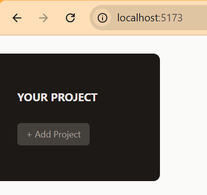

</details>

<details>
<summary>Adding the "New Project" Component & A Reusable "Input" Component</summary>

Here we add or create new file called NewProject.jsx on a **components** folder

Fore temporary code it seems to be like this :

```javascript
export default function NewProject() {
    return (
        <div>
            <menu>
                <li><button>Cancel</button></li>
                <li><button>Save</button></li>
            </menu>
            <div>
                <p>
                    <label>Title</label>
                    <input />
                </p>
                <p>
                    <label>Description</label>
                    <textarea />
                </p>
                <p>
                    <label>Due Date</label>
                    <input />
                </p>
            </div>
        </div>
    )
}
```

Next we create also a new file called **Input.jsx** still on a *components* folder

```javascript
export default function Input({ label, textarea, ...props }) {
    return (
        <p>
            <label>{label}</label>
            {textarea ? <textarea {...props} /> : <input {...props} />}
        </p>
    );
}
```

Then on **NewProject.jsx** file we can modify the code by adding the <Input sign there

```javascript
import Input from "./Input.jsx";

export default function NewProject() {
    return (
        <div>
            <menu>
                <li><button>Cancel</button></li>
                <li><button>Save</button></li>
            </menu>
            <div>
                <Input label="Title" />
                <Input label="Description" textarea />
                <Input label="Due Date" />
            </div>
        </div>
    );
}
```

Also in **App.jsx** file we can add <New Project and then also adding a talwin css again. As we see below :

```javascript
import NewProject from "./components/NewProject.jsx";
import ProjectsSidebar from "./components/ProjectsSidebar.jsx";

function App() {
  return (
    <main className="h-screen my-8 flex gap-8">
      <ProjectsSidebar />
      <NewProject />
    </main>
  );
}

export default App;

```

Then run the dev, we will see the result below :

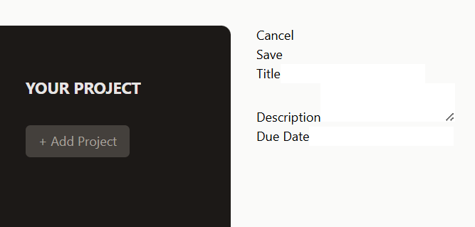

</details>

<details>
<summary>Styling Buttons & Inputs with Talwind CSS</summary>

To improve our styling, now we'll go back to file of *NewProject.jsx* and then adding a talwind css to the codes

```javascript
import Input from "./Input.jsx";

export default function NewProject() {
    return (
        <div className="w-[35rem] mt-16">
            <menu className="flex items-center justify-end gap-4 my-4">
                <li>
                    <button className="text-stone-800 hover:text-stone-950">Cancel</button>
                </li>
                <li>
                    <button className="px-6 py-2 rounded-md bg-stone-800 text-stone-50 hover:bg-stone-950">Save</button>
                </li>
            </menu>
            <div>
                <Input label="Title" />
                <Input label="Description" textarea />
                <Input label="Due Date" />
            </div>
        </div>
    );
}
```

And the result will be displayed like this :

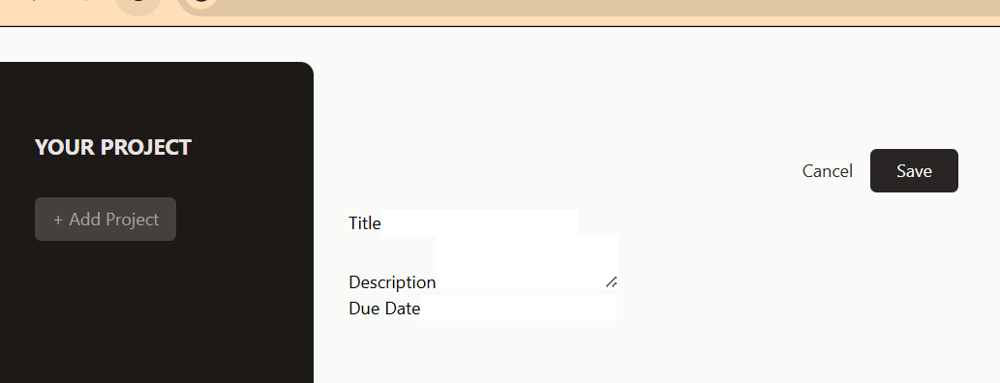

Next we also can add some talwin css code into *Input.jsx* file :

```javascript
export default function Input({ label, textarea, ...props }) {
    return (
        <p className="flex flex-col gap-1 my-4">
            <label className="text-sm font-bold uppercase">{label}</label>
            {textarea ? <textarea {...props} /> : <input {...props} />}
        </p>
    );
}
```

And if we save this and the displayed result will be like this :

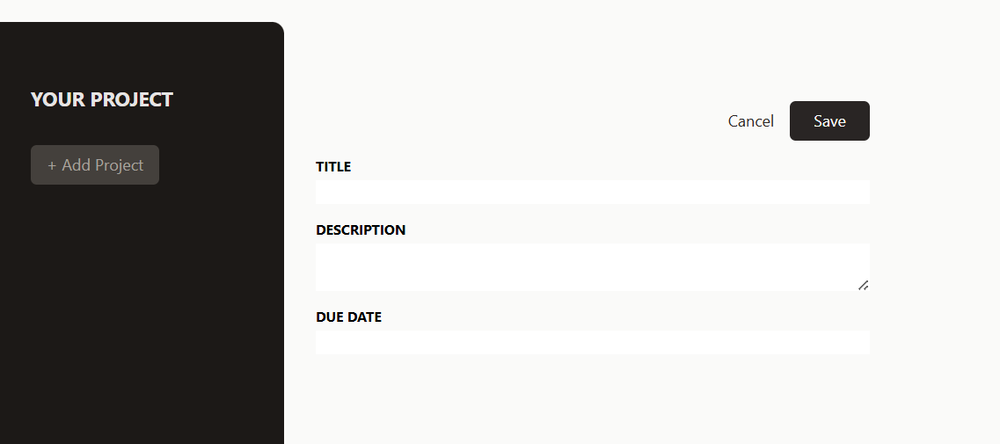

And actually we can make it cleaner for the codes on *Input.jsx* file to be :

```javascript
export default function Input({ label, textarea, ...props }) {
    const classes = "w-full p-1 border-b-2 rounded-sm border-stone-300 bg-stone-200 text-stone-600 focus:outline-none focus:border-stone-600";
    return (
        <p className="flex flex-col gap-1 my-4">
            <label className="text-sm font-bold uppercase">{label}</label>
            {textarea ? (
                <textarea className={classes} {...props} />
             ) : ( <input className={classes} {...props} />
            )}
        </p>
    );
}
```

And the result to be :

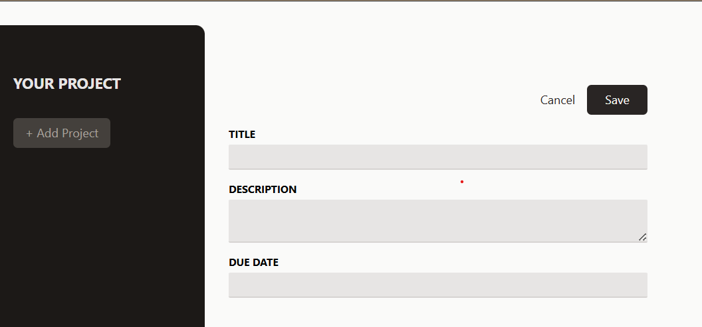

</details>

<details>
<summary>Splitting Components to Split JSX & Tailwind Styles (for higher Reusability)</summary>

Here we create new file called **NoProjectSelected.jsx** on *components* folder

```javascript
import noProjectImg from '../assets/no-projects.png';
import Button from './Button.jsx';

export default function NoProjectSelected() {
    return (
        <div className="mt-24 text-center w-2/3">
            
            <h2 className='text-xl font-bold text-stone-500 my-4'>No Project Selected</h2>
            <p className='text-stone-400 mb-4'>Select a project or get started with a new one</p>
            <p className='mt-8 '>
                <Button>Create new project</Button>
            </p>
        </div>
    );
}
```

On file above there's a tag **Button**, it derives from creating new file again called *Button.jsx* file :

```javascript
export default function Button({ children, ...props }) {
    return (
        <button className="px-4 py-2 text-xs md:text-base rounded-md bg-stone-700 text-stone-400 hover:bg-stone-600 hover:text-stone-100" {...props}>
            {children}
        </button>
    );
}
```

Note : On file of **Button.jsx**, the code of button is cut from *ProjectSidebar.jsx* and the on file of *ProjectSidebar.jsx* we only import *Button.jsx* file :

```javascript
import Button from "./Button.jsx";

export default function ProjectsSidebar() {
    return (
        <aside className="w-1/3 px-8 py-16 bg-stone-900 text-stone-50 md:w-72 rounded-r-xl">
            <h2 className="mb-8 font-bold uppercase md:text-xl text-stone-200">Your Project</h2>
            <div>
                <Button>
                    + Add Project
                </Button>
            </div>
            <ul>

            </ul>
        </aside>
    );
}

```

And the last, we should also change the code or midify on **App.jsx** file into :

```javascript
import NewProject from "./components/NewProject.jsx";
import NoProjectSelected from "./components/NoProjectSelected.jsx";
import ProjectsSidebar from "./components/ProjectsSidebar.jsx";

function App() {
  return (
    <main className="h-screen my-8 flex gap-8">
      <ProjectsSidebar />
      <NoProjectSelected />
    </main>
  );
}

export default App;

```

Note : The tag of NoProjectSelected replace the previous tag.

So the results on we should be like this :

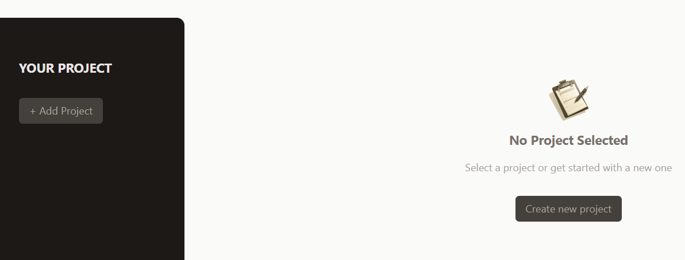

</details>

<details>
<summary>Managing State to Switch Between Components</summary>

Here on *App.jsx* file, we should manage the state 

```javascript
import { useState } from "react";

import NewProject from "./components/NewProject.jsx";
import NoProjectSelected from "./components/NoProjectSelected.jsx";
import ProjectsSidebar from "./components/ProjectsSidebar.jsx";

function App() {

  const [projectState, setProjectState] = useState({
    selectedProjectId: undefined,
    projects: []
  });

  function handleStartAddProject() {
    setProjectState(prevState => {
      return {
        ...prevState,
        selectedProjectId: null,
      };
    });
  }

  return (
    <main className="h-screen my-8 flex gap-8">
      <ProjectsSidebar onStartAddProject={handleStartAddProject} />
      <NoProjectSelected onStartAddProject={handleStartAddProject} />
    </main>
  );
}

export default App;

```

The on **ProjectsSidebar.jsx** file we should add onClick of onStartAddProject like this :

```javascript
import Button from "./Button.jsx";

export default function ProjectsSidebar({ onStartAddProject }) {
    return (
        <aside className="w-1/3 px-8 py-16 bg-stone-900 text-stone-50 md:w-72 rounded-r-xl">
            <h2 className="mb-8 font-bold uppercase md:text-xl text-stone-200">Your Project</h2>
            <div>
                <Button onClick={onStartAddProject}>
                    + Add Project
                </Button>
            </div>
            <ul>

            </ul>
        </aside>
    );
}
```

also in **NoProjectSelected.jsx** file :

```javascript
import noProjectImg from '../assets/no-projects.png';
import Button from './Button.jsx';

export default function NoProjectSelected({ onStartAddProject }) {
    return (
        <div className="mt-24 text-center w-2/3">
            
            <h2 className='text-xl font-bold text-stone-500 my-4'>No Project Selected</h2>
            <p className='text-stone-400 mb-4'>Select a project or get started with a new one</p>
            <p className='mt-8 '>
                <Button onClick={onStartAddProject}>Create new project</Button>
            </p>
        </div>
    );
}
```

Then the *App.jsx* file we should modify again by adding variable of content and also there are codes to be updated in there :

```javascript
import { useState } from "react";

import NewProject from "./components/NewProject.jsx";
import NoProjectSelected from "./components/NoProjectSelected.jsx";
import ProjectsSidebar from "./components/ProjectsSidebar.jsx";

function App() {

  const [projectsState, setProjectState] = useState({
    selectedProjectId: undefined,
    projects: []
  });

  function handleStartAddProject() {
    setProjectState(prevState => {
      return {
        ...prevState,
        selectedProjectId: null,
      };
    });
  }

  let content;

  if(projectsState.selectedProjectId === null) {
    content = <NewProject />
  } else if(projectsState.selectedProjectId === undefined) {
    content = <NoProjectSelected onStartAddProject={handleStartAddProject} />;
  }

  return (
    <main className="h-screen my-8 flex gap-8">
      <ProjectsSidebar onStartAddProject={handleStartAddProject} />
      {content}
    </main>
  );
}

export default App;

```

Then when we open the Apps, both button + Add Project and Create New Project is go back to the same form for creating new project.

</details>

<details>
<summary>Collecting User Input with Refs & Forwarded Refs</summary>

First we want to add refs on **NewProject.jsx** and **Input.jsx** file, both files are using ref and modify some codes using refs also which ref={ref} in is taken from the parameter and import the forwarded ref.

```javascript
import { forwardRef } from "react";

const Input = forwardRef (function Input({ label, textarea, ...props }, ref) {
    const classes = "w-full p-1 border-b-2 rounded-sm border-stone-300 bg-stone-200 text-stone-600 focus:outline-none focus:border-stone-600";
    return (
        <p className="flex flex-col gap-1 my-4">
            <label className="text-sm font-bold uppercase">{label}</label>
            {textarea ? (
                <textarea ref={ref} className={classes} {...props} />
             ) : ( 
                <input ref={ref} className={classes} {...props} />
            )}
        </p>
    );
});

export default Input;
```

```javascript
import { useRef } from 'react';
import Input from "./Input.jsx";

export default function NewProject() {
    const title = useRef();
    const description = useRef();
    const dueDate = useRef();

    function handleSave() {
        const enteredTitle = title.current.value;
        const enteredDescription = description.current.value;
        const enteredDueDate = dueDate.current.value;

        // validation ....
        
    }

    return (
        <div className="w-[35rem] mt-16">
            <menu className="flex items-center justify-end gap-4 my-4">
                <li>
                    <button className="text-stone-800 hover:text-stone-950">
                        Cancel
                    </button>
                </li>
                <li>
                    <button className="px-6 py-2 rounded-md bg-stone-800 text-stone-50 hover:bg-stone-950"
                    onClick={handleSave}>
                        Save
                    </button>
                </li>
            </menu>
            <div>
                <Input ref={title} label="Title" />
                <Input ref={description} label="Description" textarea />
                <Input ref={dueDate} label="Due Date" />
            </div>
        </div>
    );
}
```

So in **App.jsx** we need to add a function named handleAddProject() and needed to call setProjectsState again etc.

```javascript
import { useState } from "react";

import NewProject from "./components/NewProject.jsx";
import NoProjectSelected from "./components/NoProjectSelected.jsx";
import ProjectsSidebar from "./components/ProjectsSidebar.jsx";

function App() {

  const [projectsState, setProjectsState] = useState({
    selectedProjectId: undefined,
    projects: []
  });

  function handleStartAddProject() {
    setProjectsState(prevState => {
      return {
        ...prevState,
        selectedProjectId: null,
      };
    });
  }

  function handleAddProject(projectData) {
    setProjectsState(prevState => {
      const newProject = {
        ...projectData,
        id: Math.random()
      };

      return {
        ...prevState,
        projects: [...prevState.projects, newProject]
      };
    });
  }

  console.log(projectsState);

  let content;

  if(projectsState.selectedProjectId === null) {
    content = <NewProject onAdd={handleAddProject} />
  } else if(projectsState.selectedProjectId === undefined) {
    content = <NoProjectSelected onStartAddProject={handleStartAddProject} />;
  }

  return (
    <main className="h-screen my-8 flex gap-8">
      <ProjectsSidebar onStartAddProject={handleStartAddProject} />
      {content}
    </main>
  );
}

export default App;
```

So in **NewProject.jsx** we can do the codes for the validation etc :

```javascript
import { useRef } from 'react';
import Input from "./Input.jsx";

export default function NewProject({onAdd}) {
    const title = useRef();
    const description = useRef();
    const dueDate = useRef();

    function handleSave() {
        const enteredTitle = title.current.value;
        const enteredDescription = description.current.value;
        const enteredDueDate = dueDate.current.value;

        // validation ....

        onAdd({
            title: enteredTitle,
            description: enteredDescription,
            dueDate: enteredDueDate
        });
    }

    return (
        <div className="w-[35rem] mt-16">
            <menu className="flex items-center justify-end gap-4 my-4">
                <li>
                    <button className="text-stone-800 hover:text-stone-950">
                        Cancel
                    </button>
                </li>
                <li>
                    <button className="px-6 py-2 rounded-md bg-stone-800 text-stone-50 hover:bg-stone-950"
                    onClick={handleSave}>
                        Save
                    </button>
                </li>
            </menu>
            <div>
                <Input type="text" ref={title} label="Title" />
                <Input ref={description} label="Description" textarea />
                <Input type="date" ref={dueDate} label="Due Date" />
            </div>
        </div>
    );
}
```
</details>

<details>
<summary>Handling Project Creation & Updating the UI</summary>

We come back to *App.jsx* file, we add selectedProjectId: undifined in handleAddProject function, to make the form when we save it will go back to previous button for creating new project. Or making a constant projectId = Math.random(). And also adding projects={projectsState.projects} in tag of <ProjectsSidebar. 

```javascript
import { useState } from "react";

import NewProject from "./components/NewProject.jsx";
import NoProjectSelected from "./components/NoProjectSelected.jsx";
import ProjectsSidebar from "./components/ProjectsSidebar.jsx";

function App() {

  const [projectsState, setProjectsState] = useState({
    selectedProjectId: undefined,
    projects: []
  });

  function handleStartAddProject() {
    setProjectsState(prevState => {
      return {
        ...prevState,
        selectedProjectId: null,
      };
    });
  }

  function handleAddProject(projectData) {
    setProjectsState(prevState => {
      const projectId = Math.random()
      const newProject = {
        ...projectData,
        id: projectId
      };

      return {
        ...prevState,
        selectedProjectId: undefined,
        projects: [...prevState.projects, newProject],
      };
    });
  }

  let content;

  if(projectsState.selectedProjectId === null) {
    content = <NewProject onAdd={handleAddProject} />;
  } else if(projectsState.selectedProjectId === undefined) {
    content = <NoProjectSelected onStartAddProject={handleStartAddProject} />;
  }

  return (
    <main className="h-screen my-8 flex gap-8">
      <ProjectsSidebar 
        onStartAddProject={handleStartAddProject} 
        projects={projectsState.projects} 
      />
      {content}
    </main>
  );
}

export default App;
```

Now we can go to *ProjectsSidebar.jsx* file, and adding props of projects into the function.

Also adding on <li tag some codes. And Tailwind CSS

```javascript
import Button from "./Button.jsx";

export default function ProjectsSidebar({ onStartAddProject, projects }) {
    return (
        <aside className="w-1/3 px-8 py-16 bg-stone-900 text-stone-50 md:w-72 rounded-r-xl">
            <h2 className="mb-8 font-bold uppercase md:text-xl text-stone-200">Your Project</h2>
            <div>
                <Button onClick={onStartAddProject}>
                    + Add Project
                </Button>
            </div>
            <ul className="mt-8">
                {projects.map(project => <li key={project.id}>
                    <button className="w-full text-left px-2 py-1 rounded-sm my-1 text-stone-400 hover:text-stone-200 hover:bg-stone-800">{project.title}</button>
                </li>)}
            </ul>
        </aside>
    );
}


```

We run this, and fill the form in there, the project will be shown on the list :

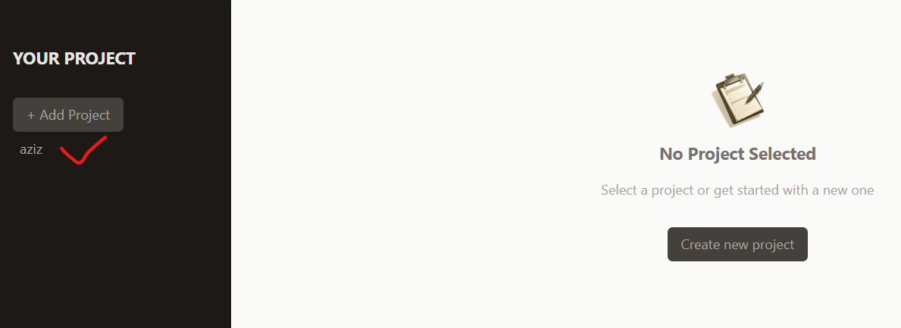
</details>

<details>
<summary>Validating User Input & Showing an Error Modal via useImperativeHandle</summary>

To show the error if we save the new project, we can go first into *NewProject.jsx* file by describing the validating codes in handleSave function.

```javascript
    function handleSave() {
        const enteredTitle = title.current.value;
        const enteredDescription = description.current.value;
        const enteredDueDate = dueDate.current.value;

        if(
            enteredTitle.trim() === '' || 
            enteredDescription.trim() === '' || 
            enteredDueDate.trim() === ''
        ) {
            //show the error modal
        }
```

Beside that, we can create new File named *Modal.jsx*, and importing createPortal from 'react-dom', importing forwardRef, useImperativeHandle from react. In file of *index.html* also we can see  modal-root reffering to Modal.jsx file.
```html
<div id="modal-root"></div>
```

Here is the *Modal.jsx* file :

```javascript
import { forwardRef, useImperativeHandle } from "react";
import { createPortal } from "react-dom";

const Modal = forwardRef(function Modal({ children }, ref) {
    const dialog = useRef();

    useImperativeHandle(ref, () => {
        return {
            open() {
                dialog.current.showModal();
            }
        };
    });

    return createPortal(
        <dialog ref={dialog}>{children}</dialog>, 
        document.getElementById('modal-root')
    );
});

export default Modal;
```

In *NewProject.jsx* file, after return code we can add <></> and import './Modal.jsx' and also const modal then fill the ref in Modal like this :

```javascript
return (
        <>
        <Modal ref={modal}>
            <h2>Invalid Input</h2>
            <p>Oops ... looks like your forgot to enter a value.</p>
            <p>Please make sure you provide a valid value for every input field.</p>
        </Modal>
```

And in file of *Modal.jsx* we can add form tag after return createPortal and also add buttonCaption props and import also useRef

```javascript
    const Modal = forwardRef(function Modal({ children, buttonCaption }, ref) {

    return createPortal(
        <dialog ref={dialog} buttonCaption="Okay">
            {children}
            <form method="dialog">
                <button>{buttonCaption}</button>
            </form>
        </dialog>, 
        document.getElementById('modal-root')
    );
```

Here are the codes of each classes after modified

**NewProject.jsx** :

```javascript
import { useRef } from 'react';

import Input from "./Input.jsx";
import Modal from './Modal.jsx';


export default function NewProject({onAdd}) {
    const modal = useRef();

    const title = useRef();
    const description = useRef();
    const dueDate = useRef();

    function handleSave() {
        const enteredTitle = title.current.value;
        const enteredDescription = description.current.value;
        const enteredDueDate = dueDate.current.value;

        if(
            enteredTitle.trim() === '' || 
            enteredDescription.trim() === '' || 
            enteredDueDate.trim() === ''
        ) {
            modal.current.open();
            return;
        }

        onAdd({
            title: enteredTitle,
            description: enteredDescription,
            dueDate: enteredDueDate
        });
    }

    return (
        <>
        <Modal ref={modal} buttonCaption="Okay">
            <h2>Invalid Input</h2>
            <p>Oops ... looks like your forgot to enter a value.</p>
            <p>Please make sure you provide a valid value for every input field.</p>
        </Modal>
        <div className="w-[35rem] mt-16">
            <menu className="flex items-center justify-end gap-4 my-4">
                <li>
                    <button className="text-stone-800 hover:text-stone-950">
                        Cancel
                    </button>
                </li>
                <li>
                    <button className="px-6 py-2 rounded-md bg-stone-800 text-stone-50 hover:bg-stone-950"
                    onClick={handleSave}>
                        Save
                    </button>
                </li>
            </menu>
            <div>
                <Input type="text" ref={title} label="Title" />
                <Input ref={description} label="Description" textarea />
                <Input type="date" ref={dueDate} label="Due Date" />
            </div>
        </div>
        </>  
    );
}
```

**Modal.jsx** :

```javascript
import { forwardRef, useImperativeHandle, useRef } from "react";
import { createPortal } from "react-dom";

const Modal = forwardRef(function Modal({ children, buttonCaption }, ref) {
    const dialog = useRef();

    useImperativeHandle(ref, () => {
        return {
            open() {
                dialog.current.showModal();
            }
        };
    });

    return createPortal(
        <dialog ref={dialog}>
            {children}
            <form method="dialog">
                <button>{buttonCaption}</button>
            </form>
        </dialog>, 
        document.getElementById('modal-root')
    );
});

export default Modal;
```

So, when we run the web, if we save the button while the field is still empty, it will show you the error dialog like this :

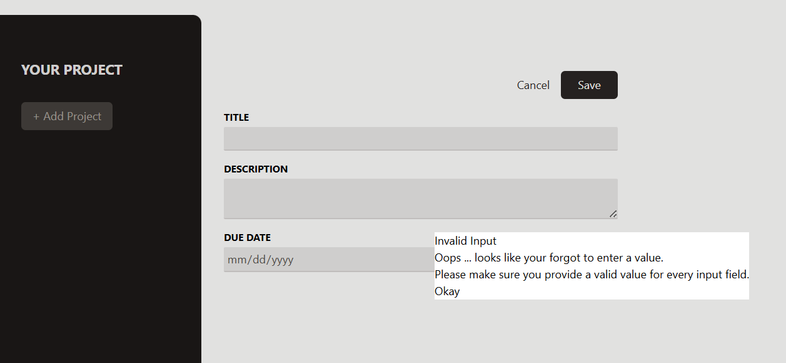

Looks like not pretty enough for the dialog error, but for this step we could catch the error.

We'll fix the error dialog for the css in the next lecture. !!!!

</details>

<details>
<summary>Styling the Modal via Tailwind CSS</summary>

First we wan't to add style on *Modal.jsx* file especial in part of return createPortal

```javascript
return createPortal(
        <dialog ref={dialog} className="backdrop:bg-stone-900/90 p-4 rounded-md shadow-md">
            {children}
            <form method="dialog">
                <button>{buttonCaption}</button>
            </form>
        </dialog>, 
        document.getElementById('modal-root')
    );
```

And also we could add tailwind css on *NewProject.jsx* file in part of Modal tag

```javascript
return (
        <>
        <Modal ref={modal} buttonCaption="Okay">
            <h2 className='text-xl font-bold text-stone-500 my-4'>Invalid Input</h2>
            <p className='text-stone-400 mb-4'>
                Oops ... looks like your forgot to enter a value.
            </p>
            <p className='text-stone-400 mb-4'>
                Please make sure you provide a valid value for every input field.
            </p>
        </Modal>
```

So if we save this and seeing on the browser, it looks much better

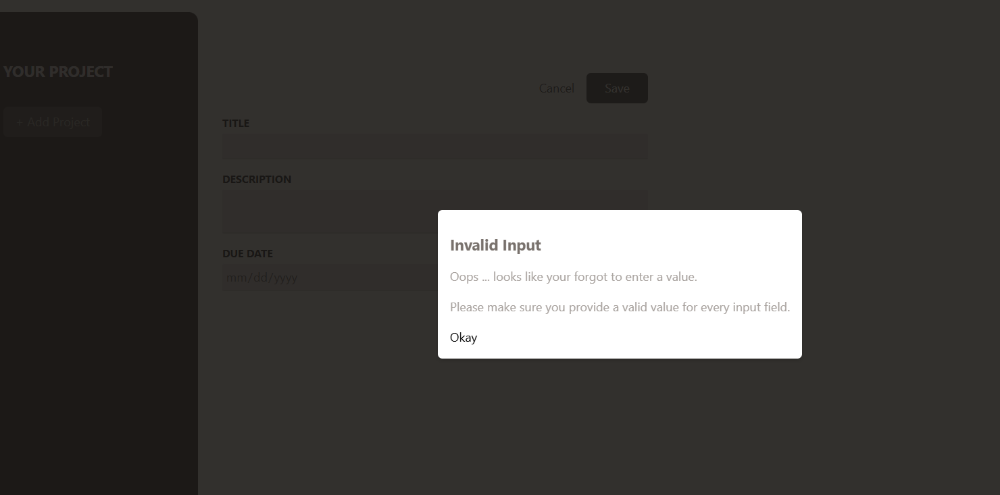

And back to *Modal.jsx* file, we can add style to a form tag, and also button tag below be changed to existing button with Button tag. like this :

```javascript
return createPortal(
        <dialog ref={dialog} className="backdrop:bg-stone-900/90 p-4 rounded-md shadow-md">
            {children}
            <form method="dialog" className="mt-4 text-right">
                <Button>{buttonCaption}</Button>
            </form>
        </dialog>, 
        document.getElementById('modal-root')
    );
```

And the result looks nicer than before :

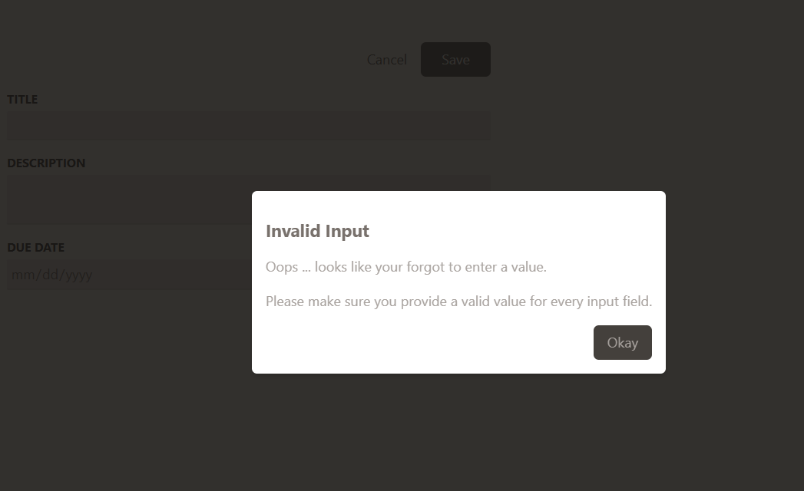

Go back to *NewProject.jsx* file, we can also make darker for the description of h2 and p tags. Which updated to 700, while p tags updated to 600.

```javascript
    return (
        <>
        <Modal ref={modal} buttonCaption="Okay">
            <h2 className='text-xl font-bold text-stone-700 my-4'>Invalid Input</h2>
            <p className='text-stone-600 mb-4'>
                Oops ... looks like your forgot to enter a value.
            </p>
            <p className='text-stone-600 mb-4'>
                Please make sure you provide a valid value for every input field.
            </p>
        </Modal>
```

Next we'll try to code for handleCancel button, which *App.jsx* should be added for it's code. Also configure it on if state below

```javascript
function handleCancelAddProject() {
    setProjectsState(prevState => {
      return {
        ...prevState,
        selectedProjectId: undefined,
      };
    });
  }
```

Also adding again code onCancel={} in if state below let content codes in *App.jsx* file.

```javascript
let content;

  if(projectsState.selectedProjectId === null) {
    content = (
      <NewProject onAdd={handleAddProject} onCancel={handleCancelAddProject} />
    );
  } else if(projectsState.selectedProjectId === undefined) {
    content = <NoProjectSelected onStartAddProject={handleStartAddProject} />;
  }
```

Back to *NewProject.jsx* file, we can add props on it function like this :

```javascript
export default function NewProject({onAdd, onCancel})
```

Also adding on button part

```javascript
    <button 
        className="text-stone-800 hover:text-stone-950" 
        onClick={onCancel}
        >
            Cancel
    </button>
```

Here are the files updated after modified :

**NewProject.jsx**

```javascript
import { useRef } from 'react';

import Input from "./Input.jsx";
import Modal from './Modal.jsx';


export default function NewProject({onAdd, onCancel}) {
    const modal = useRef();

    const title = useRef();
    const description = useRef();
    const dueDate = useRef();

    function handleSave() {
        const enteredTitle = title.current.value;
        const enteredDescription = description.current.value;
        const enteredDueDate = dueDate.current.value;

        if(
            enteredTitle.trim() === '' || 
            enteredDescription.trim() === '' || 
            enteredDueDate.trim() === ''
        ) {
            modal.current.open();
            return;
        }

        onAdd({
            title: enteredTitle,
            description: enteredDescription,
            dueDate: enteredDueDate
        });
    }

    return (
        <>
        <Modal ref={modal} buttonCaption="Okay">
            <h2 className='text-xl font-bold text-stone-700 my-4'>Invalid Input</h2>
            <p className='text-stone-600 mb-4'>
                Oops ... looks like your forgot to enter a value.
            </p>
            <p className='text-stone-600 mb-4'>
                Please make sure you provide a valid value for every input field.
            </p>
        </Modal>
        <div className="w-[35rem] mt-16">
            <menu className="flex items-center justify-end gap-4 my-4">
                <li>
                    <button 
                        className="text-stone-800 hover:text-stone-950" 
                        onClick={onCancel}
                    >
                        Cancel
                    </button>
                </li>
                <li>
                    <button className="px-6 py-2 rounded-md bg-stone-800 text-stone-50 hover:bg-stone-950"
                    onClick={handleSave}>
                        Save
                    </button>
                </li>
            </menu>
            <div>
                <Input type="text" ref={title} label="Title" />
                <Input ref={description} label="Description" textarea />
                <Input type="date" ref={dueDate} label="Due Date" />
            </div>
        </div>
        </>  
    );
}
```

**Modal.jsx**

```javascript
import { forwardRef, useImperativeHandle, useRef } from "react";
import { createPortal } from "react-dom";
import Button from "./Button.jsx";

const Modal = forwardRef(function Modal({ children, buttonCaption }, ref) {
    const dialog = useRef();

    useImperativeHandle(ref, () => {
        return {
            open() {
                dialog.current.showModal();
            }
        };
    });

    return createPortal(
        <dialog ref={dialog} className="backdrop:bg-stone-900/90 p-4 rounded-md shadow-md">
            {children}
            <form method="dialog" className="mt-4 text-right">
                <Button>{buttonCaption}</Button>
            </form>
        </dialog>, 
        document.getElementById('modal-root')
    );
});

export default Modal;
```

**App.jsx**

```javascript
import { useState } from "react";

import NewProject from "./components/NewProject.jsx";
import NoProjectSelected from "./components/NoProjectSelected.jsx";
import ProjectsSidebar from "./components/ProjectsSidebar.jsx";

function App() {

  const [projectsState, setProjectsState] = useState({
    selectedProjectId: undefined,
    projects: []
  });

  function handleStartAddProject() {
    setProjectsState(prevState => {
      return {
        ...prevState,
        selectedProjectId: null,
      };
    });
  }

  function handleCancelAddProject() {
    setProjectsState(prevState => {
      return {
        ...prevState,
        selectedProjectId: undefined,
      };
    });
  }

  function handleAddProject(projectData) {
    setProjectsState(prevState => {
      const projectId = Math.random()
      const newProject = {
        ...projectData,
        id: projectId
      };

      return {
        ...prevState,
        selectedProjectId: undefined,
        projects: [...prevState.projects, newProject],
      };
    });
  }

  let content;

  if(projectsState.selectedProjectId === null) {
    content = (
      <NewProject onAdd={handleAddProject} onCancel={handleCancelAddProject} />
    );
  } else if(projectsState.selectedProjectId === undefined) {
    content = <NoProjectSelected onStartAddProject={handleStartAddProject} />;
  }

  return (
    <main className="h-screen my-8 flex gap-8">
      <ProjectsSidebar 
        onStartAddProject={handleStartAddProject} 
        projects={projectsState.projects} 
      />
      {content}
    </main>
  );
}

export default App;
```

So if we save this, and show on the browser, when we add new project but we want to cancel it by clicking the cancel button, it will back to page of Add new project.

</details>

<details>
<summary>Making Projects Selectable & Viewing Project</summary>

To make selectedProject we need to create new component file named *SelectedProject.jsx* 

```javascript
export default function SelectedProject() {
    return <div>
        <header>
            <div>
                <h1>TITLE</h1>
                <button>Delete</button>
            </div>
            <p>DATA</p>
            <p>DESCRIPTION</p>
        </header>
        TASK
    </div>
}
```

But here for advanced, we need to add the props etc to this *SelectedProject.jsx* component file, also here we add talwind css styles.

```javascript
export default function SelectedProject({ project }) {

    const formattedDate = new Date(project.dueDate).toLocaleDateString('en-US', {
        year: 'numeric',
        month: 'short',
        day: 'numeric'
    });

    return (
        <div className="w-[35rem] mt-16">
        <header className="pb-4 mb-4 border-b-2 border-stone-300">
            <div className="flex items-center justify-between">
                <h1 className="text-3xl font-bold text-stone-600 mb-2">
                    {project.title}
                </h1>
                <button className="text-stone-600 hover:text-stone-950 ">
                    Delete
                </button>
            </div>
            <p className="mb-4 text-stone-400">{formattedDate}</p>
            <p className="text-stone-600 whitespace-pre-wrap">{project.description}</p>
        </header>
        TASK
        </div>
    );
}
```

Open di file of *App.jsx* and we'll add new function named **handleSelectProject** 

```javascript
function App() {

  const [projectsState, setProjectsState] = useState({
    selectedProjectId: undefined,
    projects: []
  });

  function handleSelectProject(id) {
    setProjectsState(prevState => {
      return {
        ...prevState,
        selectedProjectId: id,
      };
    });
  }
```

Also adding it on return of ProjectsSidebar tag

```javascript
return (
    <main className="h-screen my-8 flex gap-8">
      <ProjectsSidebar 
        onStartAddProject={handleStartAddProject} 
        projects={projectsState.projects} 
        onSelectProject={handleSelectProject}
      />
```

In *ProjectsSidebar.jsx* we can add props *onSelectProject*, and *selectedProjectId* and also adding after it's button etc.

```javascript
import Button from "./Button.jsx";

export default function ProjectsSidebar({ 
    onStartAddProject,
    projects,
    onSelectProject,
    selectedProjectId
    }) {
    return (
        <aside className="w-1/3 px-8 py-16 bg-stone-900 text-stone-50 md:w-72 rounded-r-xl">
            <h2 className="mb-8 font-bold uppercase md:text-xl text-stone-200">Your Project</h2>
            <div>
                <Button onClick={onStartAddProject}>
                    + Add Project
                </Button>
            </div>
            <ul className="mt-8">
                {projects.map(project => {
                    let cssClasses = "w-full text-left px-2 py-1 rounded-sm my-1 hover:text-stone-200 hover:bg-stone-800";

                    if(project.id === selectedProjectId) {
                        cssClasses += ' bg-stone-800 text-stone-200'
                    } else {
                        cssClasses += ' text-stone-400'
                    }
                    return (
                        <li key={project.id}>
                        <button className={cssClasses}
                        onClick={onSelectProject}
                        >
                            {project.title}
                        </button>
                        </li>
                        );
                        })} 
            </ul>
        </aside>
    );
}

```
And here in *App.jsx* file component, we modify the codes, import selectedProject etc.

```javascript
import { useState } from "react";

import NewProject from "./components/NewProject.jsx";
import NoProjectSelected from "./components/NoProjectSelected.jsx";
import ProjectsSidebar from "./components/ProjectsSidebar.jsx";
import SelectedProject from './components/SelectedProject';

function App() {

  const [projectsState, setProjectsState] = useState({
    selectedProjectId: undefined,
    projects: []
  });

  function handleSelectProject(id) {
    setProjectsState(prevState => {
      return {
        ...prevState,
        selectedProjectId: id,
      };
    });
  }

  function handleStartAddProject() {
    setProjectsState(prevState => {
      return {
        ...prevState,
        selectedProjectId: null,
      };
    });
  }

  function handleCancelAddProject() {
    setProjectsState(prevState => {
      return {
        ...prevState,
        selectedProjectId: undefined,
      };
    });
  }

  function handleAddProject(projectData) {
    setProjectsState(prevState => {
      const projectId = Math.random()
      const newProject = {
        ...projectData,
        id: projectId
      };

      return {
        ...prevState,
        selectedProjectId: undefined,
        projects: [...prevState.projects, newProject],
      };
    });
  }

  const selectedProject = projectsState.projects.find(project => project.id === projectsState.selectedProjectId);

  let content = <SelectedProject project={selectedProject} />;

  if(projectsState.selectedProjectId === null) {
    content = (
      <NewProject onAdd={handleAddProject} onCancel={handleCancelAddProject} />
    );
  } else if(projectsState.selectedProjectId === undefined) {
    content = <NoProjectSelected onStartAddProject={handleStartAddProject} />;
  }

  return (
    <main className="h-screen my-8 flex gap-8">
      <ProjectsSidebar 
        onStartAddProject={handleStartAddProject} 
        projects={projectsState.projects} 
        onSelectProject={handleSelectProject}
      />
      {content}
    </main>
  );
}

export default App;
```
If we save this and run the browser *npm run dev*, It's still getting error or not displayed after we fill the form in creating project. The solution is changing part of code in *ProjectsSidebar.jsx* in onClick become **onClick={() => onSelectProject(project.id)}**

```javascript
<ul className="mt-8">
                {projects.map(project => {
                    let cssClasses = "w-full text-left px-2 py-1 rounded-sm my-1 hover:text-stone-200 hover:bg-stone-800";

                    if(project.id === selectedProjectId) {
                        cssClasses += ' bg-stone-800 text-stone-200'
                    } else {
                        cssClasses += ' text-stone-400'
                    }
                    return (
                        <li key={project.id}>
                        <button className={cssClasses}
                        onClick={() => onSelectProject(project.id)}
                        >
                            {project.title}
                        </button>
                        </li>
                        );
                        })} 
            </ul>
```

And the full codes of *ProjectsSidebar.jsx* are :

```javascript
import Button from "./Button.jsx";

export default function ProjectsSidebar({ 
    onStartAddProject,
    projects,
    onSelectProject,
    selectedProjectId
    }) {
    return (
        <aside className="w-1/3 px-8 py-16 bg-stone-900 text-stone-50 md:w-72 rounded-r-xl">
            <h2 className="mb-8 font-bold uppercase md:text-xl text-stone-200">Your Project</h2>
            <div>
                <Button onClick={onStartAddProject}>
                    + Add Project
                </Button>
            </div>
            <ul className="mt-8">
                {projects.map(project => {
                    let cssClasses = "w-full text-left px-2 py-1 rounded-sm my-1 hover:text-stone-200 hover:bg-stone-800";

                    if(project.id === selectedProjectId) {
                        cssClasses += ' bg-stone-800 text-stone-200'
                    } else {
                        cssClasses += ' text-stone-400'
                    }
                    return (
                        <li key={project.id}>
                        <button className={cssClasses}
                        onClick={() => onSelectProject(project.id)}
                        >
                            {project.title}
                        </button>
                        </li>
                        );
                        })} 
            </ul>
        </aside>
    );
}

```

Here is the result after the codes being changed :

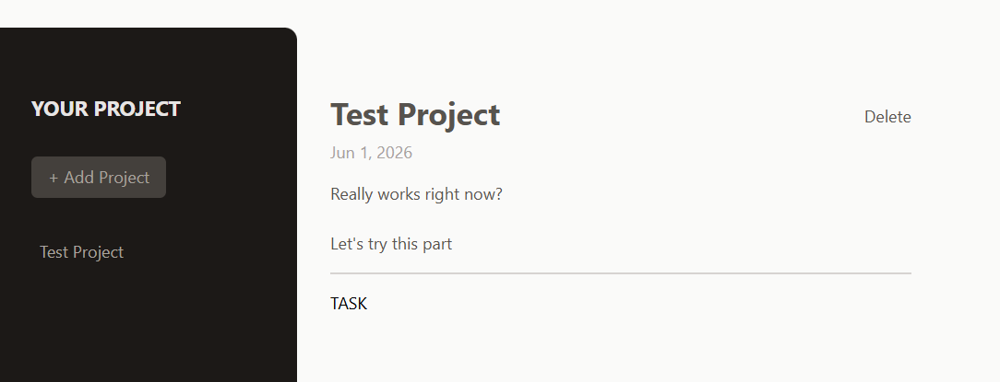

Note : We'll see the details of our project after created.

</details>

<details>
<summary>Handling Project Deletion</summary>

First in *App.jsx* component file, we need to add function for deletion, here we named handleDeleteProject. And at variable let content we edit also the code 

```javascript
function handleDeleteProject() {
    setProjectsState(prevState => {
      return {
        ...prevState,
        selectedProjectId: undefined,
        projects: prevState.projects.filter(
          (project) => project.id !== prevState.selectedProjectId
        ),
      };
    });
  }
```

```javascript
let content = (
    <SelectedProject project={selectedProject} onDelete={handleDeleteProject} />
);
```

So, in SelectedProject.jsx we add props onDelete in it's function and adding onClick={onDelete} in button tag

```javascript
export default function SelectedProject({ project, onDelete }) {
```

```javascript
                <button className="text-stone-600 hover:text-stone-950"
                    onClick={onDelete}
                >
                    Delete
                </button>
```

Here are the complete codes of *App.jsx* and *SelectedProject.jsx* files :

```javascript
import { useState } from "react";

import NewProject from "./components/NewProject.jsx";
import NoProjectSelected from "./components/NoProjectSelected.jsx";
import ProjectsSidebar from "./components/ProjectsSidebar.jsx";
import SelectedProject from './components/SelectedProject';

function App() {

  const [projectsState, setProjectsState] = useState({
    selectedProjectId: undefined,
    projects: []
  });

  function handleSelectProject(id) {
    setProjectsState(prevState => {
      return {
        ...prevState,
        selectedProjectId: id,
      };
    });
  }

  function handleStartAddProject() {
    setProjectsState(prevState => {
      return {
        ...prevState,
        selectedProjectId: null,
      };
    });
  }

  function handleCancelAddProject() {
    setProjectsState(prevState => {
      return {
        ...prevState,
        selectedProjectId: undefined,
      };
    });
  }

  function handleAddProject(projectData) {
    setProjectsState(prevState => {
      const projectId = Math.random()
      const newProject = {
        ...projectData,
        id: projectId
      };

      return {
        ...prevState,
        selectedProjectId: undefined,
        projects: [...prevState.projects, newProject],
      };
    });
  }

  function handleDeleteProject() {
    setProjectsState(prevState => {
      return {
        ...prevState,
        selectedProjectId: undefined,
        projects: prevState.projects.filter(
          (project) => project.id !== prevState.selectedProjectId
        ),
      };
    });
  }

  const selectedProject = projectsState.projects.find(project => project.id === projectsState.selectedProjectId);

  let content = (
    <SelectedProject project={selectedProject} onDelete={handleDeleteProject} />
  );

  if(projectsState.selectedProjectId === null) {
    content = (
      <NewProject onAdd={handleAddProject} onCancel={handleCancelAddProject} />
    );
  } else if(projectsState.selectedProjectId === undefined) {
    content = <NoProjectSelected onStartAddProject={handleStartAddProject} />;
  }

  return (
    <main className="h-screen my-8 flex gap-8">
      <ProjectsSidebar 
        onStartAddProject={handleStartAddProject} 
        projects={projectsState.projects} 
        onSelectProject={handleSelectProject}
      />
      {content}
    </main>
  );
}

export default App;
```

```javascript
export default function SelectedProject({ project, onDelete }) {

    const formattedDate = new Date(project.dueDate).toLocaleDateString('en-US', {
        year: 'numeric',
        month: 'short',
        day: 'numeric'
    });

    return (
        <div className="w-[35rem] mt-16">
        <header className="pb-4 mb-4 border-b-2 border-stone-300">
            <div className="flex items-center justify-between">
                <h1 className="text-3xl font-bold text-stone-600 mb-2">
                    {project.title}
                </h1>
                <button className="text-stone-600 hover:text-stone-950"
                    onClick={onDelete}
                >
                    Delete
                </button>
            </div>
            <p className="mb-4 text-stone-400">{formattedDate}</p>
            <p className="text-stone-600 whitespace-pre-wrap">{project.description}</p>
        </header>
        TASK
        </div>
    );
}
```

If we save this and open the browser, we now can add the project and we can delete the projects


</details>

<details>
<summary>Adding "Project Tasks" and A Tasks Component</summary>

First we create new component file named **Task.jsx** file

```javascript
export default function Tasks() {
    return <section>
        <h2 className="text-2xl font-bold text-stone-700 mb-4">Tasks</h2>
        NEWE TASK
        <p className="text-stone-800 mb-4">
            This project does not have any task yet.
        </p>
        <ul>

        </ul>
    </section>
}
```

And in *SelectedProject.jsx* we can put Tasks tag class below tag of header. And make sure to import the class of Tasks.jsx in this class.

```javascript
            <p className="mb-4 text-stone-400">{formattedDate}</p>
            <p className="text-stone-600 whitespace-pre-wrap">{project.description}</p>
        </header>
        <Tasks />
        </div>
```

If we save this and open the browser, we'll find the text of TASK like captured below :

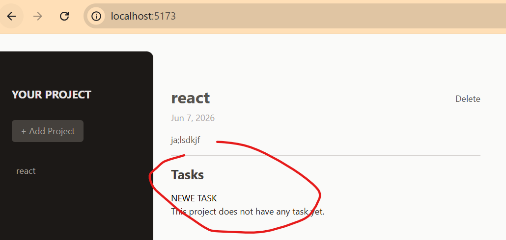

Next step is creating new file again named **NewTask.jsx** file

```javascript
export default function NewTask() {
    return (
        <div className="flex items-center gap-4">
            <input type="text" className="w-64 px-2 rounded-sm bg-stone-200" />
            <button className="text-stone-700 hover:text-stone-950">Add Task</button>
        </div>
    );
}
```

So in *Tasks.jsx* file we can import the component class of *NewTask.jsx*

```javascript
import NewTask from "./NewTask.jsx";

export default function Tasks() {
    return <section>
        <h2 className="text-2xl font-bold text-stone-700 mb-4">Tasks</h2>
        <NewTask />
        <p className="text-stone-800 mb-4">
            This project does not have any task yet.
        </p>
        <ul>

        </ul>
    </section>
}
```

If we save this and open the browser we'll see the updates :

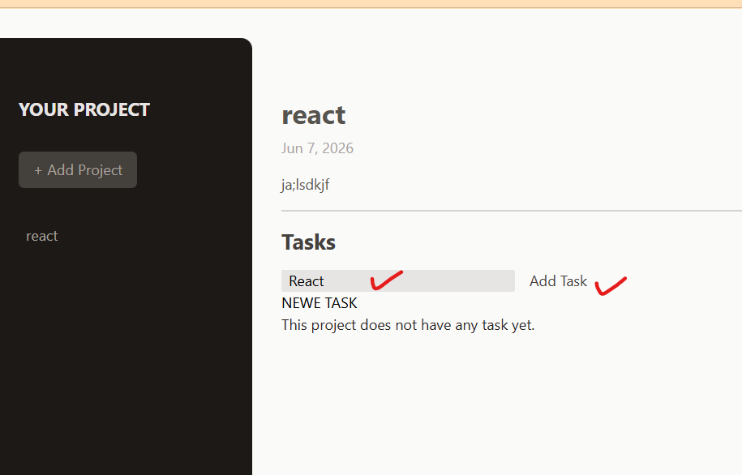
</details>

<details>
<summary>Managing Tasks & Understanding Prop Driling</summary>

So, in *NewTask.jsx* file we can add useState, also create function named handleChange and adding props on it etc.

```javascript
import { useState } from 'react';

export default function NewTask() {

    const [enteredTask, setEnteredTask] = useState();

    function handleChange(event) {
        setEnteredTask(event.target.value);
    }
    return (
        <div className="flex items-center gap-4">
            <input 
                type="text" 
                className="w-64 px-2 rounded-sm bg-stone-200"
                onChange={handleChange}
                value={enteredTask}
            />
            <button className="text-stone-700 hover:text-stone-950">Add Task</button>
        </div>
    );
}
```

Now we jump into *App.jsx* file. Here we add task: [] in *const [projectsState, setProjectsState] = useState* row. Also adding functions like handleAddTask() and handleDeleteTask() 

```javascript
function App() {

  const [projectsState, setProjectsState] = useState({
    selectedProjectId: undefined,
    projects: [],
    tasks: []
  });

  function handleAddTask() {}

  function handleDeleteTask() {}
```

Go back again into *NewTask.jsx* file, we add a function again named function handleClick() and add onClick in button tag 

```javascript
function handleClick() {
        setEnteredTask('');
    }

    return (
        <div className="flex items-center gap-4">
            <input 
                type="text" 
                className="w-64 px-2 rounded-sm bg-stone-200"
                onChange={handleChange}
                value={enteredTask}
            />
            <button 
                className="text-stone-700 hover:text-stone-950"
                onClick={handleClick}
            >Add Task</button>
        </div>
```

Go back again in *App.jsx* file and adding onAddTask={handleAddTask} & onDeleteTask={handleDeleteTask} in let content

```javascript
  let content = (
    <SelectedProject 
      project={selectedProject} 
      onDelete={handleDeleteProject} 
      onAddTask={handleAddTask}
      onDeleteTask={handleDeleteTask}
    />
  );
```

After that we should add props onAddTask and onDeleteTask in props of *SelectedProject.jsx* file and also adding <Tasks onAdd={onAddTask} onDelete={onDeleteTask}

```javascript
import Tasks from "./Tasks";

export default function SelectedProject({ project, onDelete, onAddTask, onDeleteTask }) {

    const formattedDate = new Date(project.dueDate).toLocaleDateString('en-US', {
        year: 'numeric',
        month: 'short',
        day: 'numeric'
    });

    return (
        <div className="w-[35rem] mt-16">
        <header className="pb-4 mb-4 border-b-2 border-stone-300">
            <div className="flex items-center justify-between">
                <h1 className="text-3xl font-bold text-stone-600 mb-2">
                    {project.title}
                </h1>
                <button className="text-stone-600 hover:text-stone-950"
                    onClick={onDelete}
                >
                    Delete
                </button>
            </div>
            <p className="mb-4 text-stone-400">{formattedDate}</p>
            <p className="text-stone-600 whitespace-pre-wrap">{project.description}</p>
        </header>
        <Tasks onAdd={onAddTask} onDelete={onDeleteTask} />
        </div>
    );
}
```

Go again on *Tasks.jsx* file, just adding props of onAdd and onDelete like this :

```javascript
import NewTask from "./NewTask.jsx";

export default function Tasks({ onAdd, onDelete }) {
    return <section>
        <h2 className="text-2xl font-bold text-stone-700 mb-4">Tasks</h2>
        <NewTask onAdd={onAdd} />
        <p className="text-stone-800 mb-4">
            This project does not have any task yet.
        </p>
        <ul>

        </ul>
    </section>
}
```

In *NewTask.jsx* we can add onAdd props in the function ant in the function of handleClick

```javascript
import { useState } from 'react';

export default function NewTask({ onAdd }) {

    const [enteredTask, setEnteredTask] = useState();

    function handleChange(event) {
        setEnteredTask(event.target.value);
    }

    function handleClick() {
        onAdd(enteredTask);
        setEnteredTask('');
    }

    return (
        <div className="flex items-center gap-4">
            <input 
                type="text" 
                className="w-64 px-2 rounded-sm bg-stone-200"
                onChange={handleChange}
                value={enteredTask}
            />
            <button 
                className="text-stone-700 hover:text-stone-950"
                onClick={handleClick}
            >Add Task</button>
        </div>
    );
}
```

So we update again by adding onAddTask in props of *SelectedProject.jsx* file. 

```javascript
import Tasks from "./Tasks";

export default function SelectedProject({ 
    project, 
    onDelete, 
    onAddTask, 
    onDeleteTask 
}) {
```

Also in *App.jsx* we can modify the function of handleAddTask into :

```javascript
function handleAddTask(text) {
    setProjectsState(prevState => {
      const taskId = Math.random();
      const newTask = {
        text: text,
        projectId: prevState.selectedProjectId,
        id: taskId,
      };

      return {
        ...prevState,
        selectedProjectId: undefined,
        tasks: [newTask, ...prevState.tasks]
      };
    });
  }
```

After that, we can go back to *Tasks.jsx* file adding props task and modify the codes of Tailwind css on that.

```javascript
import NewTask from "./NewTask.jsx";

export default function Tasks({ tasks, onAdd, onDelete }) {
    return (
    <section>
        <h2 className="text-2xl font-bold text-stone-700 mb-4">Tasks</h2>
        <NewTask onAdd={onAdd} />
        {tasks.length === 0 && (
            <p className="text-stone-800 mb-4">
                This project does not have any task yet.
            </p>
        )}
        {tasks.length > 0 && (
            <ul className="p-4 mt-8 rounded-md bg-stone-100">
            {tasks.map((tasks) => (
                <li key={tasks.id} className="flex justify-between my-4">
                    <span>{tasks.text}</span>
                    <button className="text-stone-700 hover:text-red-500">
                        Clear
                    </button>
                </li>
            ))}
        </ul>
        )}
    </section>
    );
}
```

Again in *App.jsx* we can add task properti in varible *let content* like this :

```javascript
  let content = (
    <SelectedProject 
      project={selectedProject} 
      onDelete={handleDeleteProject} 
      onAddTask={handleAddTask}
      onDeleteTask={handleDeleteTask}
      tasks={projectsState.tasks}
    />
  );
```

So in *SelectedProject.jsx* we can add props task in it's function and the tag of <Taks 

```javascript
export default function SelectedProject({ 
    project, 
    onDelete, 
    onAddTask, 
    onDeleteTask,
    task
}) {
```

```javascript
<Tasks onAdd={onAddTask} onDelete={onDeleteTask} tasks={tasks} />
```
And here are the complete codes of each classes :

```javascript
  import { useState } from "react";

  import NewProject from "./components/NewProject.jsx";
  import NoProjectSelected from "./components/NoProjectSelected.jsx";
  import ProjectsSidebar from "./components/ProjectsSidebar.jsx";
  import SelectedProject from './components/SelectedProject';

  function App() {

    const [projectsState, setProjectsState] = useState({
      selectedProjectId: undefined,
      projects: [],
      tasks: []
    });

    function handleAddTask(text) {
      setProjectsState(prevState => {
        const taskId = Math.random();
        const newTask = {
          text: text,
          projectId: prevState.selectedProjectId,
          id: taskId,
        };

        return {
          ...prevState,
          selectedProjectId: undefined,
          tasks: [newTask, ...prevState.tasks]
        };
      });
    }


    function handleDeleteTask() {}

    function handleSelectProject(id) {
      setProjectsState(prevState => {
        return {
          ...prevState,
          selectedProjectId: id,
        };
      });
    }

    function handleStartAddProject() {
      setProjectsState(prevState => {
        return {
          ...prevState,
          selectedProjectId: null,
        };
      });
    }

    function handleCancelAddProject() {
      setProjectsState(prevState => {
        return {
          ...prevState,
          selectedProjectId: undefined,
        };
      });
    }

    function handleAddProject(projectData) {
      setProjectsState(prevState => {
        const projectId = Math.random();
        const newProject = {
          ...projectData,
          id: projectId
        };

        return {
          ...prevState,
          selectedProjectId: undefined,
          projects: [...prevState.projects, newProject],
        };
      });
    }

    function handleDeleteProject() {
      setProjectsState(prevState => {
        return {
          ...prevState,
          selectedProjectId: undefined,
          projects: prevState.projects.filter(
            (project) => project.id !== prevState.selectedProjectId
          ),
        };
      });
    }

    const selectedProject = projectsState.projects.find(project => project.id === projectsState.selectedProjectId);

    let content = (
      <SelectedProject 
        project={selectedProject} 
        onDelete={handleDeleteProject} 
        onAddTask={handleAddTask}
        onDeleteTask={handleDeleteTask}
        tasks={projectsState.tasks}
      />
    );

    if(projectsState.selectedProjectId === null) {
      content = (
        <NewProject onAdd={handleAddProject} onCancel={handleCancelAddProject} />
      );
    } else if(projectsState.selectedProjectId === undefined) {
      content = <NoProjectSelected onStartAddProject={handleStartAddProject} />;
    }

    return (
      <main className="h-screen my-8 flex gap-8">
        <ProjectsSidebar 
          onStartAddProject={handleStartAddProject} 
          projects={projectsState.projects} 
          onSelectProject={handleSelectProject}
        />
        {content}
      </main>
    );
  }

  export default App;
```

```javascript
import Tasks from "./Tasks";

export default function SelectedProject({ 
    project, 
    onDelete, 
    onAddTask, 
    onDeleteTask,
    tasks
}) {

    const formattedDate = new Date(project.dueDate).toLocaleDateString('en-US', {
        year: 'numeric',
        month: 'short',
        day: 'numeric'
    });

    return (
        <div className="w-[35rem] mt-16">
        <header className="pb-4 mb-4 border-b-2 border-stone-300">
            <div className="flex items-center justify-between">
                <h1 className="text-3xl font-bold text-stone-600 mb-2">
                    {project.title}
                </h1>
                <button className="text-stone-600 hover:text-stone-950"
                    onClick={onDelete}
                >
                    Delete
                </button>
            </div>
            <p className="mb-4 text-stone-400">{formattedDate}</p>
            <p className="text-stone-600 whitespace-pre-wrap">{project.description}</p>
        </header>
        <Tasks onAdd={onAddTask} onDelete={onDeleteTask} tasks={tasks} />
        </div>
    );
}
```

```javascript
import NewTask from "./NewTask.jsx";

export default function Tasks({ tasks, onAdd, onDelete }) {
    return (
    <section>
        <h2 className="text-2xl font-bold text-stone-700 mb-4">Tasks</h2>
        <NewTask onAdd={onAdd} />
        {tasks.length === 0 && (
            <p className="text-stone-800 my-4">
                This project does not have any task yet.
            </p>
        )}
        {tasks.length > 0 && (
            <ul className="p-4 mt-8 rounded-md bg-stone-100">
            {tasks.map((tasks) => (
                <li key={tasks.id} className="flex justify-between my-4">
                    <span>{tasks.text}</span>
                    <button className="text-stone-700 hover:text-red-500">
                        Clear
                    </button>
                </li>
            ))}
        </ul>
        )}
    </section>
    );
}
```

```javascript
import { useState } from 'react';

export default function NewTask({ onAdd }) {

    const [enteredTask, setEnteredTask] = useState();

    function handleChange(event) {
        setEnteredTask(event.target.value);
    }

    function handleClick() {
        onAdd(enteredTask);
        setEnteredTask('');
    }

    return (
        <div className="flex items-center gap-4">
            <input 
                type="text" 
                className="w-64 px-2 rounded-sm bg-stone-200"
                onChange={handleChange}
                value={enteredTask}
            />
            <button 
                className="text-stone-700 hover:text-stone-950"
                onClick={handleClick}
            >Add Task</button>
        </div>
    );
}
```

So if we save this and open the browser, when we add new project and save this, the displayed taks can be clicked and will display like this below capture :

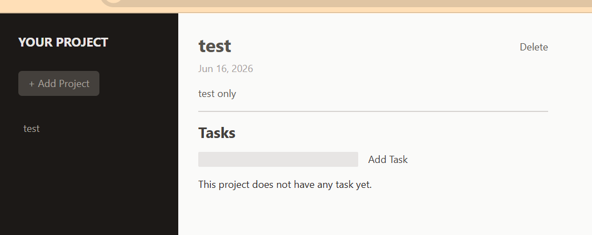
</details>

<details>
<summary>Clearing Tasks & Fixing Minor Bugs</summary>

We jump into *App.jsx* file, and go editing into function handleDeleteTask

```javascript
    function handleDeleteTask(id) {
      setProjectsState(prevState => {
        return {
          ...prevState,
          tasks: prevState.tasks.filter((task) => task.id !== id),
        };
      });
    }
```

So in *Tasks.jsx* file we need to add onClick of onDelete props into the button tag

```javascript
import NewTask from "./NewTask.jsx";

export default function Tasks({ tasks, onAdd, onDelete }) {
    return (
    <section>
        <h2 className="text-2xl font-bold text-stone-700 mb-4">Tasks</h2>
        <NewTask onAdd={onAdd} />
        {tasks.length === 0 && (
            <p className="text-stone-800 my-4">
                This project does not have any task yet.
            </p>
        )}
        {tasks.length > 0 && (
            <ul className="p-4 mt-8 rounded-md bg-stone-100">
            {tasks.map((tasks) => (
                <li key={tasks.id} className="flex justify-between my-4">
                    <span>{tasks.text}</span>
                    <button 
                        className="text-stone-700 hover:text-red-500" 
                        onClick={() => onDelete(tasks.id)}
                    >
                        Clear
                    </button>
                </li>
            ))}
        </ul>
        )}
    </section>
    );
}
```

So we check into the browser, when we added the test, the task can be cleared now.

But there are some error when we inspect the element on the browser. It because of the useState. So we'll fix it on *NewTask.jsx* file

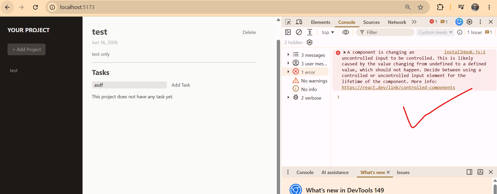

To avoid the error message we need to add empty string of useState on useState like this :

```javascript
export default function NewTask({ onAdd }) {

    const [enteredTask, setEnteredTask] = useState('');
```

And the error will be empty.

And to avoid the the error when we wanna add the task in order go back to main webpage, we should add the if login on function handleClick in *NewTask.jsx* file.

```javascript
    function handleClick() {
        if(enteredTask.trim() === '') {
            return; 
        }
          onAdd(enteredTask);
          setEnteredTask(''); 
    }
```

So we need also to add selectedProejctId on *App.jsx* after return code

```javascript
    return (
      <main className="h-screen my-8 flex gap-8">
        <ProjectsSidebar 
          onStartAddProject={handleStartAddProject} 
          projects={projectsState.projects} 
          onSelectProject={handleSelectProject}
          selectedProjectId={projectsState.selectedProjectId}
        />
        {content}
      </main>
    );
```
</details>

<details>
<summary>The Complete and Complex codes are here</summary>

*App.jsx*
```javascript
  import { useState } from "react";

  import NewProject from "./components/NewProject.jsx";
  import NoProjectSelected from "./components/NoProjectSelected.jsx";
  import ProjectsSidebar from "./components/ProjectsSidebar.jsx";
  import SelectedProject from './components/SelectedProject';

  function App() {

    const [projectsState, setProjectsState] = useState({
      selectedProjectId: undefined,
      projects: [],
      tasks: []
    });

    function handleAddTask(text) {
      setProjectsState(prevState => {
        const taskId = Math.random();
        const newTask = {
          text: text,
          projectId: prevState.selectedProjectId,
          id: taskId,
        };

        return {
          ...prevState,
          selectedProjectId: undefined,
          tasks: [newTask, ...prevState.tasks]
        };
      });
    }


    function handleDeleteTask(id) {
      setProjectsState(prevState => {
        return {
          ...prevState,
          tasks: prevState.tasks.filter((task) => task.id !== id),
        };
      });
    }

    function handleSelectProject(id) {
      setProjectsState(prevState => {
        return {
          ...prevState,
          selectedProjectId: id,
        };
      });
    }

    function handleStartAddProject() {
      setProjectsState(prevState => {
        return {
          ...prevState,
          selectedProjectId: null,
        };
      });
    }

    function handleCancelAddProject() {
      setProjectsState(prevState => {
        return {
          ...prevState,
          selectedProjectId: undefined,
        };
      });
    }

    function handleAddProject(projectData) {
      setProjectsState(prevState => {
        const projectId = Math.random();
        const newProject = {
          ...projectData,
          id: projectId
        };

        return {
          ...prevState,
          selectedProjectId: undefined,
          projects: [...prevState.projects, newProject],
        };
      });
    }

    function handleDeleteProject() {
      setProjectsState(prevState => {
        return {
          ...prevState,
          selectedProjectId: undefined,
          projects: prevState.projects.filter(
            (project) => project.id !== prevState.selectedProjectId
          ),
        };
      });
    }

    const selectedProject = projectsState.projects.find(project => project.id === projectsState.selectedProjectId);

    let content = (
      <SelectedProject 
        project={selectedProject} 
        onDelete={handleDeleteProject} 
        onAddTask={handleAddTask}
        onDeleteTask={handleDeleteTask}
        tasks={projectsState.tasks}
      />
    );

    if(projectsState.selectedProjectId === null) {
      content = (
        <NewProject onAdd={handleAddProject} onCancel={handleCancelAddProject} />
      );
    } else if(projectsState.selectedProjectId === undefined) {
      content = <NoProjectSelected onStartAddProject={handleStartAddProject} />;
    }

    return (
      <main className="h-screen my-8 flex gap-8">
        <ProjectsSidebar 
          onStartAddProject={handleStartAddProject} 
          projects={projectsState.projects} 
          onSelectProject={handleSelectProject}
          selectedProjectId={projectsState.selectedProjectId}
        />
        {content}
      </main>
    );
  }

  export default App;
```

*Input.jsx*
```javascript
import { forwardRef } from "react";

const Input = forwardRef (function Input({ label, textarea, ...props }, ref) {
    const classes = "w-full p-1 border-b-2 rounded-sm border-stone-300 bg-stone-200 text-stone-600 focus:outline-none focus:border-stone-600";
    return (
        <p className="flex flex-col gap-1 my-4">
            <label className="text-sm font-bold uppercase">{label}</label>
            {textarea ? (
                <textarea ref={ref} className={classes} {...props} />
             ) : ( 
                <input ref={ref} className={classes} {...props} />
            )}
        </p>
    );
});

export default Input;
```

*Button.jsx*
```javascript
export default function Button({ children, ...props }) {
    return (
        <button className="px-4 py-2 text-xs md:text-base rounded-md bg-stone-700 text-stone-400 hover:bg-stone-600 hover:text-stone-100" {...props}>
            {children}
        </button>
    );
}
```

*Modal.jsx*
```javascript
import { forwardRef, useImperativeHandle, useRef } from "react";
import { createPortal } from "react-dom";
import Button from "./Button.jsx";

const Modal = forwardRef(function Modal({ children, buttonCaption }, ref) {
    const dialog = useRef();

    useImperativeHandle(ref, () => {
        return {
            open() {
                dialog.current.showModal();
            }
        };
    });

    return createPortal(
        <dialog ref={dialog} className="backdrop:bg-stone-900/90 p-4 rounded-md shadow-md">
            {children}
            <form method="dialog" className="mt-4 text-right">
                <Button>{buttonCaption}</Button>
            </form>
        </dialog>, 
        document.getElementById('modal-root')
    );
});

export default Modal;
```

*NewProject.jsx*
```javascript
import { useRef } from 'react';

import Input from "./Input.jsx";
import Modal from './Modal.jsx';


export default function NewProject({onAdd, onCancel}) {
    const modal = useRef();

    const title = useRef();
    const description = useRef();
    const dueDate = useRef();

    function handleSave() {
        const enteredTitle = title.current.value;
        const enteredDescription = description.current.value;
        const enteredDueDate = dueDate.current.value;

        if(
            enteredTitle.trim() === '' || 
            enteredDescription.trim() === '' || 
            enteredDueDate.trim() === ''
        ) {
            modal.current.open();
            return;
        }

        onAdd({
            title: enteredTitle,
            description: enteredDescription,
            dueDate: enteredDueDate
        });
    }

    return (
        <>
        <Modal ref={modal} buttonCaption="Okay">
            <h2 className='text-xl font-bold text-stone-700 my-4'>Invalid Input</h2>
            <p className='text-stone-600 mb-4'>
                Oops ... looks like your forgot to enter a value.
            </p>
            <p className='text-stone-600 mb-4'>
                Please make sure you provide a valid value for every input field.
            </p>
        </Modal>
        <div className="w-[35rem] mt-16">
            <menu className="flex items-center justify-end gap-4 my-4">
                <li>
                    <button 
                        className="text-stone-800 hover:text-stone-950" 
                        onClick={onCancel}
                    >
                        Cancel
                    </button>
                </li>
                <li>
                    <button className="px-6 py-2 rounded-md bg-stone-800 text-stone-50 hover:bg-stone-950"
                    onClick={handleSave}>
                        Save
                    </button>
                </li>
            </menu>
            <div>
                <Input type="text" ref={title} label="Title" />
                <Input ref={description} label="Description" textarea />
                <Input type="date" ref={dueDate} label="Due Date" />
            </div>
        </div>
        </>  
    );
}
```

*NewTask.jsx*
```javascript
import { useState } from 'react';

export default function NewTask({ onAdd }) {

    const [enteredTask, setEnteredTask] = useState('');

    function handleChange(event) {
        setEnteredTask(event.target.value);
    }

    function handleClick() {
        if(enteredTask.trim() === '') {
          return;
        }
          onAdd(enteredTask);
          setEnteredTask('');  
    }

    return (
        <div className="flex items-center gap-4">
            <input 
                type="text" 
                className="w-64 px-2 rounded-sm bg-stone-200"
                onChange={handleChange}
                value={enteredTask}
            />
            <button 
                className="text-stone-700 hover:text-stone-950"
                onClick={handleClick}
            >Add Task</button>
        </div>
    );
}
```

*NoProjectSelected.jsx*
```javascript
import noProjectImg from '../assets/no-projects.png';
import Button from './Button.jsx';

export default function NoProjectSelected({ onStartAddProject }) {
    return (
        <div className="mt-24 text-center w-2/3">
            
            <h2 className='text-xl font-bold text-stone-500 my-4'>No Project Selected</h2>
            <p className='text-stone-400 mb-4'>Select a project or get started with a new one</p>
            <p className='mt-8 '>
                <Button onClick={onStartAddProject}>Create new project</Button>
            </p>
        </div>
    );
}
```
*ProjectsSidebar.jsx*
```javascript
import Button from "./Button.jsx";

export default function ProjectsSidebar({ 
    onStartAddProject,
    projects,
    onSelectProject,
    selectedProjectId
    }) {
    return (
        <aside className="w-1/3 px-8 py-16 bg-stone-900 text-stone-50 md:w-72 rounded-r-xl">
            <h2 className="mb-8 font-bold uppercase md:text-xl text-stone-200">Your Project</h2>
            <div>
                <Button onClick={onStartAddProject}>
                    + Add Project
                </Button>
            </div>
            <ul className="mt-8">
                {projects.map(project => {
                    let cssClasses = "w-full text-left px-2 py-1 rounded-sm my-1 hover:text-stone-200 hover:bg-stone-800";

                    if(project.id === selectedProjectId) {
                        cssClasses += ' bg-stone-800 text-stone-200'
                    } else {
                        cssClasses += ' text-stone-400'
                    }
                    return (
                        <li key={project.id}>
                        <button className={cssClasses}
                        onClick={() => onSelectProject(project.id)}
                        >
                            {project.title}
                        </button>
                        </li>
                        );
                        })} 
            </ul>
        </aside>
    );
}

```

*SelectedProject.jsx*
```javascript
import Tasks from "./Tasks";

export default function SelectedProject({ 
    project, 
    onDelete, 
    onAddTask, 
    onDeleteTask,
    tasks
}) {

    const formattedDate = new Date(project.dueDate).toLocaleDateString('en-US', {
        year: 'numeric',
        month: 'short',
        day: 'numeric'
    });

    return (
        <div className="w-[35rem] mt-16">
        <header className="pb-4 mb-4 border-b-2 border-stone-300">
            <div className="flex items-center justify-between">
                <h1 className="text-3xl font-bold text-stone-600 mb-2">
                    {project.title}
                </h1>
                <button className="text-stone-600 hover:text-stone-950"
                    onClick={onDelete}
                >
                    Delete
                </button>
            </div>
            <p className="mb-4 text-stone-400">{formattedDate}</p>
            <p className="text-stone-600 whitespace-pre-wrap">{project.description}</p>
        </header>
        <Tasks onAdd={onAddTask} onDelete={onDeleteTask} tasks={tasks} />
        </div>
    );
}
```

*Tasks.jsx*
```javascript
import NewTask from "./NewTask.jsx";

export default function Tasks({ tasks, onAdd, onDelete }) {
    return (
    <section>
        <h2 className="text-2xl font-bold text-stone-700 mb-4">Tasks</h2>
        <NewTask onAdd={onAdd} />
        {tasks.length === 0 && (
            <p className="text-stone-800 my-4">
                This project does not have any task yet.
            </p>
        )}
        {tasks.length > 0 && (
            <ul className="p-4 mt-8 rounded-md bg-stone-100">
            {tasks.map((tasks) => (
                <li key={tasks.id} className="flex justify-between my-4">
                    <span>{tasks.text}</span>
                    <button 
                        className="text-stone-700 hover:text-red-500" 
                        onClick={() => onDelete(tasks.id)}
                    >
                        Clear
                    </button>
                </li>
            ))}
        </ul>
        )}
    </section>
    );
}
```

*index.css*
```css
@tailwind base;
@tailwind components;
@tailwind utilities;
```

*main.jsx*

```javascript
import React from 'react'
import ReactDOM from 'react-dom/client'
import App from './App.jsx'
import './index.css'

ReactDOM.createRoot(document.getElementById('root')).render(
  <React.StrictMode>
    <App />
  </React.StrictMode>,
)

```

*index.html*

```javascript
<!doctype html>
<html lang="en">
  <head>
    <meta charset="UTF-8" />
    <link rel="icon" type="image/svg+xml" href="/logo.png" />
    <meta name="viewport" content="width=device-width, initial-scale=1.0" />
    <title>React Project Manager</title>
  </head>
  <body class="bg-stone-50">
    <div id="modal-root"></div>
    <div id="root"></div>
    <script type="module" src="/src/main.jsx"></script>
  </body>
</html>

```
</details>