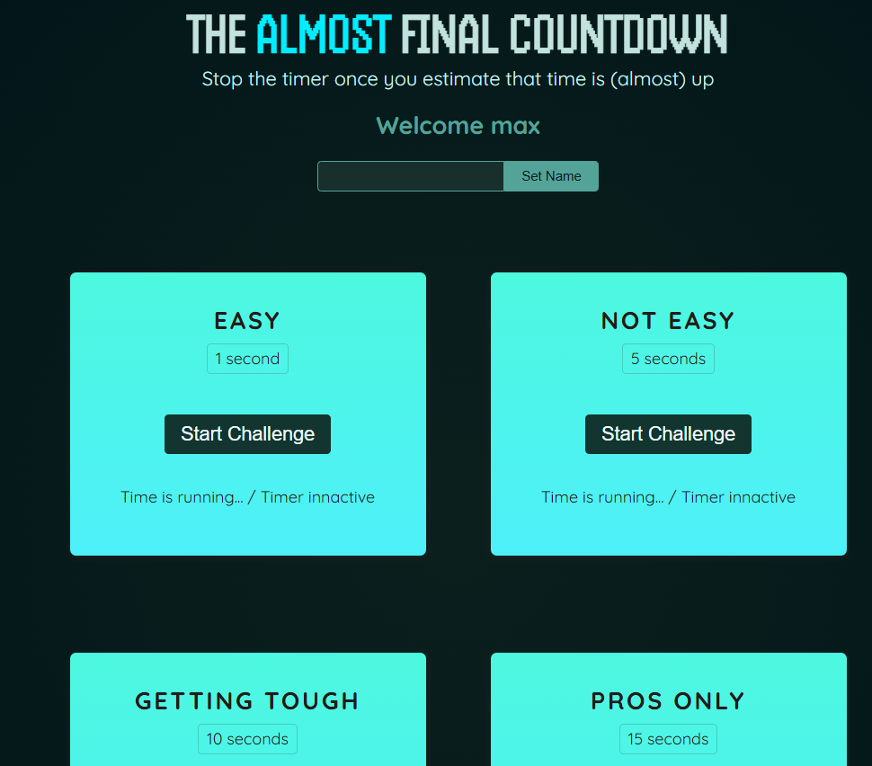

<details>
<summary>Module Introduction & Starting Project</summary>

**Refs & Portals**

*Advanced DOM Access & Value Management*

- Accessing *DOM Elements* with *Refs*
- *Managing Values* with Refs
- *Expossing API Functions* from Components
- *Detaching DOM Rendering* from JSX Structure with *Portals*

Next, just do the command **npm install** from the provided file here : 

https://github.com/academind/react-complete-guide-course-resources/blob/main/attachments/08%20Refs%20Portals/01-starting-project.zip

and then **npm run dev** to know what is inside


</details>

<details>
<summary>Repetition : Managing User Input with State (Two Way-Binding)</summary>

In Player.jsx file we can add useState('') with an empty parameter for the first step.

First file of Player.jsx is :

```javascript

export default function Player() {
  return (
    <section id="player">
      <h2>Welcome unknown entity</h2>
      <p>
        <input type="text" />
        <button>Set Name</button>
      </p>
    </section>
  );
}

```

The code of Player.jsx after we add useState and also we should add a function like handleChange() etc.

```javascript
import { useState } from 'react';

export default function Player() {
  const [enteredPlayerName, setEnteredPlayerName] = useState(null);
  const [submitted, setSubmitted] = useState(falsee);

  function handleChange(event) {
    setSubmitted(false);
    setEnteredPlayerName(event.target.value);
  }

  function handleClick() {
    setSubmitted(true);
  }

  return (
    <section id="player">
      <h2>Welcome {submitted ? enteredPlayerName : 'unknown entiry'}</h2>
      <p>
        <input type="text" onChange={handleChange} value={enteredPlayerName} />
        <button onClick={handleClick}>Set Name</button>
      </p>
    </section>
  );
}

```

Note : The codes above is not a greate way to write there, will continue in the next lecture.

</details>

<details>
<summary>Repetition : Fragments</summary>

In earlier versions of this course, this section also introduced the concept of "React Fragments" (

```javascript
<Fragment> ... </Fragment> or <> ... </>).
```

The newer version of the course already introduced this concept in the "React Essentials" sections.

But since it's a key concept that will be used throughout the entire course (and, in general, in pretty much all React projects), it's time for a brief refresher!

When writing JSX code, there's one important rule: A JSX value must have only one root element.

For example, the following code would be invalid and cause an error:

```javascript
return (
  <h2>Welcome!</h2>
  <p>React is awesome!</p>
);
```

So would this code:

```javascript
const content = (
  <h2>Welcome!</h2>
  <p>React is awesome!</p>
);
```

In both snippets, the JSX value has two sibling root elements - and that's not allowed!

One solution would be to wrap these elements into a <div> - which then acts as a single root JSX element:

```javascript
return (
  <div>
    <h2>Welcome!</h2>
    <p>React is awesome!</p>
  </div>
);
```

This would work and therefore is an acceptable solution.

But it has a downside: You now have that extra <div> in your DOM - even though you don't really need it (besides for getting rid of the this error).

That's why React offers a better solution: A special JSX element called "React Fragment".

It can be used as a wrapper to ensure that there's only one root JSX element whilst at the same time not rendering any DOM element.

You can use it like this:

```javascript
import { Fragment } from 'react';
 
// ... other code ...
 
return (
  <Fragment>
    <h2>Welcome!</h2>
    <p>React is awesome!</p>
  </Fragment>
);
```

Most React projects (e.g., projects created with Vite or create-react-app) offer an even shorter form:

```javascript
// no import needed
 
return (
  <>
    <h2>Welcome!</h2>
    <p>React is awesome!</p>
  </>
);
```

</details>

<details>
<summary>Introducing Refs : Connecting & Accessing HTML elements via Refs</summary>

We still process on Player.jsx file. First we just importing useRef

And here is the codes after modified again, important to note when we run on the browser, so we input our name, it would be displayed on it as we can see below capture.

```javascript
import { useState, useRef } from 'react';

export default function Player() {
  const PlayerName = useRef();

  const [enteredPlayerName, setEnteredPlayerName] = useState(null);

  function handleClick() {
    setEnteredPlayerName(PlayerName.current.value);
  }

  return (
    <section id="player">
      <h2>Welcome {enteredPlayerName ?? 'unknown entiry'}</h2>
      <p>
        <input ref={PlayerName} type="text" />
        <button onClick={handleClick}>Set Name</button>
      </p>
    </section>
  );
}

```


</details>

<details>
<summary>Manipulating the DOM via Refs</summary>

First we should input on handleClick at Player.jsx file some codes playerName.current.value = ''. We have to set the value into an empty string.

```javascript
import { useState, useRef } from 'react';

export default function Player() {
  const PlayerName = useRef();

  const [enteredPlayerName, setEnteredPlayerName] = useState(null);

  function handleClick() {
    setEnteredPlayerName(PlayerName.current.value);
    PlayerName.current.value = '';
  }

  return (
    <section id="player">
      <h2>Welcome {enteredPlayerName ?? 'unknown entiry'}</h2>
      <p>
        <input ref={PlayerName} type="text" />
        <button onClick={handleClick}>Set Name</button>
      </p>
    </section>
  );
}

```
</details>

<details>
<summary>Refs vs State Values</summary>

**State**

- Causes component re-evaluation (re-execution) when changed
- Should be used for values that are directly reflected in the UI
- Should not be used for "Behind the scenes" values that have no direct UI impact

**Refs**

- Do not cause component re-evaluation when changed
- Can be used to gain direct DOM element access (-> gret for reading values or accessing certain browsers APIs)


For instance we can command the codes below and change some codes on return on a Player.jsx file

From 

```javascript
import { useState, useRef } from 'react';

export default function Player() {
  const PlayerName = useRef();

  const [enteredPlayerName, setEnteredPlayerName] = useState(null);

  function handleClick() {
    setEnteredPlayerName(PlayerName.current.value);
    PlayerName.current.value = '';
  }

  return (
    <section id="player">
      <h2>Welcome {enteredPlayerName ?? 'unknown entiry'}</h2>
      <p>
        <input ref={PlayerName} type="text" />
        <button onClick={handleClick}>Set Name</button>
      </p>
    </section>
  );
}

```

To 

```javascript
import { useState, useRef } from 'react';

export default function Player() {
  const PlayerName = useRef();

  //const [enteredPlayerName, setEnteredPlayerName] = useState(null);

  function handleClick() {
    //setEnteredPlayerName(PlayerName.current.value);
    PlayerName.current.value = '';
  }

  return (
    <section id="player">
      <h2>Welcome {PlayerName.current ? PlayerName.current.value : 'unknown entiry'}</h2>
      <p>
        <input ref={PlayerName} type="text" />
        <button onClick={handleClick}>Set Name</button>
      </p>
    </section>
  );
}

```

Note : The logic on h2 we change like above codes, and the result is different. WHen we input our name. There's no change on there.


The we should go back into the first code to make it normal again.

</details>

<details>
<summary>Adding Challenges to the Demo Project</summary>

To know about this lesson deeper. We should create a new file on a component folder. Here for example we create TimerChallenge.jsx file

```javascript
export default function TimerChallenge({ title, targetTime }) {
    return (
        <section className="challenge">
            <h2>{title}</h2>
            <p className="challenge-time">
                {targetTime} second{targetTime > 1 ? 's' : ''}
            </p>
            <p>
                <button>
                    Start Challenge
                </button>
            </p>
            <p className="">
                Time is running... / Timer innactive
            </p>
        </section>
    )
}
```

So on App.jsx file we could add TimerChallenge

```javascript
import Player from './components/Player.jsx';
import TimerChallenge from './components/TimerChallenge.jsx';

function App() {
  return (
    <>
      <Player />
      <div id="challenges">
        <TimerChallenge title="Easy" targetTime={1} />
        <TimerChallenge title="Not Easy" targetTime={5} />
        <TimerChallenge title="Getting tough" targetTime={10} />
        <TimerChallenge title="Pros Only" targetTime={15} />
      </div>
    </>
  );
}

export default App;

```

So the results should be :




</details>
