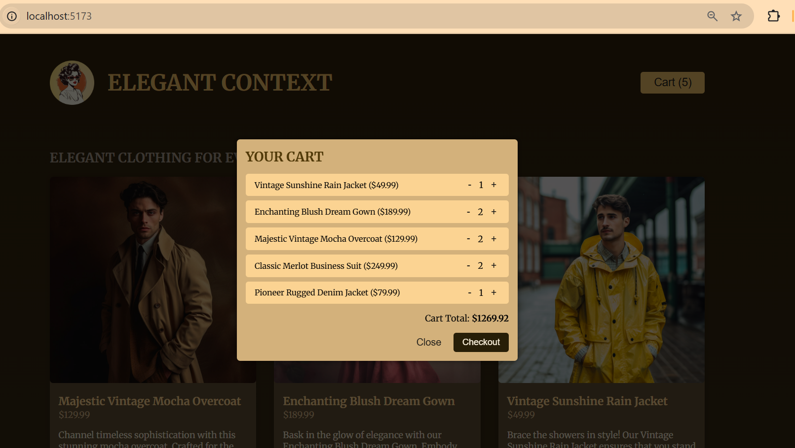
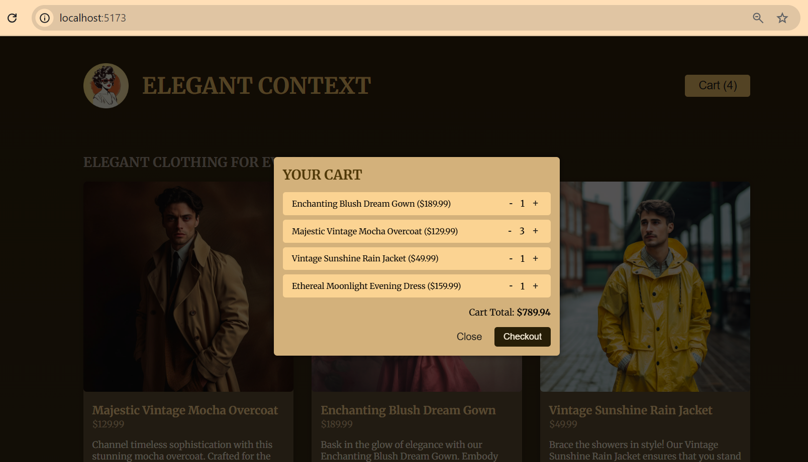
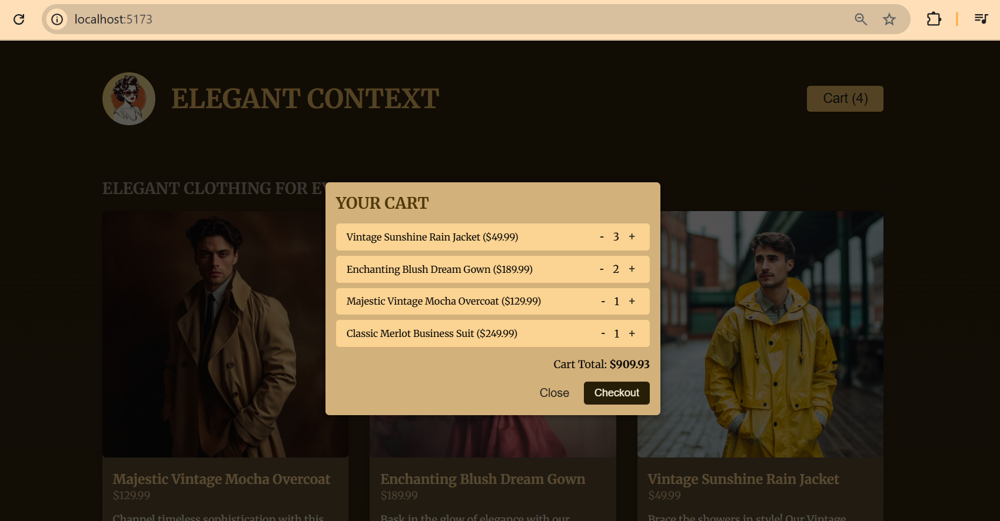

<details>
<summary>Module Introduction</summary>

**Advanced State Management**
*Beyond Basic App & Lifting Up State*

- The Problem of Shared State : Prop Drilling
- Embracing **Component Composition**
- Sharing State with **Context**
- Managing Complex State with **Reducers**
</details>

<details>
<summary>Understanding Pop Drilling & Project Overview</summary>

Here is the link of the sources we can download for references :

https://github.com/academind/react-complete-guide-course-resources/blob/main/attachments/10%20Advanced%20State%20Management%20with%20Context%20useReducer/01-starting-project.zip

</details>

<details>
<summary>Pop Drilling: Component Composition as a Solution</summary>

do **run npm install** and we'll see the result below :


Before we run into several components here, these are files to be known :

*App.jsx*

```javascript
import { useState } from 'react';

import Header from './components/Header.jsx';
import Shop from './components/Shop.jsx';
import { DUMMY_PRODUCTS } from './dummy-products.js';

function App() {
  const [shoppingCart, setShoppingCart] = useState({
    items: [],
  });

  function handleAddItemToCart(id) {
    setShoppingCart((prevShoppingCart) => {
      const updatedItems = [...prevShoppingCart.items];

      const existingCartItemIndex = updatedItems.findIndex(
        (cartItem) => cartItem.id === id
      );
      const existingCartItem = updatedItems[existingCartItemIndex];

      if (existingCartItem) {
        const updatedItem = {
          ...existingCartItem,
          quantity: existingCartItem.quantity + 1,
        };
        updatedItems[existingCartItemIndex] = updatedItem;
      } else {
        const product = DUMMY_PRODUCTS.find((product) => product.id === id);
        updatedItems.push({
          id: id,
          name: product.title,
          price: product.price,
          quantity: 1,
        });
      }

      return {
        items: updatedItems,
      };
    });
  }

  function handleUpdateCartItemQuantity(productId, amount) {
    setShoppingCart((prevShoppingCart) => {
      const updatedItems = [...prevShoppingCart.items];
      const updatedItemIndex = updatedItems.findIndex(
        (item) => item.id === productId
      );

      const updatedItem = {
        ...updatedItems[updatedItemIndex],
      };

      updatedItem.quantity += amount;

      if (updatedItem.quantity <= 0) {
        updatedItems.splice(updatedItemIndex, 1);
      } else {
        updatedItems[updatedItemIndex] = updatedItem;
      }

      return {
        items: updatedItems,
      };
    });
  }

  return (
    <>
      <Header
        cart={shoppingCart}
        onUpdateCartItemQuantity={handleUpdateCartItemQuantity}
      />
      <Shop onAddItemToCart={handleAddItemToCart} />
    </>
  );
}

export default App;

```

*Shop.jsx*

```javascript
import { DUMMY_PRODUCTS } from '../dummy-products.js';
import Product from './Product.jsx';

export default function Shop({ onAddItemToCart }) {
  return (
    <section id="shop">
      <h2>Elegant Clothing For Everyone</h2>

      <ul id="products">
        {DUMMY_PRODUCTS.map((product) => (
          <li key={product.id}>
            <Product {...product} onAddToCart={onAddItemToCart} />
          </li>
        ))}
      </ul>
    </section>
  );
}

```

*dummy-proudcts.js*

```javascript
import mochaOvercoat from './assets/mocha-overcoat.jpg';
import dreamGown from './assets/dream-gown.jpg';
import rainJacket from './assets/rain-jacket.jpg';
import merlotSuit from './assets/merlot-suit.jpg';
import moonlightDress from './assets/moonlight-dress.jpg';
import denimPioneer from './assets/denim-pioneer.jpg';

export const DUMMY_PRODUCTS = [
  {
    id: 'p1',
    image: mochaOvercoat,
    title: 'Majestic Vintage Mocha Overcoat',
    price: 129.99,
    description:
      'Channel timeless sophistication with this stunning mocha overcoat. Crafted for the discerning gentleman who appreciates the fine blend of vintage charm and modern elegance.',
  },
  {
    id: 'p2',
    image: dreamGown,
    title: 'Enchanting Blush Dream Gown',
    price: 189.99,
    description:
      'Bask in the glow of elegance with our Enchanting Blush Dream Gown. Embody the regality of a queen with a sweet touch of pink that whispers enchantment. This is the perfect piece for those seeking to create unforgettable moments.',
  },

  {
    id: 'p3',
    image: rainJacket,
    title: 'Vintage Sunshine Rain Jacket',
    price: 49.99,
    description:
      'Brace the showers in style! Our Vintage Sunshine Rain Jacket ensures that you stand out, even in the dullest weather. Because rain is never a reason to compromise on your fashion quotient.',
  },
  {
    id: 'p4',
    image: merlotSuit,
    title: 'Classic Merlot Business Suit',
    price: 249.99,
    description:
    'Step into the boardroom with unmatched confidence in our Classic Merlot Business Suit. Exuding an air of refined class and understated power, it is ideal for the modern executive who values tradition and elegance.',
    },
    {
    id: 'p5',
    image: moonlightDress,
    title: 'Ethereal Moonlight Evening Dress',
    price: 159.99,
    description:
    'Sweep the room off its feet in our Ethereal Moonlight Evening Dress. Crafted to mimic the allure of the moonlight, this dress is a nod to those who appreciate subtle glamour and a standout silhouette.',
    },
    {
    id: 'p6',
    image: denimPioneer,
    title: 'Pioneer Rugged Denim Jacket',
    price: 79.99,
    description:
    'Our Pioneer Rugged Denim Jacket is a tribute to those who embody the spirit of adventure. Designed with durability and comfort in mind, this jacket is a wardrobe essential for the urban explorer.'
    }
];

```

First, let's open the file of *Shop.jsx* and cut the code below into *App.jsx* file component.

This below codes from *Shop.jsx* component file and cut them
```javascript
        {DUMMY_PRODUCTS.map((product) => (
          <li key={product.id}>
            <Product {...product} onAddToCart={onAddItemToCart} />
          </li>
        ))}
```

paste in *App.jsx*, in tag of <Shop
```javascript
  return (
    <>
      <Header
        cart={shoppingCart}
        onUpdateCartItemQuantity={handleUpdateCartItemQuantity}
      />
      <Shop onAddItemToCart={handleAddItemToCart}>
        {DUMMY_PRODUCTS.map((product) => (
          <li key={product.id}>
            <Product {...product} onAddToCart={onAddItemToCart} />
          </li>
        ))}
      </Shop>
    </>
  );
```

and also import the DUMMY and the Product.jsx on *App.jsx* component

```javascript
import Product from './components/Product.jsx';
import { DUMMY_PRODUCTS } from './dummy-products.js';
```

afterward we can replace on tag of Shop in App.jsx from onAddToCart={onAddItemToCart} into onAddToCart={handleAddItemToCart} and also deleting onAddItemToCart={handleAddItemToCart} in the tag Shop

```javascript
import { useState } from 'react';

import Header from './components/Header.jsx';
import Shop from './components/Shop.jsx';
import { DUMMY_PRODUCTS } from './dummy-products.js';

function App() {
  const [shoppingCart, setShoppingCart] = useState({
    items: [],
  });

  function handleAddItemToCart(id) {
    setShoppingCart((prevShoppingCart) => {
      const updatedItems = [...prevShoppingCart.items];

      const existingCartItemIndex = updatedItems.findIndex(
        (cartItem) => cartItem.id === id
      );
      const existingCartItem = updatedItems[existingCartItemIndex];

      if (existingCartItem) {
        const updatedItem = {
          ...existingCartItem,
          quantity: existingCartItem.quantity + 1,
        };
        updatedItems[existingCartItemIndex] = updatedItem;
      } else {
        const product = DUMMY_PRODUCTS.find((product) => product.id === id);
        updatedItems.push({
          id: id,
          name: product.title,
          price: product.price,
          quantity: 1,
        });
      }

      return {
        items: updatedItems,
      };
    });
  }

  function handleUpdateCartItemQuantity(productId, amount) {
    setShoppingCart((prevShoppingCart) => {
      const updatedItems = [...prevShoppingCart.items];
      const updatedItemIndex = updatedItems.findIndex(
        (item) => item.id === productId
      );

      const updatedItem = {
        ...updatedItems[updatedItemIndex],
      };

      updatedItem.quantity += amount;

      if (updatedItem.quantity <= 0) {
        updatedItems.splice(updatedItemIndex, 1);
      } else {
        updatedItems[updatedItemIndex] = updatedItem;
      }

      return {
        items: updatedItems,
      };
    });
  }

  return (
    <>
      <Header
        cart={shoppingCart}
        onUpdateCartItemQuantity={handleUpdateCartItemQuantity}
      />
      <Shop>
        {DUMMY_PRODUCTS.map((product) => (
          <li key={product.id}>
            <Product {...product} onAddToCart={handleAddItemToCart} />
          </li>
        ))}
      </Shop>
    </>
  );
}

export default App;

```

So we replace the props on function of export default function Shop({ onAddItemToCart }) into props {children}

```javascript
import { DUMMY_PRODUCTS } from '../dummy-products.js';
import Product from './Product.jsx';

export default function Shop({ children }) {
  return (
    <section id="shop">
      <h2>Elegant Clothing For Everyone</h2>

      <ul id="products">{children}</ul>
    </section>
  );
}

```

Both files here updated :

```javascript
import { useState } from 'react';

import Header from './components/Header.jsx';
import Shop from './components/Shop.jsx';
import Product from './components/Product.jsx';
import { DUMMY_PRODUCTS } from './dummy-products.js';

function App() {
  const [shoppingCart, setShoppingCart] = useState({
    items: [],
  });

  function handleAddItemToCart(id) {
    setShoppingCart((prevShoppingCart) => {
      const updatedItems = [...prevShoppingCart.items];

      const existingCartItemIndex = updatedItems.findIndex(
        (cartItem) => cartItem.id === id
      );
      const existingCartItem = updatedItems[existingCartItemIndex];

      if (existingCartItem) {
        const updatedItem = {
          ...existingCartItem,
          quantity: existingCartItem.quantity + 1,
        };
        updatedItems[existingCartItemIndex] = updatedItem;
      } else {
        const product = DUMMY_PRODUCTS.find((product) => product.id === id);
        updatedItems.push({
          id: id,
          name: product.title,
          price: product.price,
          quantity: 1,
        });
      }

      return {
        items: updatedItems,
      };
    });
  }

  function handleUpdateCartItemQuantity(productId, amount) {
    setShoppingCart((prevShoppingCart) => {
      const updatedItems = [...prevShoppingCart.items];
      const updatedItemIndex = updatedItems.findIndex(
        (item) => item.id === productId
      );

      const updatedItem = {
        ...updatedItems[updatedItemIndex],
      };

      updatedItem.quantity += amount;

      if (updatedItem.quantity <= 0) {
        updatedItems.splice(updatedItemIndex, 1);
      } else {
        updatedItems[updatedItemIndex] = updatedItem;
      }

      return {
        items: updatedItems,
      };
    });
  }

  return (
    <>
      <Header
        cart={shoppingCart}
        onUpdateCartItemQuantity={handleUpdateCartItemQuantity}
      />
      <Shop>
        {DUMMY_PRODUCTS.map((product) => (
          <li key={product.id}>
            <Product {...product} onAddToCart={handleAddItemToCart} />
          </li>
        ))}
      </Shop>
    </>
  );
}

export default App;

```

*Shop.jsx*

```javascript
import { DUMMY_PRODUCTS } from '../dummy-products.js';
import Product from './Product.jsx';

export default function Shop({ children }) {
  return (
    <section id="shop">
      <h2>Elegant Clothing For Everyone</h2>

      <ul id="products">{children}</ul>
    </section>
  );
}

```

</details>

<details>
<summary>Introducing the Context API</summary>
</details>

<details>
<summary>Creating & Providing The Context</summary>

In **src** folder we create new folder named **store** . So inside store folder we can create *shopping-cart-context.jsx* file name. And in that file we should import createContext from react.

```javascript
import { createContext } from 'react';

export const CartContext = createContext({
    items: []
});
```

Then go to *App.jsx* file and import the file of *shopping-cart-context.jsx* and after return code use the Wrap CartContext tag

```javascript
import { CartContext } from './store/shopping-cart-context.jsx';
```

From this :
```javascript
return (
    <>
      <Header
        cart={shoppingCart}
        onUpdateCartItemQuantity={handleUpdateCartItemQuantity}
      />
      <Shop>
        {DUMMY_PRODUCTS.map((product) => (
          <li key={product.id}>
            <Product {...product} onAddToCart={handleAddItemToCart} />
          </li>
        ))}
      </Shop>
    </>
  );
```

To :
```javascript
return (
    <CartContext>
      <Header
        cart={shoppingCart}
        onUpdateCartItemQuantity={handleUpdateCartItemQuantity}
      />
      <Shop>
        {DUMMY_PRODUCTS.map((product) => (
          <li key={product.id}>
            <Product {...product} onAddToCart={handleAddItemToCart} />
          </li>
        ))}
      </Shop>
    </CartContext>
  );
```

Note : But when we use the old version of react the wrapper of the tag in CartContext we can call Provider like this :

```javascript
  return (
    <CartContext.Provider>
      <Header
        cart={shoppingCart}
        onUpdateCartItemQuantity={handleUpdateCartItemQuantity}
      />
      <Shop>
        {DUMMY_PRODUCTS.map((product) => (
          <li key={product.id}>
            <Product {...product} onAddToCart={handleAddItemToCart} />
          </li>
        ))}
      </Shop>
    </CartContext.Provider>
  );
```

So here is the complete codes of *App.jsx* component file :

```javascript
import { useState } from 'react';

import Header from './components/Header.jsx';
import Shop from './components/Shop.jsx';
import Product from './components/Product.jsx';
import { DUMMY_PRODUCTS } from './dummy-products.js';
import { CartContext } from './store/shopping-cart-context.jsx';

function App() {
  const [shoppingCart, setShoppingCart] = useState({
    items: [],
  });

  function handleAddItemToCart(id) {
    setShoppingCart((prevShoppingCart) => {
      const updatedItems = [...prevShoppingCart.items];

      const existingCartItemIndex = updatedItems.findIndex(
        (cartItem) => cartItem.id === id
      );
      const existingCartItem = updatedItems[existingCartItemIndex];

      if (existingCartItem) {
        const updatedItem = {
          ...existingCartItem,
          quantity: existingCartItem.quantity + 1,
        };
        updatedItems[existingCartItemIndex] = updatedItem;
      } else {
        const product = DUMMY_PRODUCTS.find((product) => product.id === id);
        updatedItems.push({
          id: id,
          name: product.title,
          price: product.price,
          quantity: 1,
        });
      }

      return {
        items: updatedItems,
      };
    });
  }

  function handleUpdateCartItemQuantity(productId, amount) {
    setShoppingCart((prevShoppingCart) => {
      const updatedItems = [...prevShoppingCart.items];
      const updatedItemIndex = updatedItems.findIndex(
        (item) => item.id === productId
      );

      const updatedItem = {
        ...updatedItems[updatedItemIndex],
      };

      updatedItem.quantity += amount;

      if (updatedItem.quantity <= 0) {
        updatedItems.splice(updatedItemIndex, 1);
      } else {
        updatedItems[updatedItemIndex] = updatedItem;
      }

      return {
        items: updatedItems,
      };
    });
  }

  return (
    <CartContext.Provider>
      <Header
        cart={shoppingCart}
        onUpdateCartItemQuantity={handleUpdateCartItemQuantity}
      />
      <Shop>
        {DUMMY_PRODUCTS.map((product) => (
          <li key={product.id}>
            <Product {...product} onAddToCart={handleAddItemToCart} />
          </li>
        ))}
      </Shop>
    </CartContext.Provider>
  );
}

export default App;

```
</details>

<details>
<summary>Consuming The Context</summary>

In this section we should add the import CartContext and useContext on *Cart.jsx* component file.
Also modify some codes into an items code such below :

```javascript
import { useContext } from 'react';

import { CartContext } from "../store/shopping-cart-context";

export default function Cart({ onUpdateItemQuantity }) {
  const cartCtx = useContext(CartContext);

  const totalPrice = cartCtx.items.reduce(
    (acc, item) => acc + item.price * item.quantity,
    0
  );
  const formattedTotalPrice = `$${totalPrice.toFixed(2)}`;

  return (
    <div id="cart">
      {cartCtx.items.length === 0 && <p>No items in cart!</p>}
      {cartCtx.items.length > 0 && (
        <ul id="cart-items">
          {cartCtx.items.map((item) => {
            const formattedPrice = `$${item.price.toFixed(2)}`;

            return (
              <li key={item.id}>
                <div>
                  <span>{item.name}</span>
                  <span> ({formattedPrice})</span>
                </div>
                <div className="cart-item-actions">
                  <button onClick={() => onUpdateItemQuantity(item.id, -1)}>
                    -
                  </button>
                  <span>{item.quantity}</span>
                  <button onClick={() => onUpdateItemQuantity(item.id, 1)}>
                    +
                  </button>
                </div>
              </li>
            );
          })}
        </ul>
      )}
      <p id="cart-total-price">
        Cart Total: <strong>{formattedTotalPrice}</strong>
      </p>
    </div>
  );
}
```

So in *App.jsx* component file we should add the value after the tag of CartContext.Provider

```javascript
return (
    <CartContext.Provider value={{ items: [] }}>
      <Header
        cart={shoppingCart}
        onUpdateCartItemQuantity={handleUpdateCartItemQuantity}
      />
      <Shop>
        {DUMMY_PRODUCTS.map((product) => (
          <li key={product.id}>
            <Product {...product} onAddToCart={handleAddItemToCart} />
          </li>
        ))}
      </Shop>
    </CartContext.Provider>
  );
```

And here is the full codes of *App.jsx* component after updated or modified

```javascript
import { useState } from 'react';

import Header from './components/Header.jsx';
import Shop from './components/Shop.jsx';
import Product from './components/Product.jsx';
import { DUMMY_PRODUCTS } from './dummy-products.js';
import { CartContext } from './store/shopping-cart-context.jsx';

function App() {
  const [shoppingCart, setShoppingCart] = useState({
    items: [],
  });

  function handleAddItemToCart(id) {
    setShoppingCart((prevShoppingCart) => {
      const updatedItems = [...prevShoppingCart.items];

      const existingCartItemIndex = updatedItems.findIndex(
        (cartItem) => cartItem.id === id
      );
      const existingCartItem = updatedItems[existingCartItemIndex];

      if (existingCartItem) {
        const updatedItem = {
          ...existingCartItem,
          quantity: existingCartItem.quantity + 1,
        };
        updatedItems[existingCartItemIndex] = updatedItem;
      } else {
        const product = DUMMY_PRODUCTS.find((product) => product.id === id);
        updatedItems.push({
          id: id,
          name: product.title,
          price: product.price,
          quantity: 1,
        });
      }

      return {
        items: updatedItems,
      };
    });
  }

  function handleUpdateCartItemQuantity(productId, amount) {
    setShoppingCart((prevShoppingCart) => {
      const updatedItems = [...prevShoppingCart.items];
      const updatedItemIndex = updatedItems.findIndex(
        (item) => item.id === productId
      );

      const updatedItem = {
        ...updatedItems[updatedItemIndex],
      };

      updatedItem.quantity += amount;

      if (updatedItem.quantity <= 0) {
        updatedItems.splice(updatedItemIndex, 1);
      } else {
        updatedItems[updatedItemIndex] = updatedItem;
      }

      return {
        items: updatedItems,
      };
    });
  }

  return (
    <CartContext.Provider value={{ items: [] }}>
      <Header
        cart={shoppingCart}
        onUpdateCartItemQuantity={handleUpdateCartItemQuantity}
      />
      <Shop>
        {DUMMY_PRODUCTS.map((product) => (
          <li key={product.id}>
            <Product {...product} onAddToCart={handleAddItemToCart} />
          </li>
        ))}
      </Shop>
    </CartContext.Provider>
  );
}

export default App;

```
</details>

<details>
<summary>Linking the Context to State</summary>

In *App.jsx* component we can create const named ctxValue and replace the items like this :

```javascript
const ctxValue = {
    items: shoppingCart.items,
    addItemToCart: handleAddItemToCart
  };

  return (
    <CartContext.Provider value={ctxValue}>
```

So we can open the component of *Product.jsx* and remove the props of onAddToCart, importing useContext and CartContext, and making a const.

```javascript
import { useContext } from 'react';

import { CartContext } from "../store/shopping-cart-context";

export default function Product({id, image, title, price, description,}) {
  const { addItemToCart } = useContext(CartContext);

  return (
    <article className="product">
      
      <div className="product-content">
        <div>
          <h3>{title}</h3>
          <p className='product-price'>${price}</p>
          <p>{description}</p>
        </div>
        <p className='product-actions'>
          <button onClick={() => addItemToCart(id)}>Add to Cart</button>
        </p>
      </div>
    </article>
  );
}

```

And on *shopping-cart-jsx* component we can add addItemToCart: () => {}, 

```javascript
import { createContext } from 'react';

export const CartContext = createContext({
    items: [],
    addItemToCart: () => {},
});
```

And here is the complete code of *App.jsx* component :

```javascript
import { useState } from 'react';

import Header from './components/Header.jsx';
import Shop from './components/Shop.jsx';
import Product from './components/Product.jsx';
import { DUMMY_PRODUCTS } from './dummy-products.js';
import { CartContext } from './store/shopping-cart-context.jsx';

function App() {
  const [shoppingCart, setShoppingCart] = useState({
    items: [],
});

  function handleAddItemToCart(id) {
    setShoppingCart((prevShoppingCart) => {
      const updatedItems = [...prevShoppingCart.items];

      const existingCartItemIndex = updatedItems.findIndex(
        (cartItem) => cartItem.id === id
      );
      const existingCartItem = updatedItems[existingCartItemIndex];

      if (existingCartItem) {
        const updatedItem = {
          ...existingCartItem,
          quantity: existingCartItem.quantity + 1,
        };
        updatedItems[existingCartItemIndex] = updatedItem;
      } else {
        const product = DUMMY_PRODUCTS.find((product) => product.id === id);
        updatedItems.push({
          id: id,
          name: product.title,
          price: product.price,
          quantity: 1,
        });
      }

      return {
        items: updatedItems,
      };
    });
  }

  function handleUpdateCartItemQuantity(productId, amount) {
    setShoppingCart((prevShoppingCart) => {
      const updatedItems = [...prevShoppingCart.items];
      const updatedItemIndex = updatedItems.findIndex(
        (item) => item.id === productId
      );

      const updatedItem = {
        ...updatedItems[updatedItemIndex],
      };

      updatedItem.quantity += amount;

      if (updatedItem.quantity <= 0) {
        updatedItems.splice(updatedItemIndex, 1);
      } else {
        updatedItems[updatedItemIndex] = updatedItem;
      }

      return {
        items: updatedItems,
      };
    });
  }

  const ctxValue = {
    items: shoppingCart.items,
    addItemToCart: handleAddItemToCart
  };

  return (
    <CartContext.Provider value={ctxValue}>
      <Header
        cart={shoppingCart}
        onUpdateCartItemQuantity={handleUpdateCartItemQuantity}
      />
      <Shop>
        {DUMMY_PRODUCTS.map((product) => (
          <li key={product.id}>
            <Product {...product} onAddToCart={handleAddItemToCart} />
          </li>
        ))}
      </Shop>
    </CartContext.Provider>
  );
}

export default App;

```

So if we save this and look on the website :


</details>

<details>
<summary>A Different Way of Consuming Context</summary>

On *Cart.jsx* we can use also the code like this :

```javascript
import { useContext } from 'react';

import { CartContext } from "../store/shopping-cart-context";

export default function Cart({ onUpdateItemQuantity }) {
  // const { items } = useContext(CartContext);

  

  return (
    <CartContext.Consumer>
      {(cartCtx) => {
          const totalPrice = cartCtx.items.reduce(
            (acc, item) => acc + item.price * item.quantity,
            0
          );
          const formattedTotalPrice = `$${totalPrice.toFixed(2)}`;
        return (
          <div id="cart">
            {cartCtx.items.length === 0 && <p>No items in cart!</p>}
            {cartCtx.items.length > 0 && (
              <ul id="cart-items">
                {cartCtx.items.map((item) => {
                  const formattedPrice = `$${item.price.toFixed(2)}`;

                  return (
                    <li key={item.id}>
                    <div>
                      <span>{item.name}</span>
                      <span> ({formattedPrice})</span>
                    </div>
                    <div className="cart-item-actions">
                      <button onClick={() => onUpdateItemQuantity(item.id, -1)}>
                        -
                      </button>
                      <span>{item.quantity}</span>
                      <button onClick={() => onUpdateItemQuantity(item.id, 1)}>
                        +
                      </button>
                    </div>
                    </li>
                  );
              })}
              </ul>
            )}
            <p id="cart-total-price">
              Cart Total: <strong>{formattedTotalPrice}</strong>
            </p>
          </div>
        )
      }}
    </CartContext.Consumer>
  );
}

```

Note : By using the tag of <CartContext.Cunsumer ,
wrapped the code as above, but we can undo this and use the previous codes because it more simple

```javascript
import { useContext } from 'react';

import { CartContext } from "../store/shopping-cart-context";

export default function Cart({ onUpdateItemQuantity }) {
  const { items } = useContext(CartContext);

  const totalPrice = items.reduce(
    (acc, item) => acc + item.price * item.quantity,
    0
  );
  const formattedTotalPrice = `$${totalPrice.toFixed(2)}`;

  return (
    <div id="cart">
      {items.length === 0 && <p>No items in cart!</p>}
      {items.length > 0 && (
        <ul id="cart-items">
          {items.map((item) => {
            const formattedPrice = `$${item.price.toFixed(2)}`;

            return (
              <li key={item.id}>
                <div>
                  <span>{item.name}</span>
                  <span> ({formattedPrice})</span>
                </div>
                <div className="cart-item-actions">
                  <button onClick={() => onUpdateItemQuantity(item.id, -1)}>
                    -
                  </button>
                  <span>{item.quantity}</span>
                  <button onClick={() => onUpdateItemQuantity(item.id, 1)}>
                    +
                  </button>
                </div>
              </li>
            );
          })}
        </ul>
      )}
      <p id="cart-total-price">
        Cart Total: <strong>{formattedTotalPrice}</strong>
      </p>
    </div>
  );
}
```
</details>

<details>
<summary>What Happens When Context Values Change?</summary>

Now, there's one other thing you must know

about consuming and using context values in components.

And that is something which you might actually

already have guessed.

When you do access a context value in a component

and that value then changes the component function

that accesses the context value,

will get re-executed by React,

just as the component function would also get re-executed

if it would be using some internal state that was updated

or if its parent component were executed again.

Just as a component function gets re-executed

by React in such situations,

it also gets re-executed

if a component function uses the useContext hook

and therefore is connected to some context value.

And that value changes because, of course,

the component must be executed again in such situations

because otherwise, the UI wouldn't be updated.

And that's why React will re-execute a component function

if it's connected context value changes so that

that component function can then

produce some new user interface.
</details>

<details>
<summary>Migrating the Entire Demo Project to use the Context API</summary>

So to fully migrate to context here, I'll start by removing this onAddToCart prop on the product component on *App.jsx*.

```javascript
      <Shop>
        {DUMMY_PRODUCTS.map((product) => (
          <li key={product.id}>
            <Product {...product} onAddToCart={handleAddItemToCart} />
          </li>
        ))}
      </Shop>
```

because I already removed it inside of the product component. There I'm not expecting it anymore I'll all the remove these two props on the header component because I plan on using context for that as well so that the header component itself does not take any props anymore.

```javascript
return (
    <CartContext.Provider value={ctxValue}>
      <Header />
      <Shop>
        {DUMMY_PRODUCTS.map((product) => (
          <li key={product.id}>
            <Product {...product} />
          </li>
        ))}
      </Shop>
    </CartContext.Provider>
  );
```

Now, with that done, we can then go to the header component, for example, and in there we'll see 
that it does actually need some data from the cart. It needs the quantity of all the items in the cart, so it needs the length of the cartItems array. And previously that, of course, was extracted 
from that incoming cart prop. But now that I removed all those props, we have to find a different solution and we can import CartContext from going up a level, store/shopping-cart-context.jsx and also import the useContext hook, of course, so that in the header component function, we can reach out to our CartContext. And then from there, get this items array with the structuring, so that we have our items length here still  but we no longer wanna pass on this updating function here and also not the cartItems because those values can now be retrieved by the CartModal component itself from inside that component so that we end up with leaner code here in the header component.

```javascript
import { useRef, useContext } from 'react';

import CartModal from './CartModal.jsx';
import { CartContext } from '../store/shopping-cart-context.jsx';

export default function Header() {
  const modal = useRef();
  const { items } = useContext(CartContext);

  const cartQuantity = items.length;

  function handleOpenCartClick() {
    modal.current.open();
  }

  let modalActions = <button>Close</button>;

  if (cartQuantity > 0) {
    modalActions = (
      <>
        <button>Close</button>
        <button>Checkout</button>
      </>
    );
  }

  return (
    <>
      <CartModal ref={modal} title="Your Cart" actions={modalActions} />
      <header id="main-header">
        <div id="main-title">
          
          <h1>Elegant Context</h1>
        </div>
        <p>
          <button onClick={handleOpenCartClick}>Cart ({cartQuantity})</button>
        </p>
      </header>
    </>
  );
}

```

In the **CartModal.jsx** component, we therefore now also wanna reach out to our context. In here, we wanna import CartContext from going up one level, store/shopping-cart-context.jsx and then import useContext here from React. And just as before, of course, use this useContext hook in this CartModal component here and pass CartContext as a value to useContext. And then here I need two things. I need the items and I need this updating function. And at the moment, this function to update the quantities of items isn't exposed to my context yet.

It's not available through the context. Therefore, we must update this context value  and add a new property to this object here. The updateItemQuantity function, for example, which points at handleUpdateCartItemQuantity. I will also add it to my default value here where we create the context to get this better auto completion. Now with that, we can go back to the CartModal component

and also extract the updateItemQuantity function there.

But wait a second, do we actually need those values here?

Well, if we take a look at our code here, the answer is no

because this modal component

actually does just wrap this cart component in the end.

It does not need any cart information itself.

So what we should do is we should get rid of those props

on the cart component now and get rid of those props here

on the CartModal component, the cartItems prop

and the onUpdateCartItemQuantity prop.

And we can get rid of the context here

because we don't actually need it in this component.

And therefore, we can also get rid of these imports

because that's the advantage of using context.

You can use it in exactly the place where you need it

and you don't need to use it anywhere else.

So it's now in the Cart.jsx component

where I'm already using this context

where we can now get rid of this prop

because we're not getting a value for this prop any longer.

And where we should now instead extract

this updateItemQuantity function

from our context so that in this cart component,

we can call this updateItemQuantity function here

and here on those two buttons,

which can be clicked to edit the quantity of the cartItems.

And with that, we're now not getting any props here

in the cart component.

In the CartModal component,

we're also not getting any cart-related props anymore

and we're not setting any props here.

In the header component,

we are using the cart, but we now are not passing any props

with cart data to CartModal.

And in the App component,

we therefore also pass nothing to header,

nothing to product, or nothing cart-related to be precise.

And in the Product component, we therefore,

also don't accept any cart-related props anymore

because we're using context

in all those components to get hold

of those values and to manipulate those context values.

And with that, if you save that and reload,

this app still works as it did before.

You can still add items

to the cart and update the cart from inside it.

And this all works, but it's now all powered by this context feature, which as you see here did allow us to get rid of prop drilling.

**CartModal.jsx** *component*

```javascript
import { forwardRef, useImperativeHandle, useRef } from 'react';
import { createPortal } from 'react-dom';
import Cart from './Cart';


const CartModal = forwardRef(function Modal(
  { title, actions },
  ref
) {
  const dialog = useRef();

  useImperativeHandle(ref, () => {
    return {
      open: () => {
        dialog.current.showModal();
      },
    };
  });

  return createPortal(
    <dialog id="modal" ref={dialog}>
      <h2>{title}</h2>
      <Cart />
      <form method="dialog" id="modal-actions">
        {actions}
      </form>
    </dialog>,
    document.getElementById('modal')
  );
});

export default CartModal;

```

**App.jsx** *component*

```javascript
import { useState } from 'react';

import Header from './components/Header.jsx';
import Shop from './components/Shop.jsx';
import Product from './components/Product.jsx';
import { DUMMY_PRODUCTS } from './dummy-products.js';
import { CartContext } from './store/shopping-cart-context.jsx';

function App() {
  const [shoppingCart, setShoppingCart] = useState({
    items: [],
});

  function handleAddItemToCart(id) {
    setShoppingCart((prevShoppingCart) => {
      const updatedItems = [...prevShoppingCart.items];

      const existingCartItemIndex = updatedItems.findIndex(
        (cartItem) => cartItem.id === id
      );
      const existingCartItem = updatedItems[existingCartItemIndex];

      if (existingCartItem) {
        const updatedItem = {
          ...existingCartItem,
          quantity: existingCartItem.quantity + 1,
        };
        updatedItems[existingCartItemIndex] = updatedItem;
      } else {
        const product = DUMMY_PRODUCTS.find((product) => product.id === id);
        updatedItems.push({
          id: id,
          name: product.title,
          price: product.price,
          quantity: 1,
        });
      }

      return {
        items: updatedItems,
      };
    });
  }

  function handleUpdateCartItemQuantity(productId, amount) {
    setShoppingCart((prevShoppingCart) => {
      const updatedItems = [...prevShoppingCart.items];
      const updatedItemIndex = updatedItems.findIndex(
        (item) => item.id === productId
      );

      const updatedItem = {
        ...updatedItems[updatedItemIndex],
      };

      updatedItem.quantity += amount;

      if (updatedItem.quantity <= 0) {
        updatedItems.splice(updatedItemIndex, 1);
      } else {
        updatedItems[updatedItemIndex] = updatedItem;
      }

      return {
        items: updatedItems,
      };
    });
  }

  const ctxValue = {
    items: shoppingCart.items,
    addItemToCart: handleAddItemToCart,
    updateItemQuantity: handleUpdateCartItemQuantity,
  };

  return (
    <CartContext.Provider value={ctxValue}>
      <Header />
      <Shop>
        {DUMMY_PRODUCTS.map((product) => (
          <li key={product.id}>
            <Product {...product} />
          </li>
        ))}
      </Shop>
    </CartContext.Provider>
  );
}

export default App;

```

**Cart.jsx** *component*

```javascript
import { useContext } from 'react';

import { CartContext } from "../store/shopping-cart-context";

export default function Cart({ onUpdateItemQuantity }) {
  const { items, updateItemQuantity } = useContext(CartContext);

  const totalPrice = items.reduce(
    (acc, item) => acc + item.price * item.quantity,
    0
  );
  const formattedTotalPrice = `$${totalPrice.toFixed(2)}`;

  return (
    <div id="cart">
      {items.length === 0 && <p>No items in cart!</p>}
      {items.length > 0 && (
        <ul id="cart-items">
          {items.map((item) => {
            const formattedPrice = `$${item.price.toFixed(2)}`;

            return (
              <li key={item.id}>
                <div>
                  <span>{item.name}</span>
                  <span> ({formattedPrice})</span>
                </div>
                <div className="cart-item-actions">
                  <button onClick={() => updateItemQuantity(item.id, -1)}>
                    -
                  </button>
                  <span>{item.quantity}</span>
                  <button onClick={() => updateItemQuantity(item.id, 1)}>
                    +
                  </button>
                </div>
              </li>
            );
          })}
        </ul>
      )}
      <p id="cart-total-price">
        Cart Total: <strong>{formattedTotalPrice}</strong>
      </p>
    </div>
  );
}

```

**shopping-cart-context.jsx** *component*

```javascript
import { createContext } from 'react';

export const CartContext = createContext({
    items: [],
    addItemToCart: () => {},
    updateItemQuantity: () => {},
});
```
</details>

<details>
<summary>Outsourcing Context & State Into a Separate Provider Component</summary>

Now, as you probably can tell, this context feature can be very useful for sharing data across multiple components in your application. But at the moment, the way we're using it, we still have a pretty bloated app component. Because we're in the end, setting up the value that should be shared through our context in that component here. And whilst this works, you might wanna avoid something like this because if your app would become more complex, you might have multiple contexts in the same app, which is possible. And you might have different state values that should be shared through those different contexts. And you would therefore end up with a lot of logic in your app component since that is typically your root component and has access to all the components that might want to use a context. And therefore there is an alternative approach an alternative pattern, which you'll see in many React projects, which allows you to get all this context related data management out of the app component into a separate context component.

And we'll use this pattern here now starting in this *shopping-cart-context.jsx* file.
 Because there besides creating and sharing that context, we can also create and share a component function, a CartContextPovider component function. Though the name, of course, as always is up to you, but you, of course, wanna use descriptive component function names.

 ```javascript
import { createContext } from 'react';

export const CartContext = createContext({
    items: [],
    addItemToCart: () => {},
    updateItemQuantity: () => {},
});

export default function CartContextProvider() {
    
}
```

And since this component function will be all about managing context data and providing that data to your application and it will be all about context related to the shopping cart.

This sounds like a good name for this component function. And now the idea simply is to, in the end, grab all that state management and context value management code from inside the app component.

So starting here where we create the state with useState, including all these functions that added to the state, all the way down to where I construct this context value, I'll cut all of that from the app component hence making it much leaner. And I'll move that into that CartContextProvider component function like this so that I'm managing my state in here. 

```javascript
import { createContext } from 'react';

export const CartContext = createContext({
    items: [],
    addItemToCart: () => {},
    updateItemQuantity: () => {},
});

export default function CartContextProvider() {
    const [shoppingCart, setShoppingCart] = useState({
    items: [],
  });

  function handleAddItemToCart(id) {
    setShoppingCart((prevShoppingCart) => {
      const updatedItems = [...prevShoppingCart.items];

      const existingCartItemIndex = updatedItems.findIndex(
        (cartItem) => cartItem.id === id
      );
      const existingCartItem = updatedItems[existingCartItemIndex];

      if (existingCartItem) {
        const updatedItem = {
          ...existingCartItem,
          quantity: existingCartItem.quantity + 1,
        };
        updatedItems[existingCartItemIndex] = updatedItem;
      } else {
        const product = DUMMY_PRODUCTS.find((product) => product.id === id);
        updatedItems.push({
          id: id,
          name: product.title,
          price: product.price,
          quantity: 1,
        });
      }

      return {
        items: updatedItems,
      };
    });
  }

  function handleUpdateCartItemQuantity(productId, amount) {
    setShoppingCart((prevShoppingCart) => {
      const updatedItems = [...prevShoppingCart.items];
      const updatedItemIndex = updatedItems.findIndex(
        (item) => item.id === productId
      );

      const updatedItem = {
        ...updatedItems[updatedItemIndex],
      };

      updatedItem.quantity += amount;

      if (updatedItem.quantity <= 0) {
        updatedItems.splice(updatedItemIndex, 1);
      } else {
        updatedItems[updatedItemIndex] = updatedItem;
      }

      return {
        items: updatedItems,
      };
    });
  }

  const ctxValue = {
    items: shoppingCart.items,
    addItemToCart: handleAddItemToCart,
    updateItemQuantity: handleUpdateCartItemQuantity,
  };
}
```
Now for this to work, we must import useState in this file here. And then with this imported here in this case, we also must import Dummy Products. So here I'll import Dummy Products from going up one level and then there it's this dummyproducts.js file here in this starting product.And with that, we're managing this entire state and we're constructing this context value here in this component function.

But it's not a real component function yet, we can't use it as such because we're not returning anything renderable yet. That of course needs to change. And what I wanna return here is my CartContext provider component and the value prop here should still be set to this context value.

But now this CartContext provider component here should be wrapped around any value. This custom CartContextProvider component here will be wrapped around. So here we should accept and destructure the children prop and then use that down here in our return JSX code to in the end make sure that we wrap this CartContext provider with that value around any JSX code around any other components.

```javascript
import { createContext, useState } from 'react';
import { DUMMY_PRODUCTS } from '../dummy-products';

export const CartContext = createContext({
    items: [],
    addItemToCart: () => {},
    updateItemQuantity: () => {},
});

export default function CartContextProvider({children}) {
    const [shoppingCart, setShoppingCart] = useState({
    items: [],
  });

  function handleAddItemToCart(id) {
    setShoppingCart((prevShoppingCart) => {
      const updatedItems = [...prevShoppingCart.items];

      const existingCartItemIndex = updatedItems.findIndex(
        (cartItem) => cartItem.id === id
      );
      const existingCartItem = updatedItems[existingCartItemIndex];

      if (existingCartItem) {
        const updatedItem = {
          ...existingCartItem,
          quantity: existingCartItem.quantity + 1,
        };
        updatedItems[existingCartItemIndex] = updatedItem;
      } else {
        const product = DUMMY_PRODUCTS.find((product) => product.id === id);
        updatedItems.push({
          id: id,
          name: product.title,
          price: product.price,
          quantity: 1,
        });
      }

      return {
        items: updatedItems,
      };
    });
  }

  function handleUpdateCartItemQuantity(productId, amount) {
    setShoppingCart((prevShoppingCart) => {
      const updatedItems = [...prevShoppingCart.items];
      const updatedItemIndex = updatedItems.findIndex(
        (item) => item.id === productId
      );

      const updatedItem = {
        ...updatedItems[updatedItemIndex],
      };

      updatedItem.quantity += amount;

      if (updatedItem.quantity <= 0) {
        updatedItems.splice(updatedItemIndex, 1);
      } else {
        updatedItems[updatedItemIndex] = updatedItem;
      }

      return {
        items: updatedItems,
      };
    });
  }

  const ctxValue = {
    items: shoppingCart.items,
    addItemToCart: handleAddItemToCart,
    updateItemQuantity: handleUpdateCartItemQuantity,
  };

  return <CartContext.Provider value={ctxValue}>
    {children}
  </CartContext.Provider>
}
```
 Therefore, this shopping CartContextProvider component here will be wrapped around. So therefore we can now use this CartContextProvider component in our app component.

And there import this from shopping cart context JSX this CartContextProvider component instead of that context object. And we can get rid of useState here because I'm not managing any state in here anymore. And we can and should now use this custom component here as a wrapper around header and shop like this. So with that, we're still setting up the wrapper here but we of course got rid of all that state management logic here. 

**App.jsx**

```javascript

import Header from './components/Header.jsx';
import Shop from './components/Shop.jsx';
import Product from './components/Product.jsx';
import { DUMMY_PRODUCTS } from './dummy-products.js';
import { CartContext } from './store/shopping-cart-context.jsx';
import CartContextProvider from './store/shopping-cart-context.jsx';

function App() {
  
  return (
    <CartContextProvider>
      <Header />
      <Shop>
        {DUMMY_PRODUCTS.map((product) => (
          <li key={product.id}>
            <Product {...product} />
          </li>
        ))}
      </Shop>
    </CartContextProvider>
  );
}

export default App;

```
And with that, if you save that and you reload this app still works as it did before. 



I still have my cart here and I can change this cart but now it works through context. And we outsourced all this context and state management code into a separate component so that if you had multiple contexts and multiple pieces of independent data in the same app you could simply create multiple context files and therefore keep your app component pretty lean. Because there you would just wrap your components with that context provider component.

</details>

<details>
<summary>Introducing the useReducer Hook</summary>

So when building more complex React apps,

context can be a crucial feature since it can help

with sharing state across multiple components.

But what about the state management itself?

In this context, which we have here

we're managing this shoppingCart state.

And as you can tell

these state updating functions are rather complex.

You could say they contain a bit more logic,

at least a couple of lines of code.

And that's of course not uncommon.

But it also means that this component function,

this CartContextProvider component function

can get a bit hard to read.

And even more importantly,

as you can see I'm always using this function form

of these state updating functions.

I'm always passing a function to them

because basically almost always

if you are managing more complex state,

an object or an array or anything like that

you will need to update your state

based on the previous state snapshot.

So this is a pattern you'll use all the time.

And therefore it's also kind of annoying

to repeat this pattern all the time.

And that's why in React,

instead of managing state with useState and code like this,

you could use another state management hook

provided by React, a hook called useReducer.

in **shopping-cart-context.jsx** file

```javascript
import { createContext, useState, useReducer } from 'react';
import { DUMMY_PRODUCTS } from '../dummy-products';

export const CartContext = createContext({
    items: [],
    addItemToCart: () => {},
    updateItemQuantity: () => {},
});

export default function CartContextProvider({children}) {
    const [shoppingCart, setShoppingCart] = useState({
    items: [],
  });
```

Now what's a reducer though?

A reducer in React apps and JavaScript programming

in general is typically a function

that reduces one or more complex values to a simpler one.

So for example, that reduces an array of numbers

to a single number by adding up those numbers.

And it's that reducer function which you define

that could perform these additions.

And indeed, in this demo project, which I prepared for you

you can already see a reducer function in action

in the Cart.jsx file.

Here I'm using the built-in reduce method

that can be used on any array in JavaScript,

and that's totally independent of React

and this useReducer hook, that's really important.

This method also works outside of React projects.

I'm using this method to define my reducer function

that will be executed on all items in this items array.

And here I'm then basically just updating my cart total

based on some starting value

by adding the price of every item times the quantity

of that item in the cart to it.

That's what I'm doing here in this function.

And this therefore is such a reducer function

because it's reducing an array of items to a single number,

the total price of all those items in this case.

And now the idea behind this useReducer hook

is to use that same concept of reducing one or more values

to a typically simpler value for state management purposes.

So how do we use use reducer for state management?

Well, in a React component,

in this case in the CartContextProvider component,

you execute the useReducer hook

just as you would execute any other React hook function.

Now the useReducer hook will then give you an array

with exactly two elements,

just as useState always gives you an array

with two elements.

And here in useReducer, just as with useState,

the first element you'll get back will be your state

that's managed by useReducer.

And of course we could also name this shoppingCartState

or anything like this.

But the second value that will be part of this array,

which you get back from useReducer

will now not be a state updating function

as you know it from useState,

but instead a dispatch function

which allows you to dispatch so-called actions

that will then be handled

by a two be defined reducer function.

So here, I'll name it shoppingCartDispatch

in **shopping-cart-context.jsx** file :

```javascript
export default function CartContextProvider({children}) {
    const [ shoppingCartState, shoppingCartDispatch ] = useReducer();
```

to make it very clear that it belongs to this state.

But you could also just name it dispatch to type a bit less.

But here I'll go for shoppingCartDispatch.

So now we've got the state and such a dispatch function,

but as I just mentioned,

we now also need a reducer function

that will actually get triggered by dispatching values

and that will then produce a new state

because that's the idea behind this hook

and the reducer function we have yet to add.

So therefore here outside of this component function

I'll add a new function,

which I'll name shoppingCartReducer.

in **shopping-cart-context.jsx** file :

```javascript
function shoppingCartReducer(state, action) {

}

export default function CartContextProvider({children}) {
    const [ shoppingCartState, shoppingCartDispatch ] = useReducer();
```

And I'm defining this outside of this component function

because this function should not be recreated

whenever the component function executes

because it also won't need direct access

to any value defined or updated in the component function.

It won't need access to props or anything like that.

Hence I'm defining it outside of this component function.

And this reducer function should now accept two parameters,

a state parameter and an action parameter.

And you should accept these two parameters here

because this reducer function ultimately will be called

by React after you dispatched a so-called action,

which will also show you in a couple of minutes of course.

And the action you will then dispatch

with this dispatch function

will indeed be the action you'll receive

on that second parameter.

But again, you'll see that in action soon.

Now the state you'll get here , on the other hand

will be the guaranteed latest state snapshot

of that state that is managed by useReducer.

So just as you get that guaranteed latest state snapshot

when using that function form here

for updating the state,

React, which we'll call this reducer function for you

will make sure that you'll get the latest state here

as this first argument.

Now inside of that shoppingCartReducer function,

you should then return the updated state.

And for the moment, I'll just return the unchanged state

by just returning state like this,

though that will of course soon change.

But now with that, we have a basic,

not too helpful at the moment reducer function.

As a next step, we have to connect this reducer function

to the useReducer hook.

And to achieve this, you pass a pointer

at that reducer function as a first argument to useReducer.

Now this reducer function is registered for React

and will be executed whenever you dispatch.

Now, often you also might want to pass a second value

to useReducer because that second value allows you

to set an initial value for this state,

which will be used if the state has never been updated yet.

So basically the equivalent to what we're doing here

when we're calling useState.

This initial state I'm setting here can now be copied

and can also be set as an initial state here

for this reducer.

So that we have the initial state and the reducer function

as arguments to useReducer.

in **shopping-cart-context.jsx** file :

```javascript
function shoppingCartReducer(state, action) {
    return state;
}

export default function CartContextProvider({children}) {
    const [ shoppingCartState, shoppingCartDispatch ] = useReducer(
        shoppingCartReducer, 
        {
            items: [],
        }
    );
```

With that, this initial state will be received here

and will be returned as state.

Now we can therefore use this shoppingCartState value here,

this first element returned by useReducer

instead of the shoppingCardState we got from using useState.

So we can use this shoppingCartState down there

still in **shopping-cart-context.jsx** file

```javascript
  const ctxValue = {
    items: shoppingCartState.items,
    addItemToCart: handleAddItemToCart,
    updateItemQuantity: handleUpdateCartItemQuantity,
  };
```

where we are creating the context value

to access the items on that state.

Now at the moment, this of course means

that we'll always have an empty array of items

since that's my initial state here for my reducer.

And I am not having any logic here that would change it.

But for the moment, that's good enough.

And if you save all your files

and you reload your application,


you therefore don't get any error.

And we see that we got no items in cart here,

which makes sense.

Now, if I change my state here,

the cart doesn't update any longer of course

because now I'm getting my value

from that newly added reducer based state.

And of course there we at the moment got no logic

for updating that value,

but that will change next.

full codes of **shopping-cart-context.jsx** file :

```javascript
import { createContext, useState, useReducer } from 'react';
import { DUMMY_PRODUCTS } from '../dummy-products';

export const CartContext = createContext({
    items: [],
    addItemToCart: () => {},
    updateItemQuantity: () => {},
});

function shoppingCartReducer(state, action) {
    return state;
}

export default function CartContextProvider({children}) {
    const [ shoppingCartState, shoppingCartDispatch ] = useReducer(
        shoppingCartReducer, 
        {
            items: [],
        }
    );

    const [shoppingCart, setShoppingCart] = useState({
    items: [],
  });

  function handleAddItemToCart(id) {
    setShoppingCart((prevShoppingCart) => {
      const updatedItems = [...prevShoppingCart.items];

      const existingCartItemIndex = updatedItems.findIndex(
        (cartItem) => cartItem.id === id
      );
      const existingCartItem = updatedItems[existingCartItemIndex];

      if (existingCartItem) {
        const updatedItem = {
          ...existingCartItem,
          quantity: existingCartItem.quantity + 1,
        };
        updatedItems[existingCartItemIndex] = updatedItem;
      } else {
        const product = DUMMY_PRODUCTS.find((product) => product.id === id);
        updatedItems.push({
          id: id,
          name: product.title,
          price: product.price,
          quantity: 1,
        });
      }

      return {
        items: updatedItems,
      };
    });
  }

  function handleUpdateCartItemQuantity(productId, amount) {
    setShoppingCart((prevShoppingCart) => {
      const updatedItems = [...prevShoppingCart.items];
      const updatedItemIndex = updatedItems.findIndex(
        (item) => item.id === productId
      );

      const updatedItem = {
        ...updatedItems[updatedItemIndex],
      };

      updatedItem.quantity += amount;

      if (updatedItem.quantity <= 0) {
        updatedItems.splice(updatedItemIndex, 1);
      } else {
        updatedItems[updatedItemIndex] = updatedItem;
      }

      return {
        items: updatedItems,
      };
    });
  }

  const ctxValue = {
    items: shoppingCartState.items,
    addItemToCart: handleAddItemToCart,
    updateItemQuantity: handleUpdateCartItemQuantity,
  };

  return <CartContext.Provider value={ctxValue}>
    {children}
  </CartContext.Provider>
}
```
</details>

<details>
<summary>Dispatching Actions & Editing State with useReducer</summary>

So to now also update this state we now have to edit this a and handle different actions that should lead to different state updates. And to understand this, let's actually start by dispatching an action with help of that second element here, this shoppingCartDispatch element in my case. The idea now simply is that for example here, in handleAddItemToCart instead of having  all the state updating logic in there, we just call this this dispatch function, which we got back from use reducer and we then use it to dispatch an action. And an action can be anything you want. It can be a string with some text, it can be a number but in most cases it's an object that has a property like type or identifier inside of it so that you can tell different actions apart from each other and handle them differently inside of your reducer.

So here I'll add a type property and I'll set my type here to ADD_ITEM. So this is a string and in there I have this notation, which is just a convention you'll see in many React projects but which is not a must have. You could also have add-item like this or any identifier of your choice.

But here I'll go for ADD_ITEM written like this and with that type added here we would be able to identify this action. But this action then also has some data attached to it that will be required to perform the action the idea of the product that should be added to the cart.

And therefore I'll also add a second property to this object and this property again, can be named anything you want but often it's called payload but it could also be id or anything else.

But I'll go for payload here and my payload here is the id. So this ID, which I'm getting as a parameter here is set as a payload on this action object.

**shopping-cart-context.jsx**

```javascript
  function handleAddItemToCart(id) {
    shoppingCartDispatch({
        type: 'ADD_ITEM',
        payload: id

    });

    setShoppingCart((prevShoppingCart) => {
```

And with that action dispatched here we can go back to the Reducer function. And there whenever an action is dispatched this function will be executed and will get this action. So this argument which we passed to the dispatch function this object here for example as a value for this action parameter.

So therefore in the Reducer function we could then check if action type or whichever identifier property you chose is equal to ADD_ITEM and if it is, we can update the state accordingly in there.

And if we had more actions, we could add more if checks to also check for UPDATE_ITEM for example. But at the moment I have just this one action, which I'll dispatch and therefore now in here I wanna return some state that changed compared to the previous state snapshot.

To be precise, we can now copy the logic we have down here

in handleAddItemToCart inside of

this state updating function.

We can copy that code or to be precise

cut that code from there and get rid of this

setShoppingCart function call so that now,

I'm only dispatching in handleAddItemToCart,

I'm not doing anything else

and that code that we cut can now be added here

inside of the shoppingCartReducer.

We just have to tweak it a little bit

because the previous shopping cart value

is now that state parameter here

because this is this guaranteed latest state

we're getting from React,

the ID here can be extracted from the action

and there I stored it under a property named payload.

Again, if you chose a different name

in your action when dispatching it,

so here if you did not choose payload here,

you of course have to use that same name here.

And I'm also using the idea again here

so that should also be action payload now and also here.

And then I'm returning my updated state snapshot

where I'm setting the items to the updated items.

And if we had a more complex state object

with multiple properties, we might want to spread

and copy the old state first

so that we don't lose any other values.

And then we just update the one value in our state

that is updated when this action here occurs.

Now this is not needed here

because we have only one value in the state

but in more complex state objects

you wanna add that to not lose any data.

But with that I'm handling this add item action

and of course the code we need to write

for updating the state is not less than before

but it's now in that Reducer function

outside of the React component.

And we don't have to keep in mind

that we should use some special function form

because in this Reducer function

we'll always get that latest state snapshot automatically.

And now of course we can also migrate

the other state updating function we have

for updating the cart item quantity.

So for that, we can cut all this code here

and get rid of setShoppingCart here

in handleUpdateCartItemQuantity

and instead use shoppingCartDispatch again

to dispatch another action and here of course,

since I used type for my identifier property up there,

I'm using type down here as well.

And now it's UPDATE_ITEM because we're now updating

an item that is already part of the cart

and the payload now actually must consist of two values.

Now we could also just pass these two values

as standalone extra properties in this action object

but I'll stick to this payload idea

and just group them into a nested object here

so that I have my product idea here,

which is equal to the product id I'm getting here,

this one and I have my amount.

And here we can also use some JavaScript shortcut

and write this a bit shorter like this.

And that's not React specific

but indeed a standard JavaScript feature.

If your property name is the same

as the variable name that contains the value

that should be stored under that property,

you can shorten your code like this.

But now I got the update item type here

and therefore, in the Reducer function

we want to add a second if check here

and check for action type being equal to UPDATE_ITEM,

so this action we just dispatched

and then paste that state updating code we cut

into this if block here.

And now we wanna start by copying the old state items

because here, just as with state updates

with help of useState,

you should never mutate the old state in memory directly.

Instead, you should always copy it first like this.

And then the product ID can be retrieved

from action.payload and then there it's this product id.

And here for the amount, it's action.payload.amount

and then here we could again copy the old state

when constructing the new state object

so that we don't lose any data,

even though as mentioned here it's not needed.

But with that we also got this updating logic here

in the Reducer function.

And therefore now we can get rid

of the useState hook in this component

because we're now managing everything through useReducer

and we can get rid of useState up here in the imports

and with that, everything should work.

We're dispatching those actions

in those event handler functions and those actions lead

to the Reducer function being executed.

And there we get these different if blocks with their logic

to update the state accordingly.

And then that state, this shopping cart state,

is passed back into the application

by sharing it through context like this.

Though I also wanna mention

that you could use this useReducer hook

in other Components as well,

and it's not connected to this context feature.

They are often used in conjunction

but they work independent from each other.

And you can use use reducer

in any React component that needs state.

But with that if we save everything and reload,

I got no error and if I try adding items to the cart

that works really well,

I can update the quantity that all works.

And with that, we now got the same behavior as before

but now with help of context and also this useReducer hook,

which is a hook you can use but you don't have to use.

full codes of **shopping-cart-context.jsx** file :

```javascript
import { createContext, useReducer } from 'react';
import { DUMMY_PRODUCTS } from '../dummy-products';

export const CartContext = createContext({
    items: [],
    addItemToCart: () => {},
    updateItemQuantity: () => {},
});

function shoppingCartReducer(state, action) {
    if (action.type === 'ADD_ITEM') {
        const updatedItems = [...state.items];

      const existingCartItemIndex = updatedItems.findIndex(
        (cartItem) => cartItem.id === action.payload
      );
      const existingCartItem = updatedItems[existingCartItemIndex];

      if (existingCartItem) {
        const updatedItem = {
          ...existingCartItem,
          quantity: existingCartItem.quantity + 1,
        };
        updatedItems[existingCartItemIndex] = updatedItem;
      } else {
        const product = DUMMY_PRODUCTS.find(
            (product) => product.id === action.payload
        );
        updatedItems.push({
          id: action.payload,
          name: product.title,
          price: product.price,
          quantity: 1,
        });
      }

      return {
        ...state, // not needed here because we have only one value
        items: updatedItems,
      };
    }

    if (action.type === 'UPDATE_ITEM') {
        const updatedItems = [...state.items];
            const updatedItemIndex = updatedItems.findIndex(
                (item) => item.id === action.payload.productId
            );

        const updatedItem = {
            ...updatedItems[updatedItemIndex],
        };

        updatedItem.quantity += action.payload.amount;

        if (updatedItem.quantity <= 0) {
            updatedItems.splice(updatedItemIndex, 1);
        } else {
            updatedItems[updatedItemIndex] = updatedItem;
        }

        return {
            ...state,
            items: updatedItems,
        };
    }

    return state;
}

export default function CartContextProvider({children}) {
    const [ shoppingCartState, shoppingCartDispatch ] = useReducer(
        shoppingCartReducer, 
        {
            items: [],
        }
    );

  function handleAddItemToCart(id) {
    shoppingCartDispatch({
        type: 'ADD_ITEM',
        payload: id

    });
  }

  function handleUpdateCartItemQuantity(productId, amount) {
    shoppingCartDispatch({
        type: 'UPDATE_ITEM',
        payload: {
            productId,
            amount
        }
    });
  }

  const ctxValue = {
    items: shoppingCartState.items,
    addItemToCart: handleAddItemToCart,
    updateItemQuantity: handleUpdateCartItemQuantity,
  };

  return <CartContext.Provider value={ctxValue}>
    {children}
  </CartContext.Provider>
}
```



</details>