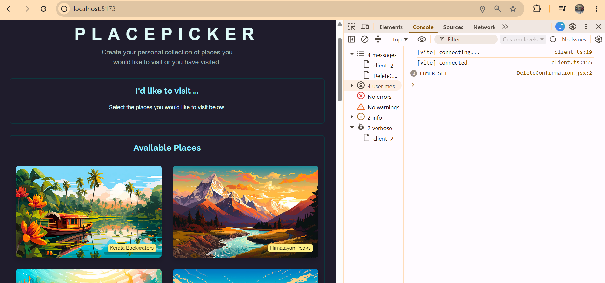
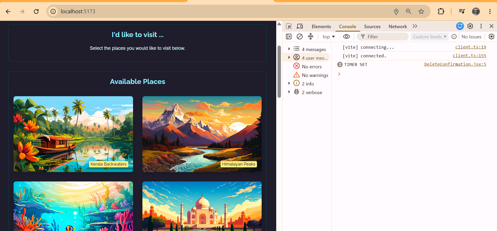
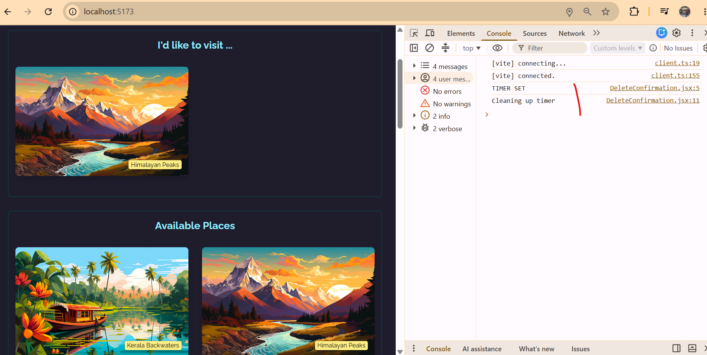
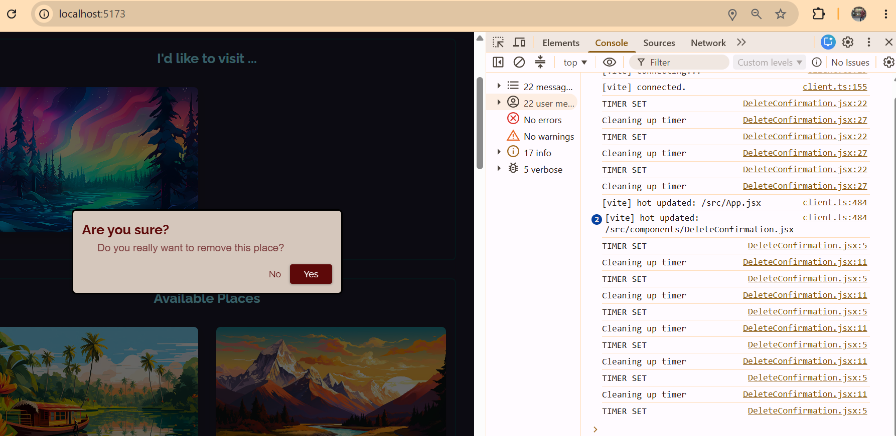
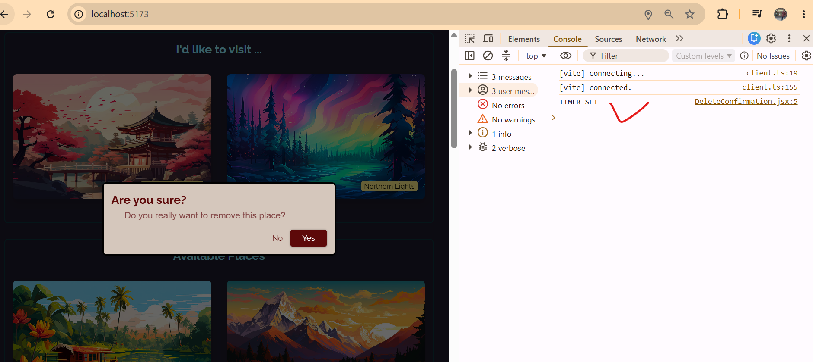
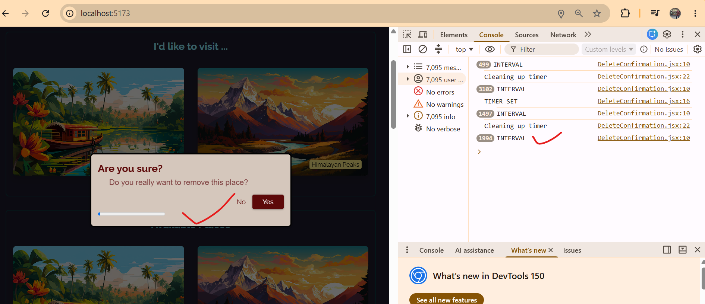
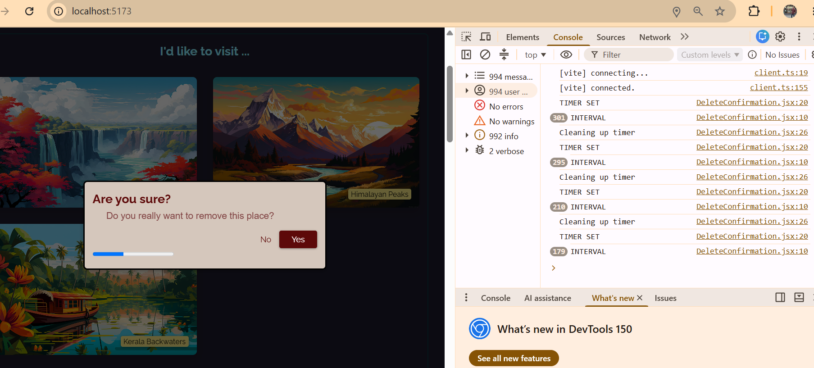
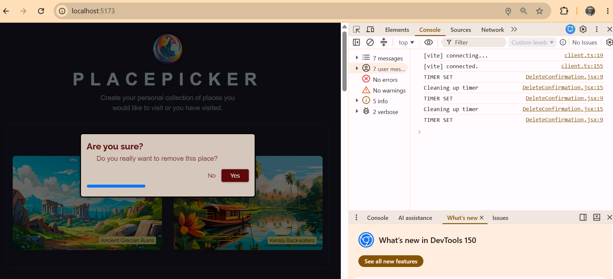

<details>
<summary>Module Introduction & Starting Project</summary>

In this course section, we'll work on this Placepicker application here,which allows us to pick places we eventually might wanna visit. And it also allows us to get rid of places if we decide we don't want to go there. And whilst working on this application, and whilst enhancing this application throughout this section, we are going to dive into a super important React concept.

Because in this section, you will learn how to deal with side effects in React apps,and you'll learn what exactly side effects are and how you can manage them.

And for that you will learn how to tackle side effects and why in certain situations React's useEffect hook might be a good choice. You will of course learn how to use that hook, how to manage its dependencies, and what exactly that is. And you will also learn when not to use useEffect. But of course at this point, this all probably sounds rather confusing and abstract. And therefore let's dive right in. Let me show you a side effect and why in certain use cases you need that useEffect hook. And of course also how you use it. Now for this section, I prepared this application here for you, and this starting project actually already works quite well. You can view places, you can select places, and you can delete places. Nonetheless, we're going to enhance this application throughout this section and also add more features to it.

And therefore, as always basically, attached you'll find this starting project, both a local and a code sandbox version. For the local version, as always, you should run npm install and then npm run dev. For the code sandbox version, this is not required.

Now if you take a look at this project code, you'll notice that it has a couple of components which are relatively straightforward. They use features you already learned about like state and refs, and the modal component uses useImperativeHandle here to expose some functions through a ref. And that ref here is received and extracted as a prop. Alternatively, this component could also be set up with help of forwardRef, but since this project uses a React version high enough to not need that, this component indeed is created without forwardRef.

So these therefore, in the end, of course, are all features you already learned about earlier in the course. And overall, this application code should be relatively straightforward and nothing new. In the end, it's just about managing this array of picked places here by adding or removing places depending on where the user clicked.

But you'll also notice that this starting project also comes with a data.js file, which includes a bunch of dummy data responsible for outputting these place cards here in the end. And a loc.js file, which contains some location calculation logic, which we'll need throughout this section. And it's indeed this file, or specifically this function, which we'll need in the next lecture where we will also meet our first side effect.

**Summary**

**Dealing with Side Effects**
*Keeping the UI Synchronized*

- Understanding side effects & useEffect()
- Effects & Dependencies
- When NOT to use useEffect()

</details>

<details>
<summary>What's a "Side Effect"? A Thorough Example</summary>

So what exactly are side effects?

Well, in the end, side effects are tasks you could say that need to be executed in your app in order for the app to work correctly but tasks that don't directly impact the current component render cycle. That's what a side effect is in the end in the context of a React app. So whenever you have a task that must be performed but that does not directly and instantly impact the current component render cycle. And that's, of course still pretty vague.

So let me give you an example. And let's say for example in this demo app, we actually wanna sort these available places down there by distance to the user of the website. So if you are living near the Sahara Desert, this card should come first and the other cards should be sorted by distance to your location. That's my idea here.

Now, that's why I'm providing this loc.js file because in there I already prepare a function that allows us to calculate the distance between two points on the earth where every point is described through a latitude and longitude coordinate. And I'm exporting a sort places by distance utility function here which takes an array of places as input, so places as they are defined in the data.js file and which then in the end, gives me that same list just sorted by distance to the user's location.

But that of course implies one important thing. We need to get the location of the user of this website. And thankfully, that's at least in theory, not too difficult in the browser. Because there's a built-in browser method you can call to get that location.

Now, for that, we could go into the app component because, of course I want to get this location as early as possible when this app starts up essentially. Then I want to get the user's location. And as you know, this app component is the root component in most React apps, and this React app is no exception. So therefore this app component functions sounds like a great place to get the user's location.

So we could go there and then maybe here, we could add that code to get the user's location, which in the browser, involves the usage of the navigator object, an object exposed by the browser to our JavaScript code that runs in the browser. So navigator is not defined by me, it's not built into React, it's provided by the browser instead.

**App.jsx** file component

```javascript
  navigator.geolocation.getCurrentPosition((position) => {
    const sortedPlaces = sortPlacesByDistance(
      AVAILABLE_PLACES,
      position.coords.latitude,
      position.coords.longitude
    );
  });
```

Now, this globally available navigator object then has a geolocation object which then has a get current position method which we can call to get the current position of the user of the website. Now, when we call this method, the user will be asked for permission to get their location and then once that permission is granted, this will go ahead and fetch this location.

Now of course, fetching that location can take some time though, and therefore, get current position takes a so-called callback function. It takes a function as an input. For example, an anonymous arrow function as I'm defining it here, which will be executed by the browser once the location has been fetched, which can be the case after a couple of milliseconds or maybe even a couple of seconds if it's slow.

So the code that depends on this location should be executed inside of this function because it's dysfunction that will be called by the browser once the location has been determined. So it's in here where I want to call sortPlacesByDistance. So this function I'm exporting in loc.js and therefore, of course we should import it here. We should import sortPlacesByDistance from loc.js so that we can call it here.

And then to this function, we must pass our available places, which is this array imported from the data.js file. So this array of dummy places. And then we also must provide the latitude and longitude coordinates of the user. Now that's what we get from get current position and the browser exposes the fetched position to us through a position object, which it automatically passes to this function.

Keep in mind that this function will be called by the browser and it's then the browser that also gives us this object which includes this user's position. So we can use this position object to then access the coords nested object and then there the latitude. And as a third argument to sort places by distance, we pass position coords longitude. So that we're passing the user's latitude and longitude coordinates to this sort places by distance function.

Now this will then return these sorted places array, which we can now use in this application. And that's now where things get tricky. Because this here, this entire code is actually a side effect. It's a side effect because this code is, of course needed by this application, we need the user's location after all but it's not directly related to the task, to the main goal of this component function.

Because the main goal of every component function is to return renderable JSX code. Now this code here is a side effect because it's not directly related with that task. All the other code in this component is related because we're setting up click listeners, which we need in our JSX code, we're setting up the state which impacts what we see on the screen. But this code where we fetch a user's location is not directly related.

Especially also because this code here does not finish instantly. Instead, this callback function will be called at some point in the future where this app component function most likely finished its execution already. And that's why this here is a side effect.

*Full Codes* of **App.jsx** component file :

```javascript
import { useRef, useState } from 'react';

import Places from './components/Places.jsx';
import { AVAILABLE_PLACES } from './data.js';
import Modal from './components/Modal.jsx';
import DeleteConfirmation from './components/DeleteConfirmation.jsx';
import logoImg from './assets/logo.png';
import { sortPlacesByDistance } from './loc';

function App() {
  const modal = useRef();
  const selectedPlace = useRef();
  const [pickedPlaces, setPickedPlaces] = useState([]);

  navigator.geolocation.getCurrentPosition((position) => {
    const sortedPlaces = sortPlacesByDistance(
      AVAILABLE_PLACES,
      position.coords.latitude,
      position.coords.longitude
    );
  });

  function handleStartRemovePlace(id) {
    modal.current.open();
    selectedPlace.current = id;
  }

  function handleStopRemovePlace() {
    modal.current.close();
  }

  function handleSelectPlace(id) {
    setPickedPlaces((prevPickedPlaces) => {
      if (prevPickedPlaces.some((place) => place.id === id)) {
        return prevPickedPlaces;
      }
      const place = AVAILABLE_PLACES.find((place) => place.id === id);
      return [place, ...prevPickedPlaces];
    });
  }

  function handleRemovePlace() {
    setPickedPlaces((prevPickedPlaces) =>
      prevPickedPlaces.filter((place) => place.id !== selectedPlace.current)
    );
    modal.current.close();
  }

  return (
    <>
      <Modal ref={modal}>
        <DeleteConfirmation
          onCancel={handleStopRemovePlace}
          onConfirm={handleRemovePlace}
        />
      </Modal>

      <header>
        
        <h1>PlacePicker</h1>
        <p>
          Create your personal collection of places you would like to visit or
          you have visited.
        </p>
      </header>
      <main>
        <Places
          title="I'd like to visit ..."
          fallbackText={'Select the places you would like to visit below.'}
          places={pickedPlaces}
          onSelectPlace={handleStartRemovePlace}
        />
        <Places
          title="Available Places"
          places={AVAILABLE_PLACES}
          onSelectPlace={handleSelectPlace}
        />
      </main>
    </>
  );
}

export default App;
```
</details>

<details>
<summary>A Potential Problem with Side Effects: An Infinite Loop</summary>

Now, it's not necessarily a problem to have a side effect and to have code like this in your component function, but it will get a problem here and I'll show you why.

Because, of course, now that we got the sortedPlaces, we wanna use these sortedPlaces to show them on the screen. Specifically, it's this usage of the places component where instead of these dummy available places, I now wanna pass my sorted available places as input.

And, of course, those sorted places, as I just explained, are not available right at the start because this operation of getting the user's location will take some time. So the first app component render cycle will be finished at the point of time where we have this location.

Therefore, we need state here. We need a state that in the end manages the available places, so the availablePlaces and a setAvailablePlaces updating function. So that we start with an empty array and we set this state to these sorted places once we have them.

**App.jsx** component file :

```javascript
function App() {
  const modal = useRef();
  const selectedPlace = useRef();
  const [availablePlaces, setAvailablePlaces] = useState([]); // adding useState codes
  const [pickedPlaces, setPickedPlaces] = useState([]);

  navigator.geolocation.getCurrentPosition((position) => {
    const sortedPlaces = sortPlacesByDistance(
      AVAILABLE_PLACES,
      position.coords.latitude,
      position.coords.longitude
    );

    setAvailablePlaces(sortedPlaces); // also adding here
  });
```

 So once this operation of fetching the user's location finished and since this then triggers a new render cycle, the state will be updated with those sorted places and we can pass the available places to this second places component here instead of the raw dummy data.

 **App.jsx** compoent file :

 ```javascript
      <main>
        <Places
          title="I'd like to visit ..."
          fallbackText={'Select the places you would like to visit below.'}
          places={pickedPlaces}
          onSelectPlace={handleStartRemovePlace}
        />
        <Places
          title="Available Places" 
          places={availablePlaces} // this changed from AVAILABLE_PLACES
          onSelectPlace={handleSelectPlace}
        />
      </main>
 ```

That looks like a good solution, but this solution actually has a flaw because it would cause an infinite loop. And why is that?

Well, because we're updating the state here, and as you learned, calling such a state updating function tells React to re-execute the component function to which the state belongs, so this app component in this case.

Now, what happens if this component function executes again? Well, we fetch the user's location again and then we set the state and we execute the component function again and we fetch the location again and we set the state and you see where that is going. That will be an infinite loop and that would crash our application.

And that's therefore an example for a side effect which when used like this causes a problem. And that's where the useEffect hook comes into play because that hook allows us to solve that problem.

Full codes of **App.jsx** component file 

```javascript
import { useRef, useState } from 'react';

import Places from './components/Places.jsx';
import { AVAILABLE_PLACES } from './data.js';
import Modal from './components/Modal.jsx';
import DeleteConfirmation from './components/DeleteConfirmation.jsx';
import logoImg from './assets/logo.png';
import { sortPlacesByDistance } from './loc';

function App() {
  const modal = useRef();
  const selectedPlace = useRef();
  const [availablePlaces, setAvailablePlaces] = useState([]);
  const [pickedPlaces, setPickedPlaces] = useState([]);

  navigator.geolocation.getCurrentPosition((position) => {
    const sortedPlaces = sortPlacesByDistance(
      AVAILABLE_PLACES,
      position.coords.latitude,
      position.coords.longitude
    );

    setAvailablePlaces(sortedPlaces);
  });

  function handleStartRemovePlace(id) {
    modal.current.open();
    selectedPlace.current = id;
  }

  function handleStopRemovePlace() {
    modal.current.close();
  }

  function handleSelectPlace(id) {
    setPickedPlaces((prevPickedPlaces) => {
      if (prevPickedPlaces.some((place) => place.id === id)) {
        return prevPickedPlaces;
      }
      const place = AVAILABLE_PLACES.find((place) => place.id === id);
      return [place, ...prevPickedPlaces];
    });
  }

  function handleRemovePlace() {
    setPickedPlaces((prevPickedPlaces) =>
      prevPickedPlaces.filter((place) => place.id !== selectedPlace.current)
    );
    modal.current.close();
  }

  return (
    <>
      <Modal ref={modal}>
        <DeleteConfirmation
          onCancel={handleStopRemovePlace}
          onConfirm={handleRemovePlace}
        />
      </Modal>

      <header>
        
        <h1>PlacePicker</h1>
        <p>
          Create your personal collection of places you would like to visit or
          you have visited.
        </p>
      </header>
      <main>
        <Places
          title="I'd like to visit ..."
          fallbackText={'Select the places you would like to visit below.'}
          places={pickedPlaces}
          onSelectPlace={handleStartRemovePlace}
        />
        <Places
          title="Available Places"
          places={availablePlaces}
          onSelectPlace={handleSelectPlace}
        />
      </main>
    </>
  );
}

export default App;
```
</details>

<details>
<summary>Using useEffect for Handling (Some) Side Effects</summary>

So, how can we use "React useEffect Hook" to get rid of this problem? So, to handle this side effect in a better way.

Well, first of all, we have to import it. useEffect from React.

```javascript
import { useRef, useState, useEffect } from 'react'; // --> import useEffect

import Places from './components/Places.jsx';
import { AVAILABLE_PLACES } from './data.js';
import Modal from './components/Modal.jsx';
import DeleteConfirmation from './components/DeleteConfirmation.jsx';
import logoImg from './assets/logo.png';
import { sortPlacesByDistance } from './loc';

function App() {
```

And with it imported like all hooks, this hook must be executed in the component function, in the app component function.

Now, useEffect, unlike useState or useRef does not return a value, though. Instead, useEffect needs two arguments. And the first argument is a function that should wrap your side effect code. So, in this case here, I'm creating an anonymous function and I move my location fetching state updating code into this anonymous function. That's the first step, but that's not all we have to do.

Instead, you should also pass second argument to useEffect. So, after this anonymous function, and that second argument is an array of dependencies of that effect function. And I'll get back to these dependencies later. For now, just add an empty array.

```javascript
function App() {
  const modal = useRef();
  const selectedPlace = useRef();
  const [availablePlaces, setAvailablePlaces] = useState([]);
  const [pickedPlaces, setPickedPlaces] = useState([]);

  useEffect(() => {
    navigator.geolocation.getCurrentPosition((position) => {
      const sortedPlaces = sortPlacesByDistance(
        AVAILABLE_PLACES,
        position.coords.latitude,
        position.coords.longitude
      );

    setAvailablePlaces(sortedPlaces);
    });
  }, []);
```

Now, if you do that, if you change the code to look like this, you will not run into this infinite loop problem. And why is that?

Because the idea behind useEffect is that this function which you pass as a first argument to useEffect will be executed by React after very important. After every component execution.

So, if the app starts and the app component function executes, this code here will not be executed right away. Instead, it's only after the app component function execution finished. So, after this JSX code here has been returned, that this side effect function you passed to useEffect will be executed by React. So, React will execute that after the component function is done executing.

Now, if you then update the state here, the component function executes again as you learned. And in theory this effect function would execute again. But that's where this dependencies array comes into play.

If you define this dependencies array. So, if you do not omit it, but you define it. Then, React will actually take a look at the dependencies specified there. And it will only execute this effect function again. If the dependency values changed.

Now, this might sound a bit abstract but I'll show you a use case. Where we have a dependency a little bit later. Here, where we have no dependencies. Those dependencies also can't change because we have none. So, they obviously never change.

Therefore, React actually never re-executes this effect function. Instead, it only executes it once after this app component function was executed for the first time. But then this effect function is never executed again.

If you would omit this dependencies array, this effect function would be executed after every app component render cycle. And therefore, we would still have an infinite loop. But with an empty dependencies array, that will not be the case.

And therefore, with this out of the way. We will now set our available places to the sorted available places. Once we have to users' location without creating an infinite loop.

And now, I'll just tweak the application a little bit. And down here on this places component, I'll add the fallback text prop, which is supported by this component and set it to Sorting places by distance. Which is simply some fallback text that will be shown during the time where we don't have any places yet. 

**App.jsx** component file :
```javascript
        <Places
          title="Available Places"
          places={availablePlaces}
          fallbackText={"Sorting places by distance..."} // adding code here
          onSelectPlace={handleSelectPlace}
        />
```

Because we're still looking for the user's location. Because initially of course, we don't have any places here. We start with an empty array.

With all that, If you save that and you reload, you should see a little pop-up here, that asks you for permission to get your location. 


And if you click block, you'll break the app. So, here, I'll click allow. And with that it'll fetch my location which can take some time as I mentioned. 


But then, it'll present me these places sorted by distance to my location.

Now of course, the order will depend on where you are located. For me, it looks pretty accurate. I'd say, I haven't checked all locations here. And it's just some dummy data anyways, but it looks correct.

There also is no error in the console. And therefore, this code now works. And we're handling this side effect in a way that does not crash our app. Which I guess is always a good thing to have.

</details>

<details>
<summary>Not All Side Effects Need useEffect</summary>

Now before we dive deeper into useEffect and see more examples for useEffect and take a look at the dependencies array again, I wanna make it very clear that, not all side effects require the usage of useEffect because overusing useEffect and using it unnecessarily is considered a bad practice because you must not forget that this is an extra execution cycle that's triggered after the App component or whichever component you're working in execution cycle. So you wanna avoid using useEffect if you don't need it.

And here's an example where we don't need it. Let's say here in handleSelectPlace, we don't just wanna update the state to add a place to our list of places here when we click on it but we also wanna store that selected place and the entire list of selected places in our browsers storage. So that when we reload the app, we don't lose these places, but they're instead still there. That's something we might want to do.

And to do that we can use another function that's built into the browser. We can use the localStorage object which just like navigator is provided by the browser. So localStorage is not coming from React, not built by me, is coming from the browser.

And localStorage allows us to use the setItem method to store some data in the browser's storage and that data will also be available if we leave the website and come back to it later, or if we reload the website.

Now, localStorage is relatively easy to use. You just pass an identifier to setItem, for example, selectedPlaces, and then as a second argument, you pass the value that should be stored. Though it's important to mention that, this data must be in string format. So you can't store an array or object, instead, that data must be converted to a string first which you, for example, can do with the built in JSON.stringify method.

This also is a method and an object that is provided by the browser. JSON.stringify for example, takes an array and will convert that to a string so that it can be stored.

And the array I wanna pass to JSON.stringify here, should be an array of place IDs I selected, let's say. So this id which we're getting here and all the previously storedIds. Therefore, I also need to get all those previously storedIds. And we can do that with a localStorage.getItem. And then of course we have to use the same key as we use for storing, that will then extract the data from localStorage and it will extract it in string format of course, because that's how the data is stored.

So to convert it back to an array, for example we again have to use the JSON object but now the parse method which is basically the opposite of the Stringify method.

Now of course, we might not have any stored places yet and therefore, I'll add some fallback code here which produces an empty array if this here should yield undefined. And this then gives us our storedIds and we can then use these storedIds here to spread them into this array, which we wanna store now and add the new Id of the place that was just selected in front of the storedIds.

So besides updating that data in my state in the currently running application, which I do in order to update the UI, I am also storing this list of IDs here in this case in my localStorage.

I also wanna make sure that I don't store an already existing id again in this list here. And therefore, we can add a if check and check if storedIds already contains this ID here. So this ID I'm getting as an argument we can do that with indexOf. And if that yields minus one, it means this ID is not part of storedIds yet and therefore in that case, I want to update the stored data. Otherwise I don't wanna do anything.

Now all this code here in the end, is just another example for a side effect because just as fetching the user's location, 

**App.jsx** component file on function handleSelectPlace :

```javascript
function handleSelectPlace(id) {
    setPickedPlaces((prevPickedPlaces) => {
      if (prevPickedPlaces.some((place) => place.id === id)) {
        return prevPickedPlaces;
      }
      const place = AVAILABLE_PLACES.find((place) => place.id === id);
      return [place, ...prevPickedPlaces];
    });

    const storedIds = JSON.parse(localStorage.getItem('selectedPlaces')) || []; // codes adding until below
    if(storedIds.indexOf(id) === -1) { 
      localStorage.setItem(
        'selectedPlaces', 
        JSON.stringify([id, ...storedIds])
      );
    }
  }
```

this code down here where we store data in the browser's storage is not directly related to rendering this JSX code. Updating this state here is, because those state updates, directly lead to a new JSX snapshot in the end. But this storage here is totally unrelated. Still it is of course code that's needed in this application to add this feature where I wanna persist this list of places that's created by the user. So having this code here is not bad. That's again, really important to understand but it is a side effect.

Now, unlike with the navigator code here we don't need to wrap this code down here with useEffect though. And indeed we can't use useEffect here because we're inside of a function. And this usage here would violate the rules of hooks because you're not allowed to use React hooks in nested functions, if statements or anything like that. They must be used directly in the root level of your component function, like we're using it here.

But we also don't need useEffect down here because there's nothing wrong with executing this code here because this code gets executed when this function here the handleSelectPlace function is executed which in the end happens when the user clicks on one of these items. And then this code does not enter an infinite loop because we're not updating any state here.

And even if we were updating any state in relation to that localStorage data storage. Even if we would do that, we would not create an infinite loop because again, this code in this handleSelectPlace function only executes when a user clicks on one of these items not when the App component function is re-executed.

So unlike this navigator code, which had to run when that component function code executed, this localStorage data storage code, does only run upon user interaction and therefore, doesn't create an infinite loop. Even if we would be updating some state here.

And that's really important to understand. Not every side effect needs useEffect. You basically only need the useEffect hook to prevent infinite loops or if you have code that can only run after the component function executed at least once. And I'll show you an example for this a little bit later. But here, this localStorage code here is totally fine.

full codes of **App.jsx** component file :

```javascript
import { useRef, useState, useEffect } from 'react';

import Places from './components/Places.jsx';
import { AVAILABLE_PLACES } from './data.js';
import Modal from './components/Modal.jsx';
import DeleteConfirmation from './components/DeleteConfirmation.jsx';
import logoImg from './assets/logo.png';
import { sortPlacesByDistance } from './loc';

function App() {
  const modal = useRef();
  const selectedPlace = useRef();
  const [availablePlaces, setAvailablePlaces] = useState([]);
  const [pickedPlaces, setPickedPlaces] = useState([]);

  useEffect(() => {
    navigator.geolocation.getCurrentPosition((position) => {
      const sortedPlaces = sortPlacesByDistance(
        AVAILABLE_PLACES,
        position.coords.latitude,
        position.coords.longitude
      );

    setAvailablePlaces(sortedPlaces);
    });
  }, []);

  function handleStartRemovePlace(id) {
    modal.current.open();
    selectedPlace.current = id;
  }

  function handleStopRemovePlace() {
    modal.current.close();
  }

  function handleSelectPlace(id) {
    setPickedPlaces((prevPickedPlaces) => {
      if (prevPickedPlaces.some((place) => place.id === id)) {
        return prevPickedPlaces;
      }
      const place = AVAILABLE_PLACES.find((place) => place.id === id);
      return [place, ...prevPickedPlaces];
    });

    const storedIds = JSON.parse(localStorage.getItem('selectedPlaces')) || [];
    if(storedIds.indexOf(id) === -1) {
      localStorage.setItem(
        'selectedPlaces', 
        JSON.stringify([id, ...storedIds])
      );
    }
  }

  function handleRemovePlace() {
    setPickedPlaces((prevPickedPlaces) =>
      prevPickedPlaces.filter((place) => place.id !== selectedPlace.current)
    );
    modal.current.close();
  }

  return (
    <>
      <Modal ref={modal}>
        <DeleteConfirmation
          onCancel={handleStopRemovePlace}
          onConfirm={handleRemovePlace}
        />
      </Modal>

      <header>
        
        <h1>PlacePicker</h1>
        <p>
          Create your personal collection of places you would like to visit or
          you have visited.
        </p>
      </header>
      <main>
        <Places
          title="I'd like to visit ..."
          fallbackText={'Select the places you would like to visit below.'}
          places={pickedPlaces}
          onSelectPlace={handleStartRemovePlace}
        />
        <Places
          title="Available Places"
          places={availablePlaces}
          fallbackText={"Sorting places by distance..."}
          onSelectPlace={handleSelectPlace}
        />
      </main>
    </>
  );
}

export default App;

```
</details>

<details>
<summary>useEffect Not Needed: Another Example</summary>

Now before we'll take another look at useEffect, let's stick at this local storage example here, because of course just storing items when we add them is not enough. The local storage should also be updated when we remove a place, by clicking on it here and confirming this. And of course, I also wanna load my data from local storage when the app starts, so that when that happens I pre-populate this box up here with my stored items.

Now let's start with the code for deleting items from local storage. To do that, we again first need to fetch our stored IDs, so that we can then update them. And then we again need to update the stored items with a local storage setItem and update them with help of this key.

And now the updated array in the end is based on the fetched existing array of data. And here we again need to create a stringified array and I'll create that array that should now be stored based on that stored IDs array with help of the filter method, which is built into the browser, basically, and which allows us to produce a new array, based on this array, and some filtering condition.

For that filter takes a function that will be executed on every item in this array, and will get every item as an input to this function here. And then we have to return true, if we want to keep that item, and false if we want drop it.

So therefore here, I'll simply check if the ID I am looking at here is not equal to selectedPlace.current, which is simply the ID of the place on which I clicked here, when I'm clicking on it in my first box. So if these two IDs do not match, I know that this is not the item I wanna delete, therefore I'm returning true and I keep the item. But if these IDs do match, this condition here will yield false and this ID will be removed from this array. And that's how we can store an updated array that does no longer contain this ID.

**App.jsx** component file 
```javascript
function handleRemovePlace() {
    setPickedPlaces((prevPickedPlaces) =>
      prevPickedPlaces.filter((place) => place.id !== selectedPlace.current)
    );
    modal.current.close();

    const storedIds = JSON.parse(localStorage.getItem('selectedPlaces')) || []; // codes to bottom added
    localStorage.setItem('selectedPlaces', JSON.stringify(storedIds.filter((id) => id !== selectedPlace.current)))
  }
```

Now last but not least, we of course also need to fetch these items when the app starts. 
And here you might again think that you probably need useEffect, because of course we could now use useEffect, just as we used it here with navigator geolocation. And we could merge our code into this existing useEffect usage, or use it again, like all React hooks, you can use useEffect as often as you want and need to.

And you could therefore think that the code for retrieving our places should go into useEffect here. So we can get our loaded places just as we're doing it down here, with help of local storage getItem, like this.

And since these are only the IDs, but I want to get places with all the place related data, like the title and the image, we then need to map these IDs to actual place objects. By using the map method, for example, to convert every ID to a complete place object.

And that can be done by taking this available places array, which is coming from the data JS file, which contains these place objects. And it's these objects to which I wanna map my IDs, and we can perform that mapping by using available places here, and by then finding a place for the ID we're having here.

So find then also takes another function. And here we get every place from AVAILABLE_PLACES passed in automatically. And here I'm looking for the place where the ID is equal to this ID. And this code here will then simply give us an array of place objects based on this array of IDs, which we retrieve from local storage.

And of course now we could call setPickedPlaces here and set this equal to storedPlaces. Now when we add an empty dependencies array, just as we did it down here, this effect function here will only run once after the app component function ran. And therefore will not enter an infinite loop, will fetch our data and populate our box with that fetched data.

```javascript
function App() {
  const modal = useRef();
  const selectedPlace = useRef();
  const [availablePlaces, setAvailablePlaces] = useState([]);
  const [pickedPlaces, setPickedPlaces] = useState([]);

  useEffect(() => {
    const storedIds = JSON.parse(localStorage.getItem('selectedPlaces')) || [];
    const storedPlaces = storedIds.map(id => 
      AVAILABLE_PLACES.find((place) => place.id === id)
    );

    setPickedPlaces(storedPlaces);
  }, []);
```

We could do it like that. And if I save that and I reload, you see indeed, I'm starting with the places I previously added here. And if I delete a place and I reload, that place is gone but the other places are still fetched. So this clearly works.

But this here is now an example for a redundant usage of useEffect. Now, why is using useEffect like this redundant and actually not recommended?

Because this code here, where we use local storage, unlike this code here where we gut the user's location, runs synchronously. Which means it basically finishes instantly. It's executed line by line and once a line finished execution, it's done. We have the final result.

And this was not the case here for getCurrentPosition, when this line executed here it was not done yet. Instead it was only done once this callback function here was executed by the browser and that happened at some point in the future. We can even see that it takes some time if we reload because these places down here are not there instantly.

But for local storage, that's not the case. We got no callback function or promise or anything like that here. Instead retrieving the data like this is instant. And therefore this app component function does not finish its execution cycle before fetching that data is done.

We can therefore simply get rid of useEffect and get rid of that state updating function here, which would be a problem, because it would lead to an infinite loop. And we can simply move that code in front of the state initialization code and use the stored places, which again are available instantly here, to initialize our picked places state like this. So to use the stored places as an initial state value.

**App.jsx** file :
```javascript
function App() {

  const storedIds = JSON.parse(localStorage.getItem('selectedPlaces')) || [];
  const storedPlaces = storedIds.map(id =>  // this line until ; is moved from useEffect before.
    AVAILABLE_PLACES.find((place) => place.id === id)
  );

  const modal = useRef();
  const selectedPlace = useRef();
  const [availablePlaces, setAvailablePlaces] = useState([]);
  const [pickedPlaces, setPickedPlaces] = useState(storedPlaces); // updated the parameter
```

This works because this code runs synchronously and does not take some time to finish, during which the app component function execution would finish. That's not the case here.

And we can actually even move that code out of the app component function, so that it only runs once in the entire application lifecycle, when this code file is parsed and executed for the first time.

```javascript
const storedIds = JSON.parse(localStorage.getItem('selectedPlaces')) || [];
const storedPlaces = storedIds.map(id => 
  AVAILABLE_PLACES.find((place) => place.id === id)
);

function App() {

  const modal = useRef();
  const selectedPlace = useRef();
  const [availablePlaces, setAvailablePlaces] = useState([]);
  const [pickedPlaces, setPickedPlaces] = useState(storedPlaces);
```

Because there's no reason to put this into the app component, which would only mean that it runs again and again every time the app component function is executed, which in the end means that we're wasting some performance.

Instead, it's enough to run this once when the overall app starts and then we can still use stored places in the component function, because this component function execution will run after this code in front of it.

And therefore, if we change the code like this and we save this and reload, we're still fetching our places here. So this is still working and we can still manipulate them and of course also delete places, that all works.

But now with side effects that don't need useEffect.

The full code of **App.jsx** become :

```javascript
import { useRef, useState, useEffect } from 'react';

import Places from './components/Places.jsx';
import { AVAILABLE_PLACES } from './data.js';
import Modal from './components/Modal.jsx';
import DeleteConfirmation from './components/DeleteConfirmation.jsx';
import logoImg from './assets/logo.png';
import { sortPlacesByDistance } from './loc';

const storedIds = JSON.parse(localStorage.getItem('selectedPlaces')) || [];
const storedPlaces = storedIds.map(id => 
  AVAILABLE_PLACES.find((place) => place.id === id)
);

function App() {

  const modal = useRef();
  const selectedPlace = useRef();
  const [availablePlaces, setAvailablePlaces] = useState([]);
  const [pickedPlaces, setPickedPlaces] = useState(storedPlaces);

  useEffect(() => {
    navigator.geolocation.getCurrentPosition((position) => {
      const sortedPlaces = sortPlacesByDistance(
        AVAILABLE_PLACES,
        position.coords.latitude,
        position.coords.longitude
      );

    setAvailablePlaces(sortedPlaces);
    });
  }, []);

  function handleStartRemovePlace(id) {
    modal.current.open();
    selectedPlace.current = id;
  }

  function handleStopRemovePlace() {
    modal.current.close();
  }

  function handleSelectPlace(id) {
    setPickedPlaces((prevPickedPlaces) => {
      if (prevPickedPlaces.some((place) => place.id === id)) {
        return prevPickedPlaces;
      }
      const place = AVAILABLE_PLACES.find((place) => place.id === id);
      return [place, ...prevPickedPlaces];
    });

    const storedIds = JSON.parse(localStorage.getItem('selectedPlaces')) || [];
    if(storedIds.indexOf(id) === -1) {
      localStorage.setItem(
        'selectedPlaces', 
        JSON.stringify([id, ...storedIds])
      );
    }
  }

  function handleRemovePlace() {
    setPickedPlaces((prevPickedPlaces) =>
      prevPickedPlaces.filter((place) => place.id !== selectedPlace.current)
    );
    modal.current.close();

    const storedIds = JSON.parse(localStorage.getItem('selectedPlaces')) || [];
    localStorage.setItem('selectedPlaces', JSON.stringify(storedIds.filter((id) => id !== selectedPlace.current)))
  }

  return (
    <>
      <Modal ref={modal}>
        <DeleteConfirmation
          onCancel={handleStopRemovePlace}
          onConfirm={handleRemovePlace}
        />
      </Modal>

      <header>
        
        <h1>PlacePicker</h1>
        <p>
          Create your personal collection of places you would like to visit or
          you have visited.
        </p>
      </header>
      <main>
        <Places
          title="I'd like to visit ..."
          fallbackText={'Select the places you would like to visit below.'}
          places={pickedPlaces}
          onSelectPlace={handleStartRemovePlace}
        />
        <Places
          title="Available Places"
          places={availablePlaces}
          fallbackText={"Sorting places by distance..."}
          onSelectPlace={handleSelectPlace}
        />
      </main>
    </>
  );
}

export default App;
```
</details>

<details>
<summary>Preparing Another Use-Case For useEffect</summary>

So now that we got started with side effects that need and that don't need useEffect, let's take a closer look at useEffect and especially at this dependencies array.

And for that, let's switch to this modal component. In there I got some code using the useImperativeHandle hook that ensures that we expose two methods, two functions, to the outside world here, a open and a closed function. And these functions will then internally, in this modal component, show or close the dialog element, which is also controlled with help of our ref here.

So these exposed functions, these methods here, are used in the app component. There I have code where I call open and I have code where I call close. And my goal now is to actually handle this with help of an effect, with help of a side effect. So with help of the useEffect hook, because as you'll see, that's all the possible in situations like this.

The full code of **Modal.jsx** file before updated :

```javascript
import { forwardRef, useImperativeHandle, useRef } from 'react';
import { createPortal } from 'react-dom';

const Modal = forwardRef(function Modal({ children }, ref) {
  const dialog = useRef();

  useImperativeHandle(ref, () => {
    return {
      open: () => {
        dialog.current.showModal();
      },
      close: () => {
        dialog.current.close();
      },
    };
  });

  return createPortal(
    <dialog className="modal" ref={dialog}>
      {children}
    </dialog>,
    document.getElementById('modal')
  );
});

export default Modal;

```

And therefore here I'll get rid of this useImperativeHandle code, I'll delete it. And also delete this import. And also get rid of this ref prop because I don't need it anymore.

And what we could now do as an alternative to the old approach is that this modal component accepts a prop, let's say a prop named open, though the name, of course, is totally up to you.

Now as it turns out, the dialog element also has a open prop built into this element which we could then set to our open prop assuming that open is true or false, because that is what the open prop of the dialog element wants.


**Modal.jsx** file component

```javascript
import { useRef } from 'react';
import { createPortal } from 'react-dom';

const Modal = forwardRef(function Modal({ open, children }) {
  const dialog = useRef();

  return createPortal(
    <dialog className="modal" ref={dialog} open={open}>
      {children}
    </dialog>,
    document.getElementById('modal')
  );
});

export default Modal;

```

And with that change, we could go back to the app component. And now instead of opening and closing that modal with help of the modal ref, we could delete this ref 

```javascript
function App() {
  // const modal = useRef(); // deteled
  const [modalIsOpen, setModalIsOpen] = useState(false);
  const selectedPlace = useRef();
  const [availablePlaces, setAvailablePlaces] = useState([]);
  const [pickedPlaces, setPickedPlaces] = useState(storedPlaces);
```
and instead manage some extra state here which controls whether the modal should be open or not.

```javascript
function App() {
  const [modalIsOpen, setModalIsOpen] = useState(false);
  const selectedPlace = useRef();
  const [availablePlaces, setAvailablePlaces] = useState([]);
  const [pickedPlaces, setPickedPlaces] = useState(storedPlaces);
```

Initially it should be false so that the modal is not open. And here we could say IsOpen and set IsOpen. And maybe name it ModalIsOpen to be clear what exactly is open or not.

And now in all the places where I called open, we should now call setModalIsOpen and set it to true. And in all the places where we called close, we should now call setModalIsOpen and set it to false. Of course, also down here.

**App.jsx** file component

*From*

```javascript
function handleStartRemovePlace(id) {
    modal.current.open();
    selectedPlace.current = id;
  }

  function handleStopRemovePlace() {
    modal.current.close();
  }
```

also in funcion below :

```javascript
function handleRemovePlace() {
    setPickedPlaces((prevPickedPlaces) =>
      prevPickedPlaces.filter((place) => place.id !== selectedPlace.current)
    );
    modal.current.close();
```

And changed into :

```javascript
function handleRemovePlace() {
    setPickedPlaces((prevPickedPlaces) =>
      prevPickedPlaces.filter((place) => place.id !== selectedPlace.current)
    );
    modal.current.close();
```
**Into :**

```javascript
function handleStartRemovePlace(id) {
    setModalIsOpen(true); // changed
    selectedPlace.current = id;
  }

  function handleStopRemovePlace() {
    setModalIsOpen(false); // changed
  }
```

aslo this function :

```javascript
function handleRemovePlace() {
    setPickedPlaces((prevPickedPlaces) =>
      prevPickedPlaces.filter((place) => place.id !== selectedPlace.current)
    );
    setModalIsOpen(false); // changed
```

Now we can use the modalIsOpen state and pass it as a value to this open prop. modalIsOpen. And we should remove this ref here because we don't have this modal ref anymore.

**App.jsx** file :

*From :*
```javascript
return (
    <>
      <Modal ref={modal}>
        <DeleteConfirmation
          onCancel={handleStopRemovePlace}
          onConfirm={handleRemovePlace}
        />
      </Modal>
```

*Into :*
```javascript
  return (
    <>
      <Modal open={modalIsOpen}>
        <DeleteConfirmation
          onCancel={handleStopRemovePlace}
          onConfirm={handleRemovePlace}
        />
      </Modal>
```


If we save that, you'll see that if I now click on an item, the modal does indeed open, but the backdrop is actually missing. This area behind the modal that grays out the page and makes sure that we can't interact with the rest of the page.

This backdrop is missing. And it's missing because this backdrop is only added by the dialog element if we open it by calling the dialog's showModal method. Only when we call this method will this backdrop be added.

the code of **Modal.jsx** changed into below 
Here the full codes of *Modal.jsx*

```javascript
import { useRef } from 'react';
import { createPortal } from 'react-dom';

function Modal({ open, children }) {
  const dialog = useRef();

  dialog.current.showModal();

  return createPortal(
    <dialog className="modal" ref={dialog}>
      {children}
    </dialog>,
    document.getElementById('modal')
  );
};

export default Modal;


```

So therefore forwarding this open prop to the dialog as we're currently doing it does not really work. But we can still stick to this prop focused solution by again using useEffect.

full codes of **App.jsx** component file :

```javascript
import { useRef, useState, useEffect } from 'react';

import Places from './components/Places.jsx';
import { AVAILABLE_PLACES } from './data.js';
import Modal from './components/Modal.jsx';
import DeleteConfirmation from './components/DeleteConfirmation.jsx';
import logoImg from './assets/logo.png';
import { sortPlacesByDistance } from './loc';

const storedIds = JSON.parse(localStorage.getItem('selectedPlaces')) || [];
const storedPlaces = storedIds.map(id => 
  AVAILABLE_PLACES.find((place) => place.id === id)
);

function App() {
  const [modalIsOpen, setModalIsOpen] = useState(false);
  const selectedPlace = useRef();
  const [availablePlaces, setAvailablePlaces] = useState([]);
  const [pickedPlaces, setPickedPlaces] = useState(storedPlaces);

  useEffect(() => {
    navigator.geolocation.getCurrentPosition((position) => {
      const sortedPlaces = sortPlacesByDistance(
        AVAILABLE_PLACES,
        position.coords.latitude,
        position.coords.longitude
      );

    setAvailablePlaces(sortedPlaces);
    });
  }, []);

  function handleStartRemovePlace(id) {
    setModalIsOpen(true);
    selectedPlace.current = id;
  }

  function handleStopRemovePlace() {
    setModalIsOpen(false);
  }

  function handleSelectPlace(id) {
    setPickedPlaces((prevPickedPlaces) => {
      if (prevPickedPlaces.some((place) => place.id === id)) {
        return prevPickedPlaces;
      }
      const place = AVAILABLE_PLACES.find((place) => place.id === id);
      return [place, ...prevPickedPlaces];
    });

    const storedIds = JSON.parse(localStorage.getItem('selectedPlaces')) || [];
    if(storedIds.indexOf(id) === -1) {
      localStorage.setItem(
        'selectedPlaces', 
        JSON.stringify([id, ...storedIds])
      );
    }
  }

  function handleRemovePlace() {
    setPickedPlaces((prevPickedPlaces) =>
      prevPickedPlaces.filter((place) => place.id !== selectedPlace.current)
    );
    setModalIsOpen(false);

    const storedIds = JSON.parse(localStorage.getItem('selectedPlaces')) || [];
    localStorage.setItem('selectedPlaces', JSON.stringify(storedIds.filter((id) => id !== selectedPlace.current)))
  }

  return (
    <>
      <Modal open={modalIsOpen}>
        <DeleteConfirmation
          onCancel={handleStopRemovePlace}
          onConfirm={handleRemovePlace}
        />
      </Modal>

      <header>
        
        <h1>PlacePicker</h1>
        <p>
          Create your personal collection of places you would like to visit or
          you have visited.
        </p>
      </header>
      <main>
        <Places
          title="I'd like to visit ..."
          fallbackText={'Select the places you would like to visit below.'}
          places={pickedPlaces}
          onSelectPlace={handleStartRemovePlace}
        />
        <Places
          title="Available Places"
          places={availablePlaces}
          fallbackText={"Sorting places by distance..."}
          onSelectPlace={handleSelectPlace}
        />
      </main>
    </>
  );
}

export default App;
```
</details>

<details>
<summary>Using useEffect for Syncing With Browser APIs</summary>

So how can we use useEffect to make sure that depending on the value of this open prop, this dialog here is shown or closed?

Well, we could first try it without useEffect because here in the modal component function, we can, of course, add a if check and check if open is truthy. And if that's the case, we use the dialog ref to call showModal like this. Else if it's not truthy, it's faulty. So in that case, we call close to close it.

**Modal.jsx**
```javascript
import { useRef } from 'react';
import { createPortal } from 'react-dom';

function Modal({ open, children }) {
  const dialog = useRef();

  if (open) { //new if statement logic added
    dialog.current.showModal();
  } else {
    dialog.current.close();
  }

  return createPortal(
    <dialog className="modal" ref={dialog}>
      {children}
    </dialog>,
    document.getElementById('modal')
  );
};

export default Modal;
```

But if we try to run this code, if we save it and we go back and we reload, that's important, we'll get an error. We'll get an error that we in the end failed to call close which is what we try to do initially because initially open is false in the app component so that we try to call close on undefined.

And the problem here, of course, is that we're calling these methods here, showModal and close, right inside of this component function. And we're using the dialog ref to interact with that dialog. But the first time this component function executes, this ref will not be set yet. It will not be connected yet because this JSX code hasn't executed yet.

So this connection between a ref and dialog element hasn't been established yet and therefore calling close fails because initially, this ref is undefined.

And that's another scenario where you wanna use useEffect because useEffect can help you synchronize prop values or state values to DOM APIs like this dialog showModal method or a close method because as you learned, the effect function you define with useEffect will be executed right after the component function.

And since it executes after the component function and not before it or at the same time, this connection between the ref and the dialog will be established at this point of time.

And we can indeed think of that code here as kind of a side effect as well because whilst calling these methods here will indeed have an impact on the UI, it does not have a direct impact on this JSX code here. So it's again not directly related to this component render cycle.

So therefore here we should now also useEffect now not to avoid an infinite loop with some side effect, but to synchronize some value, the open prop in this case here, to a DOM API or to a certain behavior.

So for that, we can call useEffect, pass our effect function to it and our dependency array and then we can move this code here into useEffect.

**Modal.jsx** component
```javascript
import { useRef, useEffect } from 'react';
import { createPortal } from 'react-dom';

function Modal({ open, children }) {
  const dialog = useRef();

  useEffect(() => {
    if (open) {
    dialog.current.showModal();
  } else {
    dialog.current.close();
  }
  }, []);

  return createPortal(
    <dialog className="modal" ref={dialog}>
      {children}
    </dialog>,
    document.getElementById('modal')
  );
};

export default Modal;

```

And now you can already see that I'm getting a warning here. You can tell by the yellow squiggly lines here. I'm getting a warning here because I haven't added all the dependencies that are required by this effect function to this dependencies array.

Now in the app component function, it was fine to have an empty array here because this effect code here in the end had no extra dependencies, but this code here has dependencies. And therefore, it's, of course, important to understand what exactly are such effect dependencies.
</details>

<details>
<summary>Understanding Effect Dependencies</summary>

Effect dependencies are in the end simply prop or state values that are used inside of this effect function. So put in our words, any value that causes the component function to execute again, which is the case in the end for props and state, any such value is a dependency if it's used inside of useEffect.

Any other value like refs or as we have it here in the app component function objects and methods that are built into the browser, any such value are not considered dependencies because useEffect only cares about dependencies that would cause the component function to execute again.

And why is that the case?

Well, because this effect function should run whenever the component function executed if one of its dependencies changed.

Now as explained earlier, with an empty array, that will never be the case because if you don't have any dependencies, they also can't change. Therefore, in the app component function, this effect function here only executed once.

But now in the modal component, we're using the open prop in this effect function and this prop or the value we receive through that prop can, of course, change and it will change in this application. It will change from false, which is its initial value, to true if we start to remove a place.

Now, at the moment, with an empty dependencies array, this effect function would never run again. And as a result, if I saved this, we got rid of this error, but I also can't click on these items or I can click on them, but nothing happens, the modal doesn't open.

And why would it open? The effect function isn't executing again and therefore showModal isn't called.

Hence, we have to add open as a dependency here, so the open prop here, and that makes sure that this effect function will now run again whenever the modal component function executed and the value of the open prop changed.

So if it was true and is again true, this will not run. If it was true and is now false, this will run and vice versa.

And therefore with open added here, if you now save that code and you reload, you'll see that now clicking on these items does indeed open that dialog again. And we can close it, we can confirm it. That all works.

But now it works with help of useEffect and it therefore made this modal component a bit leaner compared to how it looked before.

Here are the codes of **Modal.jsx** component file that only added the array open :

```javascript
import { useRef, useEffect } from 'react';
import { createPortal } from 'react-dom';

function Modal({ open, children }) {
  const dialog = useRef();

  useEffect(() => {
    if (open) {
    dialog.current.showModal();
  } else {
    dialog.current.close();
  }
  }, [open]); // adding open parameter on array empty beforehand

  return createPortal(
    <dialog className="modal" ref={dialog}>
      {children}
    </dialog>,
    document.getElementById('modal')
  );
};

export default Modal;

```
</details>

<details>
<summary>Fixing a Small Bug</summary>

The '<dialog>' element can also be closed by pressing the ESC key on the keyboard. In that case, the dialog will disappear but the state passed to the open prop (i.e., the modalIsOpen state) will not be set to false.

Therefore, the modal can't be opened again (because modalIsOpen still is true - the UI basically now is not in sync with the state anymore).

To fix this issue, we must listen to the modal being closed by adding the built-in onClose prop to the '<dialog>'. The event is then "forwarded" to the App component by accepting a custom onClose prop on the Modal component.

The Modal component therefore should look like this:

```javascript
import { useRef, useEffect } from 'react';
import { createPortal } from 'react-dom';
 
function Modal({ open, children, onClose }) {
  const dialog = useRef();
 
  useEffect(() => {
    if (open) {
      dialog.current.showModal();
    } else {
      dialog.current.close();
    }
  }, [open]);
 
  return createPortal(
    <dialog className="modal" ref={dialog} onClose={onClose}>
      {children}
    </dialog>,
    document.getElementById('modal')
  );
}
 
export default Modal;
```

In the **App** component, we can now set the handleStopRemovePlace function as a value for the onClose prop on the **'<Modal>'** component:

```javascript
<Modal open={modalIsOpen} onClose={handleStopRemovePlace}>
  <DeleteConfirmation
    onCancel={handleStopRemovePlace}
    onConfirm={handleRemovePlace}
  />
</Modal>
```
</details>

<details>
<summary>Preparing Another Problem That Can Be Fixed with useEffect</summary>

Now besides this dependencies array, useEffect also has one other feature you should be aware of.

And for this feature, let's go to this **DeleteConfirmation.jsx** component file. 

```javascript
export default function DeleteConfirmation({ onConfirm, onCancel }) {
  return (
    <div id="delete-confirmation">
      <h2>Are you sure?</h2>
      <p>Do you really want to remove this place?</p>
      <div id="confirmation-actions">
        <button onClick={onCancel} className="button-text">
          No
        </button>
        <button onClick={onConfirm} className="button">
          Yes
        </button>
      </div>
    </div>
  );
}

```

This component is responsible for rendering the content of this modal here. And I now want to add a feature to this app where this modal closes automatically after three seconds and we automatically delete the place, so we automatically confirm this modal after those three seconds.

And to implement this feature, we need to set a timer which we can do with help of another browser feature, the set timeout function, which is a function built into the browser.

Set timeout takes two arguments and the first argument is a function. The second argument is a duration in milliseconds. For example, 3000 milliseconds would be three seconds. And this function, which you pass as a first argument, will be executed once this duration expired.

So if we want to close this modal after three seconds, we should call onConfirm inside of this callback function that executes after three seconds so that when this component is rendered, this timer here is set and we then execute onConfirm after three seconds.

**DeleteConfirmation.jsx** component file :
```javascript
export default function DeleteConfirmation({ onConfirm, onCancel }) {
  setTimeout(() => {
    onConfirm();
  }, 3000);

  return (
    <div id="delete-confirmation">
      <h2>Are you sure?</h2>
      <p>Do you really want to remove this place?</p>
      <div id="confirmation-actions">
        <button onClick={onCancel} className="button-text">
          No
        </button>
        <button onClick={onConfirm} className="button">
          Yes
        </button>
      </div>
    </div>
  );
}
```

Now with this code, we'll face a couple of problems though. One problem is that this delete confirmation component is always rendered. It is rendered here by the app component and it's wrapped by the modal component, which is also always rendered, it's just not always visible in the DOM because internally the modal component controls the dialogue's visibility through this open prop by showing or hiding this dialogue.

But technically this delete confirmation component is always part of the DOM, and therefore this timer will actually be set and started when the app component renders for the first time because during that render cycle, delete confirmation is also rendered.

Now to work around this issue, we could simply render delete confirmation conditionally here, depending on modal is open, like this, so that it's only rendered if modal is open is true. That would work around this problem and would make sure that this timer is not always set right at the start.

A more elegant solution could be to render it here but to then go into the modal component and not always output this children prop so that the app component doesn't have to deal with conditionally rendering this, but instead it's the modal component where this might make more sense so that here we can check if open is true and if that's the case, we output the children, otherwise we render null here.

**Modal.jsx**

```javascript
import { useRef, useEffect } from 'react';
import { createPortal } from 'react-dom';

function Modal({ open, children }) {
  const dialog = useRef();

  useEffect(() => {
    if (open) {
    dialog.current.showModal();
  } else {
    dialog.current.close();
  }
  }, [open]);

  return createPortal(
    <dialog className="modal" ref={dialog}>
      {open ? children : null} //adding code open
    </dialog>,
    document.getElementById('modal')
  );
};

export default Modal;

```

That would be an alternative solution that should also make sure that this timer is not set right away and we can confirm this by simply console logging timer set here.

**Modal.jsx**

```javascript
export default function DeleteConfirmation({ onConfirm, onCancel }) {
  console.log('TIMER SET'); // adding timer set
  setTimeout(() => {
    onConfirm();
  }, 3000);
```

If I console log this, save this, and reload, I'm not seeing this in the log here which proves that it's not set right away but still this code here has a problem.

And to show you this problem, let me try to remove one of these items here. If I do that, you see the timer is set and after three seconds the item was therefore removed.



But if I remove it myself before these three seconds expire, this timer will also still expire because we didn't stop it and that wasn't a problem here.

But it will be a problem if I click no because now you will see that even though I clicked no, after three seconds this item disappeared because the timer is never stopped when this component here is not rendered anymore.

Instead it was started and it keeps on going behind the scenes, independent from the question whether this component is currently visible or not.

And that's of course a problem. And it is a problem that can be fixed with useEffect.
</details>

<details>
<summary>Introducing useEffect's Cleanup Function</summary>

Now, it's worth noting that this code here, of course, again in the end, is a side effect because it's not directly related to outputting this JSX code.

And useEffect can fix this timer problem I showed you in the previous lecture because with useEffect, we can actually stop this timer when this component disappears. And I'll show you how.

So, let's import useEffect from React here and let's then set the timer with help of useEffect by providing this effect function and our dependencies array. And now we can move this code here into this effect function.

**DeleteConfirmation.jsx** component file :
```javascript
import { useEffect } from "react";

export default function DeleteConfirmation({ onConfirm, onCancel }) {
  useEffect(() => {
    console.log('TIMER SET');
    setTimeout(() => {
      onConfirm();
    }, 3000);
  }, []);
```

And now just to be clear, for setting this timer, we would not need this effect function because setting the timer wasn't the problem. Neither does this create an infinite loop as we did it with the user location earlier, nor do we have the problem we faced in the modal where we needed to work with some ref that wasn't connected yet.

Instead here the problem is not setting the timer but cleaning it up, getting rid of it, when this component function disappears.

And that is also something useEffect can help you with because when using useEffect, you cannot just define this effect function, but also a cleanup function that should be executed right before this effect function runs again.

And you define such a cleanup function by returning it from inside the effect function. So, this effect function can return another function which will then be executed by React right before this effect function runs again or, and that's the important part here, right before this component dismounts. So, before it's removed from the DOM.

And therefore it's here in this cleanup function where we can now stop the timer. To do that, we can use the browser's built-in clear timeout function, which now just needs a reference of the timer that should be stopped.

And thankfully, such a reference is returned by set timeout. So, we can simply store it in a constant, maybe named timer, and then pass timer to clear timeout. And this will now stop this timer whenever this component is removed from the DOM.

Now, I also just again want to emphasize that this cleanup function would also run if that effect function would run again, then the cleanup function runs right before the effect function runs. But this is not something that can happen here because currently I have no dependencies here and therefore this effect function never runs again.

Now as you see, I'm actually getting a warning here. So, I should add a dependency, to be precise, it's this unconfirmed prop which I'm using in here that should be added as a dependency but I'm deliberately not doing that just yet. And I'll explain why in just a second.

Instead, let's keep this code like this and therefore the cleanup function will run only once when the component is removed.

**DeleteConfirmation.jsx** 

```javascript
import { useEffect } from "react";

export default function DeleteConfirmation({ onConfirm, onCancel }) {
  useEffect(() => {
    console.log('TIMER SET');
    const timer = setTimeout(() => { // make a timer const
      onConfirm();
    }, 3000);

    return () => {
      clearTimeout(timer); // adding a return and timer included.
    }
  }, []);
```

And let's save everything and reload.

Now with that, if we wait for the sorted places to arrive, I can add some places, of course. And if I now open this and click no, you see the timer was set, but we don't have that problem that we faced before that the place is magically removed because the timer expires behind the scenes.



This is not happening anymore because we're cleaning up that timer. We can console log cleaning up timer here just to see that in action, kind of.

```javascript
import { useEffect } from "react";

export default function DeleteConfirmation({ onConfirm, onCancel }) {
  useEffect(() => {
    console.log('TIMER SET');
    const timer = setTimeout(() => {
      onConfirm();
    }, 3000);

    return () => {
      console.log('Cleaning up timer');
      clearTimeout(timer);
    }
  }, []);
```

If I reload and I click here and I click no, you see cleaning up timer.



It's also worth noting that this cleanup function does not run right before the effect function is executed for the first time. It's only executed before subsequent executions of this effect function, and as mentioned, when this component is removed.

And with that, we're now managing the timer as such that we don't cause any strange bugs in this application.

Full codes of **DeleteConfirmation.jsx** file :

```javascript
import { useEffect } from "react";

export default function DeleteConfirmation({ onConfirm, onCancel }) {
  useEffect(() => {
    console.log('TIMER SET');
    const timer = setTimeout(() => {
      onConfirm();
    }, 3000);

    return () => {
      console.log('Cleaning up timer');
      clearTimeout(timer);
    }
  }, []);

  return (
    <div id="delete-confirmation">
      <h2>Are you sure?</h2>
      <p>Do you really want to remove this place?</p>
      <div id="confirmation-actions">
        <button onClick={onCancel} className="button-text">
          No
        </button>
        <button onClick={onConfirm} className="button">
          Yes
        </button>
      </div>
    </div>
  );
}
```
</details>

<details>
<summary>The Problem with Object & Function Dependencies</summary>

So let's now take a closer look at this onConfirm prop, which we're using here in this effect.

As you learned earlier in this section here, if you're using prop or state values in your effect function, you should add them as dependencies. So here, we should add the onConfirm prop as a dependency and you should not execute it but just point at it, use it as a value. By the way, if you had multiple dependencies, you would simply separate them with a comma. But here it's only one dependency that we need. This onConfirm prop.

**DeleteConfirmation.jsx** component file :

```javascript
import { useEffect } from "react";

export default function DeleteConfirmation({ onConfirm, onCancel }) {
  useEffect(() => {
    console.log('TIMER SET');
    const timer = setTimeout(() => {
      onConfirm();
    }, 3000);

    return () => {
      console.log('Cleaning up timer');
      clearTimeout(timer);
    }
  }, [onConfirm]); // adding onConfirm
```

But there is a problem you should be aware of when adding functions as dependencies. And onConfirm is a function in the end because this prop receives a function as a value.

So onConfirm is a function and when adding functions as dependencies, there is a danger of creating an infinite loop.

And here's why, because when you add a dependency to this array, like open, here in this modal component, you're telling React that this effect function should be re-executed whenever this modal component function executed, and if the open value changed.

So in the case of open, if it was false and is now true, or if it was true and is now false. If the dependency would be a number or a string, the effect function would run again if that number or string changed.

Now, when the dependency is a function, it's a bit trickier because this function, which we use here, this onConfirm function is in the end defined in the app component in this case. This onConfirm prop is set equal to this handleRemovePlace function.

And of course, if you take a look at this function, you would probably say that it never changes, the code and the function is always the same, but technically, that's not correct because functions in JavaScript are just values. Specifically, they are objects.

And this function object, this handleRemovePlace function object is indeed recreated every time this App component function executes because this entire function body then runs again.

And all the values that are defined in this app component function are recreated whenever the app component function is executed again. So if I'm defining a variable here, hello, and this is the number one, this is technically recreated if this app component function runs again.

Now, a function defined inside of this function, as it's the case for handleRemovePlace, is therefore also recreated. And since functions are objects in JavaScript, a new object is created.

And as you might know in JavaScript, when you create two different objects, even if they have the same shape or the same code as it's the case here with the function, even if that's the case, they're not the same.

And you can easily verify this with help of the developer tools in your browser. There, if you open that console, you can create a new function, hello, where you maybe just console.log('Hello').

If I do that and I then create another function, hello2, which has exactly the same function body, so where I also just console.log('Hello'). If I do that and I then compare hello to hello2, I get false. They are not equal. JavaScript does not treat these two functions as equal even though they have the same code.

And that's the case for objects in general in JavaScript. If I have an object A with a name of Max written like this and I then have an object B, which again, has exactly the same shape and the same value. In that case, these two are not treated as equal.

And therefore, because objects and also specifically functions are not treated as equal, this onConfirm dependency of this effect function in the DeleteConfirmation component will be different between render cycles.

Because when the app component re-renders, when this function is executed again, a brand new handleRemovePlace function will be created. And when that function is then received here in the DeleteConfirmation component, React takes a look at this new value, this new function and compares it to the old value, the old function. And it determines that these two are different for the reasons I just laid out.

And therefore, React would go ahead and re-execute this effect function even though technically, this dependency didn't change.

And this can lead to problems if in that function, which gets executed inside of this effect function, you are then updating the state again as it is the case here because that can then trigger an infinite loop.

I'm updating the state here. This causes the app component function to run again, therefore a brand new handleRemovePlace function is created and passed to DeleteConfirmation. And therefore, there the effect function runs again, which then again triggers onConfirm and so on.

Now, here in this app, specifically, due to how it works, we actually won't face this infinite loop problem because in this app, when onConfirm is called a state update is indeed triggered and we could therefore face this infinite loop.

But this state update that is triggered, that setModalIsOpen(false), actually leads to DeleteConfirmation being removed from the DOM because it leads to the modal component removing the children from the DOM. And the children prop of the modal component holds this DeleteConfirmation component.

So therefore, here indeed, we don't enter the infinite loop because this component disappears.

Nonetheless, we face the danger of having such an infinite loop and we can see it in action if I go back to the app component and I temporarily disable setModalIsOpen so that DeleteConfirmation is not removed from the DOM.

**App.jsx** component file :

```javascript

  function handleRemovePlace() {
    setPickedPlaces((prevPickedPlaces) =>
      prevPickedPlaces.filter((place) => place.id !== selectedPlace.current)
    );
    //setModalIsOpen(false);

    const storedIds = JSON.parse(localStorage.getItem('selectedPlaces')) || [];
    localStorage.setItem('selectedPlaces', JSON.stringify(storedIds.filter((id) => id !== selectedPlace.current)))
  }
```

I'm still updating some other state. And therefore, the app component will re-render. And now, we will see an infinite loop in action.

And you can see it if you go back and you reload and you then open this modal and you wait for the timer to expire and you'll see a new timer was set and another new timer and another new timer. And it continues on like this until we remove this modal here. But until then, we had this infinite loop.



And to avoid this infinite loop, we can of course make sure that we remove the element from the DOM as we're doing it with this state update. But a safer way, which will always work no matter if the element is removed or not, is to use another special React hook. A hook I'll show you in the next lecture.

Full codes of **DeleteConfirmation.jsx** file :

```javascript
import { useEffect } from "react";

export default function DeleteConfirmation({ onConfirm, onCancel }) {
  useEffect(() => {
    console.log('TIMER SET');
    const timer = setTimeout(() => {
      onConfirm();
    }, 3000);

    return () => {
      console.log('Cleaning up timer');
      clearTimeout(timer);
    }
  }, [onConfirm]);

  return (
    <div id="delete-confirmation">
      <h2>Are you sure?</h2>
      <p>Do you really want to remove this place?</p>
      <div id="confirmation-actions">
        <button onClick={onCancel} className="button-text">
          No
        </button>
        <button onClick={onConfirm} className="button">
          Yes
        </button>
      </div>
    </div>
  );
}

```
</details>

<details>
<summary>The useCallback Hook</summary>

So in the last lecture, I explained why we can face an infinite loop when adding functions as dependencies to useEffect. It's a real problem, which I explained in great detail in that previous lecture.

Now, thankfully though, the fix for this problem is straightforward and simple because React offers a hook which you can use to make sure that this function is not recreated all the time and you should use that special hook to fix this potential problem here.

Now, this special hook, which you can use is the useCallback Hook, another hook offered by React. And the idea behind this hook here is that you wrap it around a function, around this handleRemovePlace function in this case here.

For this, you execute useCallback and then you pass the function that should be wrapped as a first argument to useCallback. Then useCallback also takes a second argument which should be an array of dependencies, a concept that might sound familiar from useEffect.

I'll get back to this array in just a second because useCallback also does something else. It returns a value. Specifically, it returns that function which you wrapped, but now such that it's not recreated whenever this surrounding component function is executed again.

So with useCallback, React makes sure that this inner function is not recreated. Instead, it stores it internally in memory and reuses that stored function whenever the component function executes again.

**App.jsx**
```javascript
import { useRef, useState, useEffect, useCallback } from 'react'; //import the useCallBack

// another codes....

const handleRemovePlace = useCallback(function handleRemovePlace() {
    setPickedPlaces((prevPickedPlaces) =>
      prevPickedPlaces.filter((place) => place.id !== selectedPlace.current)
    );
    //setModalIsOpen(false);

    const storedIds = JSON.parse(localStorage.getItem('selectedPlaces')) || [];
    localStorage.setItem('selectedPlaces', JSON.stringify(storedIds.filter((id) => id !== selectedPlace.current)))
  }, []); 
  //the function codes of handleRemovePlace wrapped by useCallback
```

So now this is not recreated, and therefore, if we save this now and I reload and wait for this all to load, add an element and open this modal, now you see the timer is set, but it's then not set again.



The modal doesn't disappear because I haven't fixed this code yet, but we don't have this infinite loop anymore and that's why you should use useCallback when passing functions as dependencies to useEffect.

But speaking of dependencies, useCallback actually also takes a dependency array here, and this dependency array indeed works exactly as the dependency array of useEffect.

Here, you should add any prop or state values that are used inside of this wrapped function. And in this case, I got none. I'm using a state updating function, which does not have to be added, and I'm using some browser features like local storage or this JSON object, which also don't have to be added because they don't trigger this component to be rendered again or anything like that.

It's prop or state values that should be added here. So therefore here, having an empty array is fine and just as with useEffect, React will now only recreate this function here with useCallback if your dependencies changed.

But if you have an empty array of dependencies, there is nothing that could change and therefore, this function isn't recreated.

And with that, I'll now comment back in that setModalIsOpen call so that the modal is removed. But I'll also keep useCallback because this gives us the extra safety that we won't face this infinite loop.

Full code of **App.jsx** component file :

```javascript
import { useRef, useState, useEffect, useCallback } from 'react';

import Places from './components/Places.jsx';
import { AVAILABLE_PLACES } from './data.js';
import Modal from './components/Modal.jsx';
import DeleteConfirmation from './components/DeleteConfirmation.jsx';
import logoImg from './assets/logo.png';
import { sortPlacesByDistance } from './loc';

const storedIds = JSON.parse(localStorage.getItem('selectedPlaces')) || [];
const storedPlaces = storedIds.map(id => 
  AVAILABLE_PLACES.find((place) => place.id === id)
);

function App() {
  const [modalIsOpen, setModalIsOpen] = useState(false);
  const selectedPlace = useRef();
  const [availablePlaces, setAvailablePlaces] = useState([]);
  const [pickedPlaces, setPickedPlaces] = useState(storedPlaces);

  useEffect(() => {
    navigator.geolocation.getCurrentPosition((position) => {
      const sortedPlaces = sortPlacesByDistance(
        AVAILABLE_PLACES,
        position.coords.latitude,
        position.coords.longitude
      );

    setAvailablePlaces(sortedPlaces);
    });
  }, []);

  function handleStartRemovePlace(id) {
    setModalIsOpen(true);
    selectedPlace.current = id;
  }

  function handleStopRemovePlace() {
    setModalIsOpen(false);
  }

  function handleSelectPlace(id) {
    setPickedPlaces((prevPickedPlaces) => {
      if (prevPickedPlaces.some((place) => place.id === id)) {
        return prevPickedPlaces;
      }
      const place = AVAILABLE_PLACES.find((place) => place.id === id);
      return [place, ...prevPickedPlaces];
    });

    const storedIds = JSON.parse(localStorage.getItem('selectedPlaces')) || [];
    if(storedIds.indexOf(id) === -1) {
      localStorage.setItem(
        'selectedPlaces', 
        JSON.stringify([id, ...storedIds])
      );
    }
  }

  const handleRemovePlace = useCallback(function handleRemovePlace() {
    setPickedPlaces((prevPickedPlaces) =>
      prevPickedPlaces.filter((place) => place.id !== selectedPlace.current)
    );
    setModalIsOpen(false);

    const storedIds = JSON.parse(localStorage.getItem('selectedPlaces')) || [];
    localStorage.setItem('selectedPlaces', JSON.stringify(storedIds.filter((id) => id !== selectedPlace.current)))
  }, []);
  

  return (
    <>
      <Modal open={modalIsOpen}>
          <DeleteConfirmation
            onCancel={handleStopRemovePlace}
            onConfirm={handleRemovePlace}
          />
      </Modal>

      <header>
        
        <h1>PlacePicker</h1>
        <p>
          Create your personal collection of places you would like to visit or
          you have visited.
        </p>
      </header>
      <main>
        <Places
          title="I'd like to visit ..."
          fallbackText={'Select the places you would like to visit below.'}
          places={pickedPlaces}
          onSelectPlace={handleStartRemovePlace}
        />
        <Places
          title="Available Places"
          places={availablePlaces}
          fallbackText={"Sorting places by distance..."}
          onSelectPlace={handleSelectPlace}
        />
      </main>
    </>
  );
}

export default App;
```
</details>

<details>
<summary>useEffect's Cleanup Function: Another Example</summary>

Now to conclude this section, I got one last feature which I wanna add to this app here. And this feature is related to this modal that opens up when we delete an item.

As you know, we got a timer running behind the scenes when this modal opens up and that's why after three seconds, it closes and the item is removed. But of course, right now, we're not giving the user any hint regarding that timer. So the user might be surprised by the fact that it suddenly disappears and the place is gone.

Therefore, I want to add a little progress bar in this modal which basically ticks down from being full to being empty, showing the user that a timer is running and that the place will be removed once that timer expired.

Now, to do that, we can go to the **DeleteConfirmation.jsx** component and in there, we can add the built-in progress element right before the last closing div. This can be used to show a progress bar, but of course now, we also need to control the fill status of that progress bar.

```javascript
return (
    <div id="delete-confirmation">
      <h2>Are you sure?</h2>
      <p>Do you really want to remove this place?</p>
      <div id="confirmation-actions">
        <button onClick={onCancel} className="button-text">
          No
        </button>
        <button onClick={onConfirm} className="button">
          Yes
        </button>
      </div>
      <progress /> // adding progress tag
    </div>
```

And to do that, we, of course, need to manage some kind of state which needs to change rather frequently so that we re-render this JSX code and this progress bar pretty frequently.

And therefore, I'll add a new state here in my DeleteConfirmation component. And I'll name that state here remainingTime and the updating function setRemainingTime like this.

And I'll add an initial state of 3,000 so that we have 3,000 milliseconds as an initial time because that's also the time I picked here. And to make sure that we don't have to repeat that value all the time and change it in multiple places if we wanna change it, I'll add a global constant here in this file which I'll name TIMER, which holds the 3,000 and which I'll then use in these two places.

```javascript
import { useEffect, useState } from "react";

const TIMER = 3000; // adding or replaced 

export default function DeleteConfirmation({ onConfirm, onCancel }) {
  const [remainingTime, setRemainingTime] = useState(TIMER);

  useEffect(() => {
    console.log('TIMER SET');
    const timer = setTimeout(() => {
      onConfirm();
    }, TIMER);
```

But we now, of course, also must update this state multiple times per second to make sure that we got a smoothly animating progress bar.

And to do that, we can use another function built into the browser, the setInterval function. Now, setInterval, as the name kind of suggests, is kind of related to setTimeout, but whilst setTimeout simply sets a timer that expires after a given time period, setInterval defines a function that will be executed every couple of milliseconds. For example, every 10 milliseconds so that we execute it 100 times per second.

And then it's in this function which is executed super frequently where I wanna update the remainingTime and deduct 10 milliseconds from the timer so that in here we call setRemainingTime and we update it based on the previous value that was stored in this state.

So I'll use this function form of updating it by passing a function to this state updating function where we get the old state snapshot and then the new remainingTime is previous time minus 10.

Now with that, we can use remainingTime down there to set and update this progress bar. For that, we can set the value prop and set that equal to our remainingTime. So 3,000 milliseconds initially and then 2,990, 2,980 and so on.

And we need to set a max value so that the fill status of this progress bar can be calculated automatically by the browser. And that, of course, is the TIMER. So these 3,000 milliseconds here, that's the maximum amount of fill status for this progress bar. And then we wanna update it every time the remainingTime is updated.

```javascript
import { useEffect, useState } from "react";

const TIMER = 3000;

export default function DeleteConfirmation({ onConfirm, onCancel }) {
  const [remainingTime, setRemainingTime] = useState(TIMER);

  setInterval(() => {
    setRemainingTime(prevTime => prevTime - 10);
  }, 10);

  useEffect(() => {
    console.log('TIMER SET');
    const timer = setTimeout(() => {
      onConfirm();
    }, TIMER);

    // another codes here

      return (
    <div id="delete-confirmation">
      <h2>Are you sure?</h2>
      <p>Do you really want to remove this place?</p>
      <div id="confirmation-actions">
        <button onClick={onCancel} className="button-text">
          No
        </button>
        <button onClick={onConfirm} className="button">
          Yes
        </button>
      </div>
      <progress value={remainingTime} max={TIMER}/> // adding value
```

And of course, that is a state update that will be performed multiple times per second here.

But with that, if we save this, you'll see that if I reload and I add a place and I then open this modal, we got this timer expiring, though that expired pretty quickly because by setting setInterval here, right in the component function, we, of course, have the problem that we create an infinite loop here as explained earlier in this section.


So we should again use useEffect here, this useEffect hook and then define our effect function and this dependencies array. And now we should move this into this effect function and save this.

Now if we reload, we should not have this infinite loop anymore. And to be sure that this isn't the case, I will simply console.log('interval') here and move that into my setInterval code here so that this should be executed every 10 milliseconds.

```javascript
import { useEffect, useState } from "react";

const TIMER = 3000;

export default function DeleteConfirmation({ onConfirm, onCancel }) {
  const [remainingTime, setRemainingTime] = useState(TIMER);

  useEffect(() => { // using useEffect and wrapping setInterval
    setInterval(() => {
      console.log('INTERVAL')
      setRemainingTime(prevTime => prevTime - 10);
    }, 10);
  }, []);

  useEffect(() => {
    console.log('TIMER SET');
    const timer = setTimeout(() => {
      onConfirm();
    }, TIMER);

    return () => {
      console.log('Cleaning up timer');
      clearTimeout(timer);
    }
  }, [onConfirm]);
```

With that, if I reload and open the dev tools, I see nothing here initially. If I open the modal though, I see a lot of interval logs and I see the timer expiring and then it closes but interval continues being logged, and that, of course, happens because we never stopped this interval. It keeps on going.

Keep in mind that we had to stop the timer to make sure that once the modal is closed, the timer doesn't keep on going behind the scenes.

Now we're facing the same problem with the interval but thankfully, the solution is the same.

We have to return this cleanup function that will be executed by React, and we should then store a reference to this interval in a constant or variable. And thankfully, setInterval returns such a reference.



And then in the cleanup function, you can execute clearInterval, a function built into the browser, and you pass that interval reference to clearInterval.

And with that, the interval will be stopped whenever this cleanup function runs, which since I have an empty dependencies array, will be the case when this DeleteConfirmation component unmounts. So when it's removed from the DOM.

And with that, if we save everything and reload, if I wait for this here, add a place, open the modal, we got the interval, we got the timer but then it's done and we got no more log messages here.

And that's therefore another example for useEffect being needed to avoid an infinite loop and the cleanup function being needed to avoid ongoing processes behind the scenes which aren't needed anymore but which, of course, would cost performance.



And then the full codes of **DeleteConfirmation.jsx** file are :

```javascript
import { useEffect, useState } from "react";

const TIMER = 3000;

export default function DeleteConfirmation({ onConfirm, onCancel }) {
  const [remainingTime, setRemainingTime] = useState(TIMER);

  useEffect(() => {
    const interval = setInterval(() => {
      console.log('INTERVAL')
      setRemainingTime(prevTime => prevTime - 10);
    }, 10);

    return () => {
      clearInterval(interval);
    };
  }, []);

  useEffect(() => {
    console.log('TIMER SET');
    const timer = setTimeout(() => {
      onConfirm();
    }, TIMER);

    return () => {
      console.log('Cleaning up timer');
      clearTimeout(timer);
    }
  }, [onConfirm]);

  return (
    <div id="delete-confirmation">
      <h2>Are you sure?</h2>
      <p>Do you really want to remove this place?</p>
      <div id="confirmation-actions">
        <button onClick={onCancel} className="button-text">
          No
        </button>
        <button onClick={onConfirm} className="button">
          Yes
        </button>
      </div>
      <progress value={remainingTime} max={TIMER}/>
    </div>
  );
}

```
</details>

<details>
<summary>Optimizing State Updates</summary>

Now, in the last lecture, I explained why we need useEffect to use setInterval correctly and I also mentioned that we want to clear the interval, not really to avoid some strange behaviors or bugs but to make sure that we don't impact the performance of this application.

And speaking of performance, there is something that could be optimized here in this application because at the moment, I am managing this interval in my DeleteConfirmation component.

And in this interval, we're updating the state every 10 milliseconds which means that this component runs every 10 milliseconds, which also means that every 10 milliseconds, React has to compare the onConfirm value here to figure out whether this effect function should run again.

And React has to reevaluate this entire JSX code and this works and also doesn't really slow down the app here on a modern computer, but it's not optimal.

It would be better to outsource this progress indicator and this related state logic and useEffect hook into a separate component so that it's then just this one single component that should be re-executed all the time.

And therefore here I'll add a new component. **ProgressBar.jsx** could be a name that we want to use and, of course, export it here.

And then in here in this component, I wanna manage this state. So I'll copy that and move it in here.

And we, of course, want to have this useEffect hook, so I'll also copy that, or actually we can cut it and also remove this state now from the DeleteConfirmation and add it here to ProgressBar.

And, of course, then return this progress element and remove that from the DeleteConfirmation and instead return it here.

Now with that, we, of course, also must import useState and useEffect from React because we're using these things here and I need that TIMER.

And we could, again, define it as a constant or simply accept it as a prop here. So use it here and here.

And now we can use this ProgressBar component here in this DeleteConfirmation component.

For that, we, of course, must import it from ProgressBar.jsx and we can get rid of the useState import here now.

And now with that, it's not the entire DeleteConfirmation component that will be re-executed every 10 milliseconds, but it's, instead, inside of the ProgressBar component that this computation will take place.

And this is an optimization you might wanna consider to avoid unnecessary computations.

Of course, we now just have to make sure that we also do pass a value for this timer prop. So here in DeleteConfirmation, we should now set timer equal to TIMER.

And if we now save that and go back and reload this app here, we should be able to add places.

And when we click on a place, it will be deleted. We see the timer.

And if we delete another place, a new timer starts in a new modal. And that all works as it should now.



Full codes of **ProgressBar.jsx** component :

```javascript
import { useState, useEffect } from "react";

export default function ProgressBar({timer}) {
    const [remainingTime, setRemainingTime] = useState(timer);

    return <progress value={remainingTime} max={timer} />
}
```

Then on **DeleteConfirmation.jsx** component we only need to add tag of ProgressBar and also import the necessary to be imported :

```javascript
import { useEffect, useState } from "react";
import ProgressBar from "./ProgressBar"; // adding this

const TIMER = 3000;

export default function DeleteConfirmation({ onConfirm, onCancel }) {

  useEffect(() => {
    console.log('TIMER SET');
    const timer = setTimeout(() => {
      onConfirm();
    }, TIMER);

    return () => {
      console.log('Cleaning up timer');
      clearTimeout(timer);
    }
  }, [onConfirm]);

  return (
    <div id="delete-confirmation">
      <h2>Are you sure?</h2>
      <p>Do you really want to remove this place?</p>
      <div id="confirmation-actions">
        <button onClick={onCancel} className="button-text">
          No
        </button>
        <button onClick={onConfirm} className="button">
          Yes
        </button>
      </div>
      <ProgressBar timer={TIMER}/> // adding this
    </div>
  );
}
```

Note : The codes on *ProgressBar.jsx* is copy & paste from codes of *DeleteConfirmation.jsx* component
</details>