<details>
<summary>Module Introduction & Starting Project</summary>

In this course section, we'll dive into a brand new demo project and we're going to build this project from scratch, from the ground up.

And whilst building this project, we will continue working with side effects and the useEffect hook. And therefore, the idea behind this course section here is to give you an opportunity to practice what you learned and to dive a bit deeper into React and effects.

Therefore, in this section, you can apply your existing React and effects knowledge. We'll continue dealing with effect dependencies and cleanup functions, so that you get a better feeling for when to add and use those things.

And since we're going to build a brand new project from the ground up, you will also see how you can combine effects with other React concepts.

And therefore, in this section you can absolutely try building this project on your own as a practice. But the main idea indeed is that we'll build it together step by step, that I explain why we build it like this and that therefore, whilst you are following along and you're also building it on your own, whilst watching those videos, you get a better understanding of all these crucial concepts.

Now, as always, for this section here, I prepared a starting project, a local and a CodeSandbox version.

In the local version, as always, you need to run npm install and npm run dev. In the CodeSandbox version, you don't need to do that.

And once you got this project started up, you should see a screen like this, if you visit the running development server.

So not a lot on it, because that's what we're going to build together throughout this section.

Because as mentioned, we're going to build this project from scratch. And we're therefore going to use effects again, because we'll need them for this project.

But we'll also revisit Components and all those things.
</details>

<details>
<summary>A First Component & Some State</summary>

So let's get started with building this quiz project.

And I will get started by adding a couple of components. Therefore, as a first step, I'll add this Components folder in the src folder.

And in there I want to add a Header.jsx file to hold the header, which I want to show on top of my page. And I'll add a Quiz.jsx file because as you saw before in this section, we're going to build a quiz web app.

And therefore I'll add such a Quiz component which will control this quiz and render other quiz-related components.

But I'll start with the header. In there I'll add my Header function component, and of course also export it, as you learned it before in this course, and as we did it many times before in this course.

And then here I wanna return the built-in header element which should be wrapped around an img element and an h1 element.

Now, in the h1 element, which should display my main title on the page, I'll output ReactQuiz.

And for the image, it's this quiz-logo.png file, which I wanna display.

And here's one important note, by the way. Definitely feel free to pause these videos at any point of time throughout this section to try out the next steps on your own.

So if I'm, for example, saying that I want to display an image here and I tell you which image, you can pause the video and add the code for that on your own.

And the same is true for when I start adding new components or I start managing some state and so on. Whenever I tell you that I'm about to do something, definitely consider pausing the video and trying it on your own because that will be a great exercise and practice.

So, here, to display this quiz-logo.png file, I'll go back to the Header.jsx file and import this logo image from...

And then going up one level here, actually, since I'm in the Components folder, then I'll dive into the assets folder, and then there it's this quiz-logo.png file, which I wanna target.

And with that import added, you learned before that in most React projects, this Vite-based project included, I can set the source of the image to this imported image here, and the project setup will then figure out and inject the path to the, potentially, optimized image behind the scenes.

Now we also want to add an alt text here. And here, I'll just say quiz logo. You could of course be a bit more descriptive here.

With that, we got a very basic component, no effects, no state, because not all components need that. Indeed, most components don't need state or don't need effects.

**Header.jsx** component file :

```javascript
import logoImg from '../assets/quiz-logo.png';

export default function Header() {
    return (
        <header>
            
            <h1>ReactQuiz</h1>
        </header>
    )
}
```

And therefore, now that we added this Header component, we can go to the App component file, the App.jsx file, and import Header from ./components/Header.jsx like this.

**App.jsx** component file :

```javascript
import Header from "./components/Header.jsx";

function App() {
    return (
        <Header />
    )
}

export default App;

```

And then simply return this custom Header component here.

And if you save everything, you should therefore then see this header here on the page.

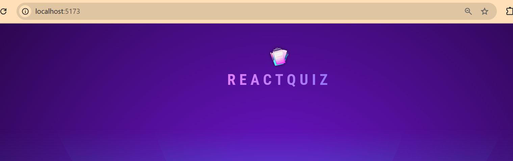

And that's of course a great first step, but of course, also pretty basic.

Therefore, we'll continue right away and also start working on the Quiz component.

Now my idea behind this component is that in there I want to show the currently active question to the user.

And when the question was answered by the user, I wanna switch to a different question.

So it should be this Quiz component that's responsible for switching between questions and registering user answers.

But of course, I'll simply start by exporting a new component function, which is called Quiz.

And then in this component, as mentioned, I wanna output the question, so the currently active question.

And this, of course, will soon be replaced with more meaningful content. That's the idea.

And then, as mentioned, in this component I wanna manage what the currently active question is, and I want to change to a different question whenever the user answers a question, and I want to store those answers.

Therefore, we'll definitely need to manage some state here, which we do with the useState hook imported from React because we need to register those answers, for example.

So, therefore, here we could add two pieces of state.

The first piece of state is the currently active question.

And for that, let's simply assume that we get an array of questions. I will soon provide you with some dummy data which will be such an array.

And therefore the currently active question could simply be managed through the index of the currently active question.

If we got an array of questions, we could simply manage the index of the currently displayed question here and change that index whenever the user answered a question.

So here we could then have the activeQuestionIndex and a setActiveQuestionIndex updating function.

That would be one way of managing which question should be displayed to the user.

And then, I'll also add a second piece of state here where I wanna register the answers selected by the user because every question will come with multiple possible answers.

And, of course, throughout the quiz, I wanna store all the answers picked by the user.

And therefore, we'll, well, need some state where we do store those answers.

And that could also be an array where we basically just add answer by answer to this array.

And I'll name this state here userAnswers and setUserAnswers because these are the answers picked by the user.

But I can already tell you that this would be a possible way of managing the state, but in my opinion, not necessarily the best way.

**Quiz.jsx** component file :

```javascript
import { useState } from 'react';

export default function Quiz() {
    const [activeQuestionIndex, setActiveQuestionIndex] = useState(0);
    const [userAnswers, setUserAnswers] = useState([]);

    return (
        <p>Currently active Question</p>
    )
}
```
</details>

<details>
<summary>Deriving Values, Outputting Questions & Registering Answers</summary>

So we got started adding some components and we got started managing some state here in the Quiz component.

Now a lot of logic is missing and of course the questions are missing. And before we'll improve the logic, I will indeed give you some questions here, so that we do have some questions to work with.

Therefore, attached to this lecture, you find a questions.js file, which you should add to your project right next to the main.jsx file.

**question.js**
```javascript
export default [
  {
    id: 'q1',
    text: 'Which of the following definitions best describes React.js?',
    answers: [
      'A library to build user interfaces with help of declarative code.',
      'A library for managing state in web applications.',
      'A framework to build user interfaces with help of imperative code.',
      'A library used for building mobile applications only.',
    ],
  },
  {
    id: 'q2',
    text: 'What purpose do React hooks serve?',
    answers: [
      'Enabling the use of state and other React features in functional components.',
      'Creating responsive layouts in React applications.',
      'Handling errors within the application.',
      'Part of the Redux library for managing global state.',
    ],
  },
  {
    id: 'q3',
    text: 'Can you identify what JSX is?',
    answers: [
      'A JavaScript extension that adds HTML-like syntax to JavaScript.',
      'A JavaScript library for building dynamic user interfaces.',
      'A specific HTML version that was explicitly created for React.',
      'A tool for making HTTP requests in a React application.',
    ],
  },
  {
    id: 'q4',
    text: 'What is the most common way to create a component in React?',
    answers: [
      'By defining a JavaScript function that returns a renderable value.',
      'By defining a custom HTML tag in JavaScript.',
      'By creating a file with a .jsx extension.',
      'By using the "new" keyword followed by the component name.',
    ],
  },
  {
    id: 'q5',
    text: 'What does the term "React state" imply?',
    answers: [
      'An object in a component that holds values and may cause the component to render on change.',
      'The lifecycle phase a React component is in.',
      'The overall status of a React application, including all props and components.',
      'A library for managing global state in React applications.',
    ],
  },
  {
    id: 'q6',
    text: 'How do you typically render list content in React apps?',
    answers: [
      'By using the map() method to iterate over an array of data and returning JSX.',
      'By using the for() loop to iterate over an array of data and returning JSX.',
      'By using the forEach() method to iterate over an array of data and returning JSX.',
      'By using the loop() method to iterate over an array of data and returning JSX.',
    ],
  },
  {
    id: 'q7',
    text: 'Which approach can NOT be used to render content conditionally?',
    answers: [
      'Using a the #if template syntax.',
      'Using a ternary operator.',
      'Using the && operator.',
      'Using an if-else statement.',
    ],
  },
];
```

So simply grab that attached file, insert it next to the main.jsx file. And in that questions.js file, you'll find an array that's being exported, which is full of dummy questions with possible answers for all those questions.

And you'll see that every question has an ID, a text, and then those mentioned answers.

And what's important about those answers is that it's always the first answer that's correct.

Now of course, when we display those answers to the user, we therefore want to shuffle them so that there it's not always the first answer that's correct.

But here in the raw data, it is the first answer so that in our web app logic, we can determine whether the user picked the right answer or not.

But we'll work on that logic a little bit later.

But now that we got this array of questions here, let's come back to this quiz state.

Why is this way of managing the state not optimal, in my opinion?

What could be the reason for that? What could be wrong here?

Well, at the moment, I plan to have two state snapshots here: the index of the currently active question and then an array of answers selected by the user.

Now, if you take a closer look at this implementation, you might see that in the end, one of the two pieces of state here is redundant because, of course, we will definitely need to store the answers picked by a user.

But when it comes to the active question index, that could actually be derived from this userAnswers array here.

Because here we will store one answer for every question. And therefore, we can simply take a look at the number of stored answers in this array, and we can derive what the currently active question index should be.

Because of course, if we have like two answers in that array, it's the third question we now want to present to the user because the first two questions have then already been answered.

Therefore, we can get rid of this activeQuestionIndex state and instead add some derived state, a computed value to this component here.

The active question index can simply be a const where we take the userAnswers and then the length of this array.

And therefore, if this is an empty array, this will give us zero and the active question index will be zero.

So it will then be the first question which we want to show to the user.

If one answer has been added because the first question has been answered, this index here will be one and therefore the second question in this questions array.

And that's therefore a better way of managing the state because when working with React, when writing React code, you typically want to manage as little state as possible and derive as much state as possible instead.

And that's what we're doing here.

And therefore, with this change here, which optimizes our code, we can now finally work on presenting a question to the user.

And therefore we want to, of course, import this questions array and then output the text of the question with the currently active question index on the screen.

Therefore, here in this component, in the Quiz component, we can import our dummy questions, maybe named like this to make it clear that this is some dummy raw data we're importing from going up one level, and then there is the questions.js file.

And then here, instead of outputting this paragraph, we can output an h2 tag, let's say, where we then output questions, access the activeQuestionIndex, and then the text property because that's the question text that should be displayed.

And of course, we also want to output the possible answers below that.

So therefore, we can actually wrap this into a div with an ID of question for styling purposes here because in this starting project I gave you, in the index.css file, I already set up a bunch of styles.

And therefore, if you use the ID question on this div, we should get some nicer styling.

And below this h2 tag, we output an unordered list, which should get an ID of answers, also for styling purposes.

And here, we then want to dynamically output all those possible answers.

Now, I said before that they should be shuffled and we will soon do that, but for the moment, just to see something on the screen, I'll simply access my question for the currently active question index, then the answers, and then we can map this list of answers, so this list of strings, to a list of JSX components as you learned early in this course.

Here, we'll get the answer in this function, and for every answer, I want to output a list item where every list item will get a key, which here could be the answer itself because the answer is just a string, but it will be a different string, a different text for every answer.

So this is indeed a unique identifier we can use.

And I'll also give every list item a className of answer, again, for styling purposes.

And then between those li tags, I want to output a button because those answers, of course, should be clickable, they should be selectable, and therefore, for semantic reasons, I'm outputting a button element.

And then here, between my button tags, I want to output the answer, so this answer text that should be displayed.

And with that, we're outputting those questions.

We can then actually also already add a function that we could call handleSelectAnswer, so that should be triggered when this button here is pressed.

And therefore, on this button, we should add the onClick prop and point at handleSelectAnswer, so that this function will be triggered.

And then in there, I want to store the selected answer in my userAnswers array.

Now therefore, of course, I'll need to get the selected answer here as a value, as a parameter, so that in here we can then update the userAnswers state.

And therefore, in order to make sure that the selected answer reaches this function, it's, of course, not enough to just point at handleSelectAnswer like this down there.

Because like this, React would just call this for us, and React, of course, would not know that it should pass the selected answer along.

And therefore, we'll instead wrap this with an arrow function here in this case, so wrap it with some other function, which will then be the function invoked by React.

So that in this potentially invoked function, we have more control over how handleSelectAnswer will be invoked, and we can now pass the answer we got here to handleSelectAnswer.

And this will still not be executed immediately when this code here is parsed, but instead still only when the button is clicked because it's then this outer function that will be invoked, and in there, our custom function execution here will then be executed.

That's how this works.

That's what you also already saw multiple times throughout this course, but it is, of course, important to be fully aware of this pattern and to understand this pattern.

So therefore, that will give us this selected answer, and now we can update our state based on that answer.

Now, of course, this state will be an array, and we definitely don't wanna lose the old answers, so the answers that have previously been selected for other questions.

And therefore, we wanna update this state with this function form, where we pass a function to the state updating function because we wanna update this state based on the previous version of this state.

And whenever you do that, you learned in this course that you should use this function form here.

And here we get our previous userAnswers, so the old version of that state, the guaranteed latest version of this state, to be precise.

And we then wanna return our updated state, which should be a new array where we spread in all those existing userAnswers, but where we then at the end append the selected answer as a new element.

That's how this state here should be updated to make sure that we don't lose any old state and that we got the guaranteed latest state.

**Quiz.jsx** component file become :

```javascript
import { useState } from 'react';

import QUESTIONS from '../questions.js';

export default function Quiz() {
    const [userAnswers, setUserAnswers] = useState([]);

    const activeQuestionIndex = userAnswers.length;

    function handleSelectAnswer(selectedAnswer) {
        setUserAnswers((prevUserAnswers) => {
            return [...prevUserAnswers, selectedAnswer];
        });
    }

    return (
        <div id='question'>
            <h2>{QUESTIONS[activeQuestionIndex].text}</h2>
            <ul id='answers'>
                {QUESTIONS[activeQuestionIndex].answers.map((answer) => (
                    <li key={answer} className='answer'>
                        <button onClick={() => handleSelectAnswer(answer)}>{answer}</button>
                    </li>
                ))}
            </ul>
        </div>
    )
}
```

And with all that out of the way, we can go to the App component now, and finally now import the Quiz component from ./components/Quiz.jsx.

**App.jsx** file :

```javascript
import Header from "./components/Header.jsx";
import Quiz from "./components/Quiz.jsx";

function App() {
    return (
        <>
            <Header />
            <main>
                <Quiz />
            </main>
        </>
    )
}

export default App;
```

And then here, besides outputting the Header, we also wanna output the Quiz, and therefore we'll need this special Fragment component that's built into React so that we can have the Header as one element and the Quiz as another element here so that we output them side by side.

And I'll actually also wrap my Quiz into the built-in main element like this just to separate them and for styling purposes.

And therefore now with all that added, if you save everything, you should see something like this on the screen.

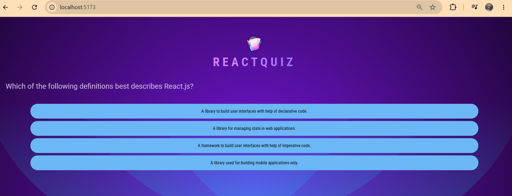

You see the answers and you see the questionnaire.

Now the styling is actually a bit off, and to fix this, we can go to the Quiz.jsx file.

And there I actually wanna add another div around my question here, so move this question div into this div, and give this div an ID of quiz.

And the codes of **Quiz.jsx** become like hits after wrapped or adding div and the id='quiz' :

```javascript
import { useState } from 'react';

import QUESTIONS from '../questions.js';

export default function Quiz() {
    const [userAnswers, setUserAnswers] = useState([]);

    const activeQuestionIndex = userAnswers.length;

    function handleSelectAnswer(selectedAnswer) {
        setUserAnswers((prevUserAnswers) => {
            return [...prevUserAnswers, selectedAnswer];
        });
    }

    return (
        <div id='quiz'>
            <div id='question'>
            <h2>{QUESTIONS[activeQuestionIndex].text}</h2>
            <ul id='answers'>
                {QUESTIONS[activeQuestionIndex].answers.map((answer) => (
                    <li key={answer} className='answer'>
                        <button onClick={() => handleSelectAnswer(answer)}>{answer}</button>
                    </li>
                ))}
            </ul>
        </div>
        </div>
    )
}
```

We'll need that because later I'll add more elements to the quiz besides this question.

But with this extra div wrapper here, you see that now this is all nicely centered.

We got this nice box here.

We can select those answers, and we progress through those different questions as we pick answers.

Now of course at the moment, at some point of time, we'll simply exhaust this array of questions, and therefore the app will crash with an error.

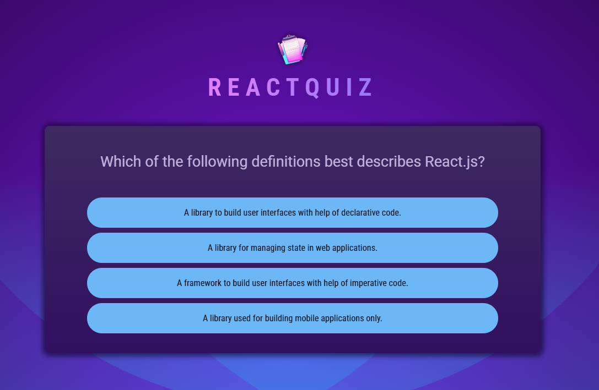

But we'll fix that soon because of course we got a lot of logic to add to this project.

But showing those questions and selecting those answers already works.
</details>

<details>
<summary>Shuffling Answers & Adding Quiz Logic</summary>

So, now that we can display questions and register answers, I wanna make sure that we do actually shuffle those answers so that they're not always presented in the same order and it's always the first answer that's correct. And I wanna make sure that once we exhausted all questions, we don't break the app with an error, but we instead show some summary screen.

Now, I wanna start by shuffling those answers. To do that, we can go to this Quiz.jsx file and in there we could now add a shuffledAnswers constant where we simply start by creating a new array. And we then spread those question answers for the selected question into this array. So, this QUESTIONS[activeQuestionIndex].answers data piece here, we spread that into this array.

Once we did that, we can use shuffledAnswers and call the built-in sort method on it. And sort will not return a new array, but instead edit the array, so the shuffledAnswers array here on which you call it. And that's why I'm creating a new array here, so that I don't edit the original answers array which I wanna keep in the order it is because there I know that it's always the first answer that's correct. And I need that information to then dynamically validate whether the user picked the right answer.

So, I don't want to edit this array, but instead I want to edit a new array, and that's what I'm doing here by creating a copy and then calling sort. And sort then takes a function, which in theory always receives two elements from this array on which you're calling it. And if you're then returning a negative number here, those elements will be swapped. If you're returning a positive number, they will stay in the order they are. And sort will then simply go through all the elements pair by pair in this array to derive a new order.

Now, I actually don't care about the inputs here because I wanna shuffle the order here. And we can achieve this by simply calling Math.random() - 0.5 because Math.random will give us a value between zero and 1, 1 excluded. And if we deduct 0.5 from that, we will end up with a negative value in 50 of 100 cases or with a positive value. And that should therefore shuffle those answers.

**Quiz.jsx** file :

```javascript
import { useState } from 'react';

import QUESTIONS from '../questions.js';

export default function Quiz() {
    const [userAnswers, setUserAnswers] = useState([]);

    const activeQuestionIndex = userAnswers.length;
    const shuffledAnswers = [...QUESTIONS[activeQuestionIndex].answers]; // edited
    shuffledAnswers.sort(() => Math.random() - 0.5); // edited
```

And therefore, it's then those shuffled answers which I wanna output down there instead of those standard default answers.

**Quiz.jsx** file :
```javascript
return (
        <div id='quiz'>
            <div id='question'>
            <h2>{QUESTIONS[activeQuestionIndex].text}</h2>
            <ul id='answers'>
                {shuffledAnswers.map((answer) => (
                    <li key={answer} className='answer'>
                        <button onClick={() => handleSelectAnswer(answer)}>{answer}</button>
                    </li>
                ))}
            </ul>
        </div>
        </div>
    )
```

With that, if we reload, you should see that the order of those answers is different every time this does reload. And that's therefore the first step.

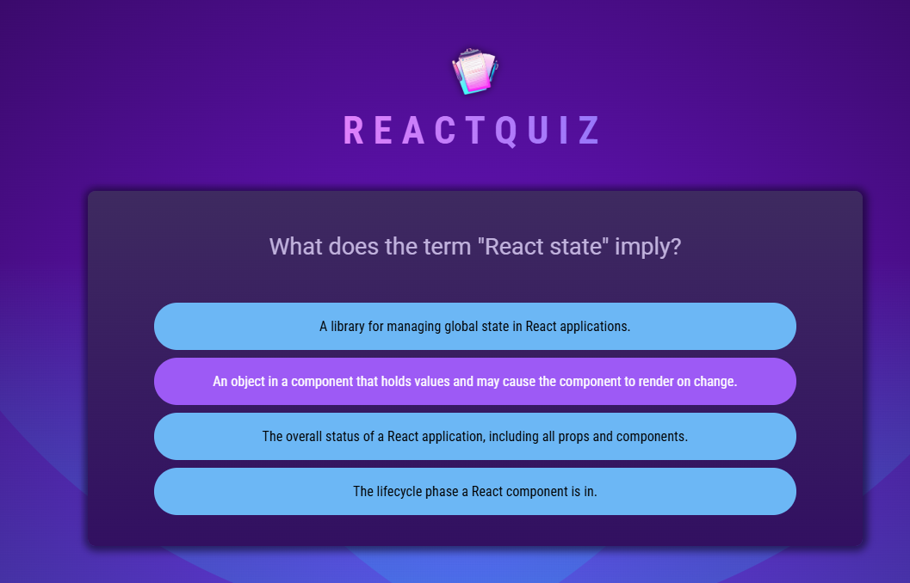

And I'll say right away that this is not fully finished yet. We'll have to tweak it a little bit later, but the core logic is correct.

But before we'll tweak it, I wanna make sure that we don't break this application and quiz if we answer too many questions as is currently the case.

And to make sure that we don't break it, we have to find out whether the quiz is over. And that can be another computed value because the quiz will be over if we registered as many user answers as we have questions.

So, we can add another new computed value, a new constant here, which could be called quizIsComplete or something like this. And this should be true if the activeQuestionIndex is equal to QUESTIONS.length like this, and false otherwise.

So with this check, we make sure that we can't exceed the number of questions we have.

```javascript
export default function Quiz() {
    const [userAnswers, setUserAnswers] = useState([]);

    const activeQuestionIndex = userAnswers.length;
    const shuffledAnswers = [...QUESTIONS[activeQuestionIndex].answers];
    shuffledAnswers.sort(() => Math.random() - 0.5);
    const quizIsComplete = activeQuestionIndex === QUESTIONS.length; // added
```

And now, we just need to display some different content and not this quiz content here if the quiz is over. So, if we did go through all questions.

And for that, we can of course add a if check here and check if quizIsComplete, and if that's the case, I want to return, let's say, a div with an id "summary". And in there we could output a h2 element where we say Quiz Completed! And maybe also some image above it which I will import into this file.

And here I wanna import this quiz-complete.png file. So therefore here it's this quizCompleteImage imported from going up one level, diving into assets, and then quiz-complete.png.

And now it's this image which should be output down there as a source. And the alt text could be "Trophy icon" because that's what's being displayed on that image.

```javascript
import quizCompleteImg from '../assets/quiz-complete.png';

export default function Quiz() {
    const [userAnswers, setUserAnswers] = useState([]);

    const activeQuestionIndex = userAnswers.length;
    const shuffledAnswers = [...QUESTIONS[activeQuestionIndex].answers];
    shuffledAnswers.sort(() => Math.random() - 0.5);
    const quizIsComplete = activeQuestionIndex === QUESTIONS.length;

    function handleSelectAnswer(selectedAnswer) {
        setUserAnswers((prevUserAnswers) => {
            return [...prevUserAnswers, selectedAnswer];
        });
    }

    if (quizIsComplete) { // adding if check
        return <div id='summary'>
            
            <h2>Quiz Completed!</h2>
        </div>
    }
```

And if you now save this, you should be able to reload, go through these questions. And once you went through all questions, it crashes again.

And that happens because we do indeed check if quizIsComplete, and then output a different component. But before we do that, even before I produce this quizIsComplete value, I'm already trying to access the activeQuestionIndex here to get my answers, which I wanna shuffle. But this will fail if the quiz is complete because we exhausted all questions.

So therefore, this logic here should actually come after this if block where we return if the quiz is complete, so that this code here only executes if we still have a question to display.

```javascript
    if (quizIsComplete) {
        return <div id='summary'>
            
            <h2>Quiz Completed!</h2>
        </div>
    }

    const shuffledAnswers = [...QUESTIONS[activeQuestionIndex].answers]; // moved after if check codes
    shuffledAnswers.sort(() => Math.random() - 0.5);
```

And with that change made, if I reload, now I can go through all those questions. And then, at the end we see this Quiz Completed screen here.

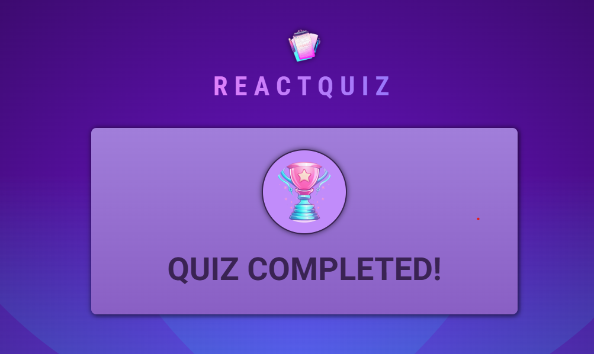

And that's therefore this logic added.

Full codes of **Quiz.jsx** component file :

```javascript
import { useState } from 'react';

import QUESTIONS from '../questions.js';
import quizCompleteImg from '../assets/quiz-complete.png';

export default function Quiz() {
    const [userAnswers, setUserAnswers] = useState([]);

    const activeQuestionIndex = userAnswers.length;
    const quizIsComplete = activeQuestionIndex === QUESTIONS.length;

    function handleSelectAnswer(selectedAnswer) {
        setUserAnswers((prevUserAnswers) => {
            return [...prevUserAnswers, selectedAnswer];
        });
    }

    if (quizIsComplete) {
        return <div id='summary'>
            
            <h2>Quiz Completed!</h2>
        </div>
    }

    const shuffledAnswers = [...QUESTIONS[activeQuestionIndex].answers];
    shuffledAnswers.sort(() => Math.random() - 0.5);

    return (
        <div id='quiz'>
            <div id='question'>
            <h2>{QUESTIONS[activeQuestionIndex].text}</h2>
            <ul id='answers'>
                {shuffledAnswers.map((answer) => (
                    <li key={answer} className='answer'>
                        <button onClick={() => handleSelectAnswer(answer)}>{answer}</button>
                    </li>
                ))}
            </ul>
        </div>
        </div>
    )
}
```
</details>

<details>
<summary>Adding Question Timers</summary>

So now that this quiz is slowly, but steadily taking shape, before we'll work on this game over screen where I of course also wanna tell the user how many questions were answered correctly and so on. Before we do that, I wanna add an extra feature to this quiz because I wanna make sure that for every question, you have a limited amount of time to answer it. Let's say 15 seconds or something like this.

And I wanna have a little progress bar that's slowly depleting as this timer expires. And if the timer did expire, the next question should be presented and this question should be skipped. So if the user does not answer in time, no answer will be registered.

And to implement this, we will now use useEffect. But of course, as you can tell, this quiz component is already growing in complexity and size, and therefore I'll outsource this timer into a brand new component.

I'll add a QuestionTimer component file called QuestionTimer.jsx. And in that file, I wanna export a new component function QuestionTimer. And here the goal in this file then is to display this progress bar, so the default progress element. But of course, this component will not just be about displaying this progress bar, it will also be about managing this progress bar.

**QuestionTimer.jsx** component file (new file) :

```javascript
export default function QuestionTimer() {
    return <progress />;
}
```

Now, I will actually start by giving this an id, question-time, which is there for styling purposes. But then to add some logic, we also wanna set a timer that expires after sometime, and we can do that with the built-in setTimeout function as you learned before.

We then just have to define after how much time this should expire. And here, I think it would be great if this QuestionTimer would be a configurable component, so that the exact time is not hard coded in this component, but can be defined in the component where this QuestionTimer component is being used.

Hence, I'll destructure my props object here and I expect to get a timeout prop here which is the timeout that should be set on this timer. So that could then, for example, be 15,000 milliseconds, so 15 seconds.

Then once the timer expired, I wanna let the parent component know about that. So that if we use QuestionTimer in the Quiz component, we actually are notified that we should move on to the next question, because it's this Quiz component where I'm managing the active question.

Therefore, QuestionTimer also should receive another prop that should be a function that should be called from inside this timer once it expired, and that could be onTimeout, for example. So that in here, in this timer, I call onTimeout.

And we can actually shorten this code and just set onTimeout as the function that should be called by the browser once this timeout expired.

Now, I'm not using useEffect here at this point because even though this is a side effect, it's at the moment not an effect that would require the usage of useEffect, because I'm not facing the danger of an infinite loop here, because I'm not updating any component state here, and I'm also not trying to interact with an element that wouldn't be available yet.

So this code at the moment is fine as it is, but of course that's not all I wanna do here.

Instead, I also wanna make sure that I update this progress bar, and therefore we also need an interval that executes some code every couple of milliseconds so that we can update this timer.

Therefore, we of course also need some state in this component so that this progress bar is rerendered every couple of milliseconds whenever that state changes.

So I'll import useState from React here and then the state that is registered here is in the end the remaining time, so remainingTime and setRemainingTime.

The initial value for the state should be this timeout value because that is the remaining time of this timer when this component is rendered.

But then I wanna update this every 10 milliseconds or something like this. And therefore we of course need setInterval as you learned, because here we can define that every 10 or 100 or whatever milliseconds, this function here should execute.

And in this function, I wanna update my remaining time by deducting 100 milliseconds or whichever frequency you chose here from it. So here we need the function form since we update the state based on the previously stored state value. And the new value is simply previous remaining time minus 100, so minus my frequency here.

And this would now of course create an infinite loop, because we're updating the state here. This would re-execute this component function. We would create a new interval where we would also update the state again and we would quickly have multiple intervals up and running which all would call this component function.

And that's of course definitely not what we want and that's therefore a use case for useEffect because now we can wrap this code with useEffect here by passing this effect function to useEffect and this dependencies array about which you learned.

And then we should move this setInterval code into useEffect to make sure that this is not re executed all the time, but instead only when those dependencies change.

And in here, we don't have any dependencies that would need to be added here, because you basically only need to add props and state values, and we're using neither of those in this effect function.

But we should now of course also wrap this setTimeout code with useEffect, because otherwise when we update the remaining time, which we will do every 100 milliseconds, this component function executes again and this timer would be recreated, and we therefore would quickly have multiple timers up and running.

Therefore, we should add another useEffect call here and move this code into this useEffect function.

And here we now do need to add a dependency, because we actually have two dependencies that are used in this effect function. Because we're using two props in there, the timeout prop and the onTimeout prop, which is a function, but still a prop.

So here we should add timeout and onTimeout as dependencies to make sure that this effect function gets re-executed if one of those dependencies changes.

And that of course makes sense because if the parent component should decide that the QuestionTimer timeout should change, we, of course, also wanna reset the timer and set it again.

And with all that, we're not done yet. We will tweak the code later, but we get a good starting state.

And we can now use this remainingTime here to update this progress bar. There we wanna set the max value to this timeout duration we're getting through the timeout prop, and the current value then should be the remaining time.

Because keep in mind, this remainingTime initially is this timeout value, but it's then getting less and less as this time expires.

**QuestionTimer.jsx** component file :

```javascript
import { useState, useEffect } from "react";

export default function QuestionTimer({ timeout, onTimeout }) {
    const [remainingTime, setRemainingTime] = useState(timeout);

    useEffect(() => {
        setTimeout(onTimeout, timeout);
    }, [timeout, onTimeout]);
    
    useEffect(() => {
        setInterval(() => {
            setRemainingTime(prevRemainingTime => prevRemainingTime - 100);
        }, 100);
    }, []);

    return <progress id="question-time" max={timeout} value={remainingTime} />;
}
```

With that, we can go back to the Quiz component and there import this QuestionTimer component we just worked on from QuestionTimer.jsx and use that component here.

**Quiz.jsx** file :

```javascript
import { useState } from 'react';

import QUESTIONS from '../questions.js';
import QuestionTimer from './QuestionTimer.jsx'; // added
import quizCompleteImg from '../assets/quiz-complete.png';

export default function Quiz() {
```

And I wanna display it right above my question text here inside of that question div. That's where I wanna output the QuestionTimer.

And now we of course must set both the timeout and the onTimeout props.

Now, timeout should be the duration of the timer in milliseconds. And to get a ten second timer, for example, we should therefore enter 10,000 here, because that's 10 seconds in milliseconds.

And onTimeout, of course, should be a function that should be executed once the timer expired.

And here we could execute handleSelectAnswer, but pass null as a value. So that we add a new entry to this userAnswers array in this function, but the value we add is null, so that it's not actually an answer from the available answers, but instead a placeholder that basically tells us that no answer was chosen for this question.

**Quiz.jsx** component file :

```javascript
return (
        <div id='quiz'>
            <div id='question'>
                <QuestionTimer  // added
                    timeout={10000} 
                    onTimeout={() => handleSelectAnswer(null) } />
                <h2>{QUESTIONS[activeQuestionIndex].text}</h2>
                <ul id='answers'>
                    {shuffledAnswers.map((answer) => (
                        <li key={answer} className='answer'>
                            <button onClick={() => handleSelectAnswer(answer)}>{answer}</button>
                        </li>
                        ))}
                </ul>
            </div>
        </div>
```

And with that, if we save that and reload, we see this timer here expiring and as it expires, nothing happens. Or actually something happens after a while, but not instantly as it expired.

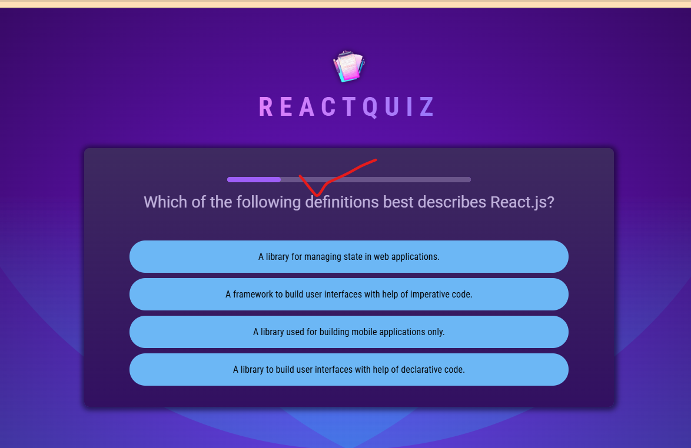

Instead, as you see, if you reload, this timer expires and then we have to wait until at some point of time we do move on to the next question.

And here we then of course have no timer as you see, instead it stays empty instead of resetting. And then at some point it still expires because it still seems to be going on behind the scenes, which is all the rather strange since it expired.

So it looks like we need to fix a couple of things here.

Full codes of **Quiz.jsx** file :

```javascript
import { useState } from 'react';

import QUESTIONS from '../questions.js';
import QuestionTimer from './QuestionTimer.jsx';
import quizCompleteImg from '../assets/quiz-complete.png';

export default function Quiz() {
    const [userAnswers, setUserAnswers] = useState([]);

    const activeQuestionIndex = userAnswers.length;
    const quizIsComplete = activeQuestionIndex === QUESTIONS.length;

    function handleSelectAnswer(selectedAnswer) {
        setUserAnswers((prevUserAnswers) => {
            return [...prevUserAnswers, selectedAnswer];
        });
    }

    if (quizIsComplete) {
        return <div id='summary'>
            
            <h2>Quiz Completed!</h2>
        </div>
    }

    const shuffledAnswers = [...QUESTIONS[activeQuestionIndex].answers];
    shuffledAnswers.sort(() => Math.random() - 0.5);

    return (
        <div id='quiz'>
            <div id='question'>
                <QuestionTimer 
                    timeout={10000} 
                    onTimeout={() => handleSelectAnswer(null) } />
                <h2>{QUESTIONS[activeQuestionIndex].text}</h2>
                <ul id='answers'>
                    {shuffledAnswers.map((answer) => (
                        <li key={answer} className='answer'>
                            <button onClick={() => handleSelectAnswer(answer)}>{answer}</button>
                        </li>
                        ))}
                </ul>
            </div>
        </div>
    )
}
```

**QuestionTimer.jsx**

```javascript
import { useState, useEffect } from "react";

export default function QuestionTimer({ timeout, onTimeout }) {
    const [remainingTime, setRemainingTime] = useState(timeout);

    useEffect(() => {
        setTimeout(onTimeout, timeout);
    }, [timeout, onTimeout]);
    
    useEffect(() => {
        setInterval(() => {
            setRemainingTime(prevRemainingTime => prevRemainingTime - 100);
        }, 100);
    }, []);

    return <progress id="question-time" max={timeout} value={remainingTime} />;
}
```
</details>

<details>
<summary>Working With Effect Dependencies & useCallback</summary>

Now to understand what's wrong here, let's first of all add a couple of console.log statements here in QuestionTimer.jsx, and I'll add one right in this effect where I set my timeout. Here I'll basically say SETTING TIMEOUT, and I'll copy that to the second useEffect call where I set my interval, and therefore I'll say SETTING INTERVAL here.

**QuestionTimer.jsx** component file :

```javascript
import { useState, useEffect } from "react";

export default function QuestionTimer({ timeout, onTimeout }) {
    const [remainingTime, setRemainingTime] = useState(timeout);

    useEffect(() => {
        console.log('SETTING TIMEOUT'); // added
        setTimeout(onTimeout, timeout);
    }, [timeout, onTimeout]);
    
    useEffect(() => {
        console.log('SETTING INTERVAL'); // added
        setInterval(() => {
            setRemainingTime(prevRemainingTime => prevRemainingTime - 100);
        }, 100);
    }, []);

    return <progress id="question-time" max={timeout} value={remainingTime} />;
}
```

Now one thing you'll notice if you save that and reload and open the console here is that you get those logs twice, but that's only happening because we're in StrictMode here in the main.jsx file. The whole app is wrapped in StrictMode, and that StrictMode actually calls every component function twice behind the scenes since this can help you catch certain issues.

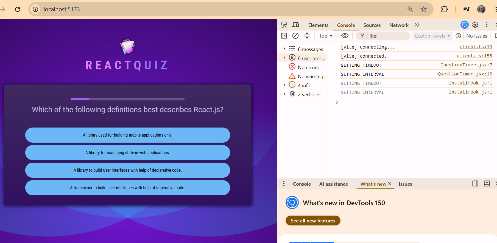

But you'll also notice if you reload again that as this timer expires, nothing happens, but then after a while a new timer is set, but not a new interval. There we still only have the old logs. But this timer keeps getting a reset, as you can tell by this number in front of SETTING TIMEOUT, which is incrementing here, which changed to two and now to three.

So clearly this effect function here keeps on getting executed. And that is weird because this QuestionTimer component is rendered once, here, when that quiz is being rendered, but it's not getting recreated thereafter. Sure, the Quiz component rerenders whenever an answer is selected, but this component instance of the QuestionTimer does not change. It was part of the old JSX code. It is part of the new JSX code.

So in theory, this effect function shouldn't execute again, and for example, this effect function where the interval is set does not execute again. As you see in the log, it's just the timeout effect function that was executed again.

So the fact that this effect function keeps on getting executed must be related to our dependencies here.

Now one dependency is the timeout, and that value never changes. So that should not trigger the effect function to run again because as you learned, the effect function is executed again if the surrounding component function executes again and the dependency values changed, and for a timeout that will definitely not be the case. It is always 10,000.

So it must be this function that changed. That's the only possible explanation here.

And indeed this is what's happening here, because as you also learned in the previous section, functions in JavaScript are values, they are objects. And when a function is created like here, when this JSX code is evaluated, it is a new object in memory that's being created. And even if it contains the same logic and code as before, it's still technically a new value in memory.

So every time this JSX code in this Quiz component gets reevaluated, a new function gets created here. And this JSX code gets reevaluated whenever the state in this Quiz component is updated, which happens when the user picks an answer.

Now, to work around that we have to do something which you learned in the last section as well. We have to use another special hook which ensures that functions don't get recreated unless they need because their dependencies changed.

We need to use the useCallback hook here. We need to use it and wrap this function with it.

Now to not violate any rules of hooks here and use this hook in this nested code, I will actually go up here below handleSelectAnswer and add a new constant that could be called handleSkipAnswer because that's in the end what happens if the timer expired.

And here I'll then store the return value of useCallback, and I'll then wrap this function here, which I had down here, this function. I'll cut it from here and wrap it with useCallback like this.

And then, as you learned in the previous section, useCallback also needs a dependencies array that lists all dependencies that might be used in here.

Now, in here I am indeed using a dependency. I am indeed using the handleSelectAnswer function. So technically we should add that as a dependency here in this array because this is a value created here in this component function which could depend on props and state.

So therefore, indirectly, this function here depends on props and state, and therefore we should also use useCallback here and create handleSelectAnswer by wrapping this function here with useCallback, and there we also have to add our list of dependencies.

But here we now don't have to add anything to that list because in this handleSelectAnswer function we are not using any state or props and also not any other values that depend on state or props.

A state updating functions like this don't have to be added here because React will guarantee that they never change.

Well, and with all that we now have functions that are not recreated just because the surrounding component function was executed again, and therefore it's now handleSkipAnswer which I pass to onTimeout.

**Quiz.jsx** compoennt file after updated :

```javascript
import { useState, useCallback } from 'react';

import QUESTIONS from '../questions.js';
import QuestionTimer from './QuestionTimer.jsx';
import quizCompleteImg from '../assets/quiz-complete.png';

export default function Quiz() {
    const [userAnswers, setUserAnswers] = useState([]);

    const activeQuestionIndex = userAnswers.length;
    const quizIsComplete = activeQuestionIndex === QUESTIONS.length;

    const handleSelectAnswer = useCallback(function handleSelectAnswer(selectedAnswer) {
        setUserAnswers((prevUserAnswers) => {
            return [...prevUserAnswers, selectedAnswer];
        });
    }, []);

    const handleSkipAnswer = useCallback(() => handleSelectAnswer(null), [handleSelectAnswer] );

    if (quizIsComplete) {
        return <div id='summary'>
            
            <h2>Quiz Completed!</h2>
        </div>
    }

    const shuffledAnswers = [...QUESTIONS[activeQuestionIndex].answers];
    shuffledAnswers.sort(() => Math.random() - 0.5);

    return (
        <div id='quiz'>
            <div id='question'>
                <QuestionTimer 
                    timeout={10000} 
                    onTimeout={handleSkipAnswer} />
                <h2>{QUESTIONS[activeQuestionIndex].text}</h2>
                <ul id='answers'>
                    {shuffledAnswers.map((answer) => (
                        <li key={answer} className='answer'>
                            <button onClick={() => handleSelectAnswer(answer)}>{answer}</button>
                        </li>
                        ))}
                </ul>
            </div>
        </div>
    )
}
```

And as I do that, if I reload, you'll see that the timeout and interval is set initially, but not thereafter. As we move to a new question, the timeout is now not set again.

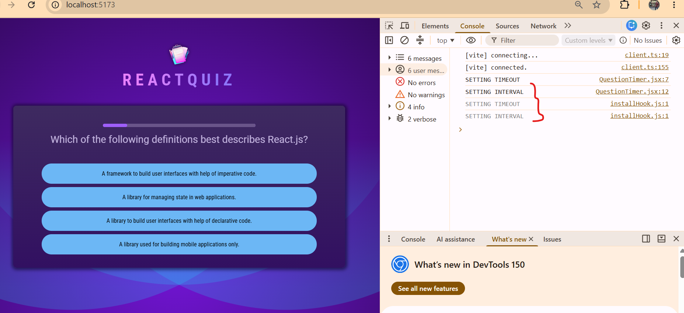

Now we still have that weird pause after the timer expired where we're not moving on to the next answer instantly, or to the next question, but that's something we'll fix in the next lectures.

**QuestionTimer.jsx** component file :

```javascript
import { useState, useEffect } from "react";

export default function QuestionTimer({ timeout, onTimeout }) {
    const [remainingTime, setRemainingTime] = useState(timeout);

    useEffect(() => {
        console.log('SETTING TIMEOUT');
        setTimeout(onTimeout, timeout);
    }, [timeout, onTimeout]);
    
    useEffect(() => {
        console.log('SETTING INTERVAL');
        setInterval(() => {
            setRemainingTime(prevRemainingTime => prevRemainingTime - 100);
        }, 100);
    }, []);

    return <progress id="question-time" max={timeout} value={remainingTime} />;
}
```
</details>

<details>
<summary>Using Effect Cleanup Functions & Using Keys for Resetting Components</summary>

Now, where's this strange behavior coming from that this progress bar is empty, but we only move on to the next question after a couple of extra seconds?

Well, the problem is simply that the progress bar is depleting too quickly. We have a ten second timer, but if you set a stopwatch, you'll see that the progress bar is empty after five seconds.

And that's happening because this interval here is actually getting triggered twice and therefore we have two intervals running behind the scenes that keep on updating this state. And therefore the progress bar is empty in half the time. You can see that it's getting triggered twice here in the console.

And that's happening as I mentioned before, because we have React's StrictMode turned on in main JSX. Now during development, and only there, this StrictMode will actually execute every component function twice, which is done to help you catch certain errors in your app.

Because in theory, your app should work in exactly the same way, no matter if a component function gets executed once when being rendered to the screen or 100 times. And clearly here, that's not the case, which is an indicator for a bug we have in our code.

So here in this case, StrictMode helps us identify that we have a bug. But what is the problem?

Well, the problem here is that when this effect function gets executed twice here we have two running intervals. That should not be the case.

And what's missing here in our code is a cleanup function. We have to clean up the existing interval if this effect function runs again. And if we do that, it wouldn't matter if this effect function gets called 10 times, because if we always clean up the old intervals, we'll only have one interval up and running at the same time.

And this is something we should add anyways, because at the moment if I move to a different question we also have the problem that the old timer keeps on running and is not being reset. And that should eventually also change and therefore will also need a cleanup function for that reason.

So let's go here to the question timer component and store a reference to that interval in a constant and then add that cleanup function as you learned it as a return value in that effect function.

And this cleanup function will then automatically be executed by React before it runs this effect function again, or when this component is unmounted from the DOM. So if it disappears from the screen.

So therefore here in this cleanup function we now should call clear interval and pass this interval reference to it.

And we should actually do the same for the timer, because otherwise this timer will keep on going. And for example, if this component would be removed from this screen because we reach that game over screen here, we of course wanna clean up the timer.

So therefore here we should also store a reference to that timer in a variable or constant. And then add that cleanup function here where we clear that timeout by passing the timer to it.

And now with that, with those cleanup functions added, if we now reload we will see that this progress bar does not deplete that quickly anymore, but instead works as intended. And therefore, once it's empty, we move on to the next question.

But of course, now we have the problem that the timer and this progress bar is never reset.

Now why is that timer and progress bar not reset when we move on to a new question?

Well, because this question timer component doesn't get recreated. Keep in mind that we're using the question timer component in the quiz component here.

And when we move on to a new question, we do that by storing a user answer. And then the act of question index changes because the length of user answers changed. But therefore, of course this JSX code just gets updated.

But this question timer component is not being recreated because it hasn't changed. It was part of the DOM before. It is still part of the DOM now. The only thing that changed is the question text that's being displayed and the answers that are displayed.

But this component was there and is there, and therefore it's not unmounted, not remounted, and therefore the timers and intervals in that component are not reset.

Now of course here in this application, we'd like to have this timer to be reset though, because of course it should reset when the question changed.

And there is a simple yet very powerful trick you can use in React to achieve this.

You can add a key to this component, because this key prop can actually be added to any element and any component, because key is a built-in prop React is looking for.

And you already learned that you should use this key when outputting list data, because there this key helps React identify those different list items and it helps React manage that list efficiently behind the scenes, so to say.

But the key prop also has another purpose. Whenever it changes on a component, even if that component is not part of a list, whenever it changes React will destroy the old component instance and create a new one. So it will unmount and remount it basically.

And that's exactly what we need here, because I wanna recreate this question timer component whenever we switch to a new question.

And therefore we could set the question timer key here to the act of question index, which will change whenever the question changes.

And with that simple change, with that key prop added here, if you now reload you'll see that once this timer expired here, once this progress bar is empty and we move to a new question, it will jump back and reset.

A new timer will be set, a new interval will start, and that will keep on happening as we automatically go through all these questions.

So that's a nice trick with key, a nice feature of React that you should definitely be aware of.

**Quiz.jsx** file :

```javascript
import { useState, useCallback } from 'react';

import QUESTIONS from '../questions.js';
import QuestionTimer from './QuestionTimer.jsx';
import quizCompleteImg from '../assets/quiz-complete.png';

export default function Quiz() {
    const [userAnswers, setUserAnswers] = useState([]);

    const activeQuestionIndex = userAnswers.length;
    const quizIsComplete = activeQuestionIndex === QUESTIONS.length;

    const handleSelectAnswer = useCallback(function handleSelectAnswer(selectedAnswer) {
        setUserAnswers((prevUserAnswers) => {
            return [...prevUserAnswers, selectedAnswer];
        });
    }, []);

    const handleSkipAnswer = useCallback(() => handleSelectAnswer(null), [handleSelectAnswer] );

    if (quizIsComplete) {
        return <div id='summary'>
            
            <h2>Quiz Completed!</h2>
        </div>
    }

    const shuffledAnswers = [...QUESTIONS[activeQuestionIndex].answers];
    shuffledAnswers.sort(() => Math.random() - 0.5);

    return (
        <div id='quiz'>
            <div id='question'>
                <QuestionTimer 
                    key={activeQuestionIndex}
                    timeout={10000} 
                    onTimeout={handleSkipAnswer} />
                <h2>{QUESTIONS[activeQuestionIndex].text}</h2>
                <ul id='answers'>
                    {shuffledAnswers.map((answer) => (
                        <li key={answer} className='answer'>
                            <button onClick={() => handleSelectAnswer(answer)}>{answer}</button>
                        </li>
                        ))}
                </ul>
            </div>
        </div>
    )
}
```

**QuestionTimer.jsx** file :

```javascript
import { useState, useEffect } from "react";

export default function QuestionTimer({ timeout, onTimeout }) {
    const [remainingTime, setRemainingTime] = useState(timeout);

    useEffect(() => {
        console.log('SETTING TIMEOUT');
        const timer = setTimeout(onTimeout, timeout);

        return () => {
            clearTimeout(timer);
        };
    }, [timeout, onTimeout]);
    
    useEffect(() => {
        console.log('SETTING INTERVAL');
        const interval = setInterval(() => {
            setRemainingTime(prevRemainingTime => prevRemainingTime - 100);
        }, 100);

        return () => {
            clearInterval(interval);
        };
    }, []);

    return <progress id="question-time" max={timeout} value={remainingTime} />;
}
```
</details>

<details>
<summary>Highlighting Selected Answers & Managing More State</summary>

So now that we got this working timer here, I'd like to enhance this application by making sure that as the user picks an answer here, I actually first highlight that answer. And then after a second the color of the answer changes to green if it was the correct answer or red if it was the wrong answer. And then after let's say two additional seconds, the next question should be loaded. So instead of instantly switching to a different question as an answer is selected, I'd like to lock the answer in and show the user whether it was right or wrong before moving on. That's my idea.

And to implement this idea, some changes in the code are required. To be precise, in the quiz component, we'll have to work on this handleSelectAnswer function here because instead of storing the selected answer right away, which would lead to the next question being selected, I first of all wanna change the color of the selected answer.

And to do that we could start managing a second piece of state here, which basically controls our current answer state. And that could be an empty string initially, for example, or a text like unanswered, to make it clear that the question has not been answered yet. But I'll go for an empty string and I'll name this answerState and have my setAnswerState updating function.

And then here in handleSelectAnswer, I wanna change my answer state and change it to answered once the user did select an answer. Then I also want to set a timer in here with setTimeout so that after a second, let's say, so after 1000 milliseconds, we changed that answer state to correct if the correct answer was chosen, or to wrong if the wrong answer was chosen. And later we'll use this state to update the styling of the answer.

So here after one second, I wanna find out whether it was the right or wrong answer. For that, we can add an if check here and simply take a look at the answer that was chosen by the user, so the selected answer, and simply compare it to the correct answer of the question which was presented to the user.

And there we know that when it comes to the answers for all those questions, it's always the first answer in that raw data that's the correct answer. So if the selected answer is equal to this first answer, we know that the correct answer was chosen. So here we can therefore check if selectedAnswer is equal to QUESTIONS. So to my raw questions data, and there of course the activeQuestionIndex and then there take a look at the first answer in its list of answers.

If our selected answer is equal to that first answer, we know it's the right answer that was picked. So then we can update our state and set answerState equal to correct like this. Else, we wanna set the answerState to wrong because then a wrong answer was picked.

Now with that, I am using the activeQuestionIndex in this handleSelectAnswer function though. And since this is wrapped with useCallback, we therefore now have to add activeQuestionIndex to this dependencies array of useCallback. Because this function here that's wrapped by useCallback should be recreated whenever the activeQuestionIndex value changed because we're using that value in that function body and we don't want to use an outdated value here. So it's important that it gets recreated whenever this answer index changes. Hence it must be added here as a dependency.

Now of course, another problem we'll face is that the activeQuestionIndex will change right away once the user answer has been selected. Now one workaround could be to move this code where we update this array of user answers into this timeout where we mark an answer as correct or wrong.

But if we would do that, we would still move away from this question right after we know whether it was correct or wrong and we would not be able to update the styling and show the user that it was right or wrong because, well, we moved away right away.

So what I'll do instead is I'll simply go back here and make sure that my activeQuestionIndex is equal to userAnswers.length if the current answerState is an empty string. So if the question has not been answered yet. So if this is an empty string, then my current activeQuestionIndex is equal to userAnswers.length. Otherwise it should be equal to userAnswers.length - 1, so that we still stick to the old questions, so to say.

And that of course also implies that we need to reset the answerState to an empty string at some point. And I wanna reset it in here, after we marked the answer as correct or wrong. Here, I wanna set another timer. So I'm having some nested timers here which will only start after this timer expired. This timer could now be set to two seconds. And here I wanna set my answerState back to an empty string, which in the end makes sure that the answer gets reset. So to say, it's no longer marked as right or wrong. And due to the logic we added here, we will then also move on to the next question.

So let's see whether that works and to see that, I also wanna update the styling of this component a little bit based on the answerState. And for that, I'll go to this button here and add a className to it and set that to a dynamic value.

And this className here should either be an empty string if the answer has not been selected yet, it should be selected, let's say, if it has been selected, and it should be correct if it was selected and is correct and wrong if it was selected and is wrong.

Therefore, here in this list, I'll actually expand this body of this function that we pass to map, cut this and return this list item like this and then derive the CSS class that should be added to this button here, so that we have the cssClasses variable here which should be used as a value, let's say.

And now cssClasses should change depending on whether this answer was selected or not and whether it is correct or not if it was selected. So here I want to check if the answerState is equal to answered, which is one of the state values we are setting up here.

And if that is the case, I of course wanna find out if it was this specific answer that's being output here that was selected because here we're outputting a list of answers and just one of them will have been selected.

And we can find out whether it's this answer that has been selected by also taking a look at the userAnswers because I'm updating that as well as soon as the answer was selected. And we can simply take a look at the last element in there to find out which answer was picked.

So here I'll add a little helper. Constant isSelected could be the name. And here I'll take a look at the userAnswers. And then there at the last element with userAnswers.length - 1 and that should be userAnswers, and check if that is equal to this answer, which we're currently outputting here.

And if that's the case, we know that it's this answer that was selected. So then we can use isSelected down there. And we know that the answerState is answered and it's this answer that has been selected. So in that case, my CSS class that I wanna apply here is selected. And it should be selected because that's one of the classes I prepared in the index.css file. And I renamed this to cssClass also down here.

And with that, we should be updating this as it is being selected.

Now we wanna switch from selected to correct or wrong once we know that this answer is correct or wrong. And for that, we again can use the answerState because it's that state that is being set to correct or wrong.

And to achieve this down here in the JSX code, we can add another if block where we check if answerState is equal to correct or answerState is equal to wrong. And... And we should now wrap that with parentheses.

And if this answer is selected, of course, and if that's the case, I instead wanna set my CSS class to answerState, so to correct or wrong. And then it's the CSS class that is applied to the button.

**Quiz.jsx** component :

```javascript
import { useState, useCallback } from 'react';

import QUESTIONS from '../questions.js';
import QuestionTimer from './QuestionTimer.jsx';
import quizCompleteImg from '../assets/quiz-complete.png';

export default function Quiz() {
    const [answerState, setAnswerState] = useState('');
    const [userAnswers, setUserAnswers] = useState([]);

    const activeQuestionIndex = answerState === '' ? userAnswers.length : userAnswers.length - 1;
    const quizIsComplete = activeQuestionIndex === QUESTIONS.length;

    const handleSelectAnswer = useCallback(function handleSelectAnswer(selectedAnswer) {
        setAnswerState('answered');
        setUserAnswers((prevUserAnswers) => {
            return [...prevUserAnswers, selectedAnswer];
        });

        setTimeout(() => {
            if (selectedAnswer === QUESTIONS[activeQuestionIndex].answers[0]) {
                setAnswerState('correct');
            } else {
                setAnswerState('wrong');
            }

            setTimeout(() => {
                setAnswerState('');
            }, 2000);
        }, 1000);
    }, [activeQuestionIndex]);

    const handleSkipAnswer = useCallback(() => handleSelectAnswer(null), [handleSelectAnswer] );

    if (quizIsComplete) {
        return <div id='summary'>
            
            <h2>Quiz Completed!</h2>
        </div>
    }

    const shuffledAnswers = [...QUESTIONS[activeQuestionIndex].answers];
    shuffledAnswers.sort(() => Math.random() - 0.5);

    return (
        <div id='quiz'>
            <div id='question'>
                <QuestionTimer 
                    key={activeQuestionIndex}
                    timeout={10000} 
                    onTimeout={handleSkipAnswer} />
                <h2>{QUESTIONS[activeQuestionIndex].text}</h2>
                <ul id='answers'>
                    {shuffledAnswers.map((answer) => {
                        const isSelected = userAnswers[userAnswers.length - 1] === answer;
                        let cssClass = '';

                        if (answerState === 'answered' && isSelected) {
                            cssClass = 'selected';
                        }

                        if ((answerState === 'correct' || answerState === 'wrong') && isSelected) {
                            cssClass = answerState;
                        }

                        return (
                            <li key={answer} className='answer'>
                            <button 
                                onClick={() => handleSelectAnswer(answer)} 
                                className={cssClass}
                            >
                                {answer}
                            </button>
                            </li>
                        );
                    })}
                </ul>
            </div>
        </div>
    )
}
```

And with that, if I save it and go back, if I click on an answer, you see it gets highlighted and then it gets marked as right or wrong, though as you also saw, it jumps around as I click on it. And that's super weird, of course. Why is it jumping around? Why is this not working?

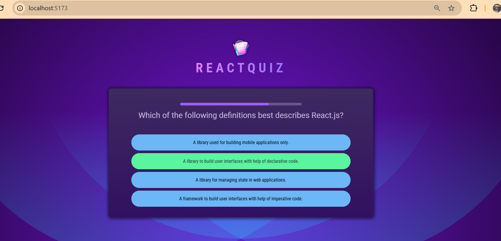
</details>

<details>
<summary>Splitting Components Up To Solve Problems</summary>

So why do these answers jump around as I select one?

Well, they jump around, because in this quiz component, which is becoming rather big by the way, but in this quiz component, we are shuffling those answers. As you might recall, we're doing that down here. And this code, of course, executes whenever this quiz component function executes.

Thus far, this was no problem, because this function only executes again if the state changes, and up to this point, we only changed the state once we moved to a new question, but this is not the case anymore. Instead now we have this in-between state where we highlight the selected answer, so where we don't move to a new question right away. And therefore this quiz component function gets executed again, when we change the answer state, for example, and hence we shuffle those answers again. We create a new order of answers and that's, of course, a problem.

We only wanna shuffle those answers once, and there are now two main ways of achieving this.

One way would be to add a new state, a shuffled answers state, which could initially be an empty array, and then we had the shuffled answers state, and a set shuffled answers state updating function, and then we could use the useEffect hook to make sure that this only gets updated when this component renders for the first time or if the active question index changed, for example, by adding active question index as a dependency of useEffect.

This would be one way, but I'm not going to take that route, because as a React developer, you should typically try to minimize the usage of useEffect, because it happens relatively quickly that you use useEffect wrong, and therefore potentially add bugs to your application. Therefore, it is typically considered a good practice to avoid the usage of useEffect if it's possible.

And here it is possible to avoid it, because you could instead use a ref with the useRef hook. Now not to connect some HTML element, but instead to manage some value, which, as you learned earlier in the course, will not change if the component function is executed again. That is something you learned in the refs course section, that you can use refs for managing values that are stored and managed independently from the component function lifecycle to which they belong.

So here we could then have our shuffledAnswers ref for example, and store the shuffled answers in this ref instead of a constant down there, so that we set the shuffledAnswers.current value equal to this array, and we call shuffledAnswers.current.sort, and we then wrap this logic with an if check, where we simply check if shuffledAnswers.current is undefined, so if it's not truthy.

If it's undefined, I want to execute this code, because if it's undefined, I know that I don't have any shuffled answers yet, because that will be the initial state, that it's undefined. But once it has been defined, I will not shuffle them again, even if the component function executes again, because I already did change the order.

Now if we do that, we also have to make sure that we use shuffledAnswers.current down there in the JSX code as well.

The temporary **Quiz.jsx** component file by adding useRef also adding the shuffledAnswer by calling current :

```javascript
import { useState, useCallback, useRef } from 'react';

import QUESTIONS from '../questions.js';
import QuestionTimer from './QuestionTimer.jsx';
import quizCompleteImg from '../assets/quiz-complete.png';

export default function Quiz() {
    const shuffledAnswers = useRef();
    const [answerState, setAnswerState] = useState('');
    const [userAnswers, setUserAnswers] = useState([]);

    const activeQuestionIndex = 
        answerState === '' ? userAnswers.length : userAnswers.length - 1;
    const quizIsComplete = activeQuestionIndex === QUESTIONS.length;

    const handleSelectAnswer = useCallback(function handleSelectAnswer(selectedAnswer) {
        setAnswerState('answered');
        setUserAnswers((prevUserAnswers) => {
            return [...prevUserAnswers, selectedAnswer];
        });

        setTimeout(() => {
            if (selectedAnswer === QUESTIONS[activeQuestionIndex].answers[0]) {
                setAnswerState('correct');
            } else {
                setAnswerState('wrong');
            }

            setTimeout(() => {
                setAnswerState('');
            }, 2000);
        }, 1000);
    }, [activeQuestionIndex]);

    const handleSkipAnswer = useCallback(() => handleSelectAnswer(null), [handleSelectAnswer] );

    if (quizIsComplete) {
        return <div id='summary'>
            
            <h2>Quiz Completed!</h2>
        </div>
    }

    if (!shuffledAnswers.current) {
        shuffledAnswers.current = [...QUESTIONS[activeQuestionIndex].answers];
        shuffledAnswers.current.sort(() => Math.random() - 0.5);
    }

    return (
        <div id='quiz'>
            <div id='question'>
                <QuestionTimer 
                    key={activeQuestionIndex}
                    timeout={10000} 
                    onTimeout={handleSkipAnswer} />
                <h2>{QUESTIONS[activeQuestionIndex].text}</h2>
                <ul id='answers'>
                    {shuffledAnswers.current.map((answer) => {
                        const isSelected = userAnswers[userAnswers.length - 1] === answer;
                        let cssClass = '';

                        if (answerState === 'answered' && isSelected) {
                            cssClass = 'selected';
                        }

                        if ((answerState === 'correct' || answerState === 'wrong') && isSelected) {
                            cssClass = answerState;
                        }

                        return (
                            <li key={answer} className='answer'>
                            <button 
                                onClick={() => handleSelectAnswer(answer)} 
                                className={cssClass}
                            >
                                {answer}
                            </button>
                            </li>
                        );
                    })}
                </ul>
            </div>
        </div>
    )
}
```

And if we now save this and reload, and I now select an answer, you see that it stays in place and we don't shuffle those answers again. And you see that highlighting it as selected and then as right or wrong also works.

But you'll also notice, that now as I select the answer and move to a new question, the answer actually stays selected, and what's even worse or also bad, is that in general, those answers now don't change anymore as we move to a new question. So the application is not working correctly anymore, and that is happening now because of our ref usage here, because I'm now never changing my shuffled answers here. I'm just shuffling them once and that's it.

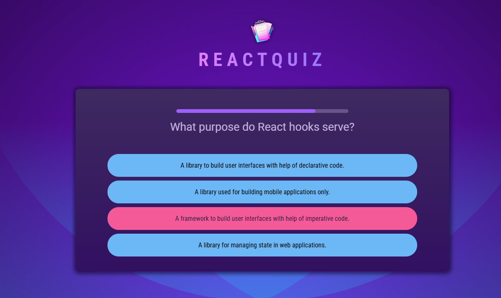

And now one of the easiest ways of getting rid of this issue here, in my opinion is to simply create a new component, because React is all about components, and here you'll now see another example for why working with components is great and why they can help you solve complex problems.

Because here we can add a new component, the **Answers.jsx** component, which lives in an Answers.jsx file, and it's a default component function that should be exported here. And my goal with this component here, is to output this list of shuffled answers.

So I'll grab this unordered list here, this unordered list of answers, cut it from the quiz component, and add it here as a returned value in the Answers.jsx file.

These below code from *Quiz.jsx* cut and paste in *Answers.jsx* component:

```javascript
<ul id='answers'>
                    {shuffledAnswers.current.map((answer) => {
                        const isSelected = userAnswers[userAnswers.length - 1] === answer;
                        let cssClass = '';

                        if (answerState === 'answered' && isSelected) {
                            cssClass = 'selected';
                        }

                        if ((answerState === 'correct' || answerState === 'wrong') && isSelected) {
                            cssClass = answerState;
                        }

                        return (
                            <li key={answer} className='answer'>
                            <button 
                                onClick={() => handleSelectAnswer(answer)} 
                                className={cssClass}
                            >
                                {answer}
                            </button>
                            </li>
                        );
                    })}
                </ul>
```

Now of course, we'll need a bunch of information in this component now, in this answers component, to render those answers correctly. For example, we'll need that list of answers that should be rendered. So we need to get that array of answers as input, as a prop.

In addition, I also need to know which answer was selected. So it would be nice to get some selectedAnswer prop which we can use. And we need that answerState, so whether an answer was selected at all, and if that selected answer is considered to be correct or not.

For temporarily the component of **Answer.jsx** become :

```javascript
export default function Answers({answers, selectedAnswers, answerState}) {
    return (
        <ul id='answers'>
            {shuffledAnswers.current.map((answer) => {
                const isSelected = userAnswers[userAnswers.length - 1] === answer;
                let cssClass = '';

                if (answerState === 'answered' && isSelected) {
                    cssClass = 'selected';
                }

                if ((answerState === 'correct' || answerState === 'wrong') && isSelected) {
                            cssClass = answerState;
                }

                return (
                    <li key={answer} className='answer'>
                    <button 
                        onClick={() => handleSelectAnswer(answer)} 
                        className={cssClass}
                    >
                        {answer}
                    </button>
                    </li>
                );
            })}
        </ul>
    )
}
```

So therefore back in the quiz component, we should import this newly added Answers component from the Answers.jsx file, and output that down here, below the question title, or question text.

The answers that should then be output are not my shuffled answers, because I'll soon add that logic right inside of this answers component, but therefore instead my available answers for the selected question. So this value here, QUESTIONS[activeQuestionIndex].answers.

The value for selectedAnswer should be the selected answer, derived as we did it here, the latest answer stored in userAnswers. That's the value I pass as a value to selectedAnswer. And the answerState of course is the answerState I'm managing here in the quiz component.

Now as mentioned, the shuffling logic should now move into the answers component though, so I'll cut it from the quiz component and instead add it here. That of course also means that the ref should move to the answers component. So we cut it from the quiz component and add it in this answers component, and here we now also must import useRef from React. And on the other hand of course, in the quiz component, this import can and should be removed.

Now in the answers component, the shuffled answers should now be derived based on the answers I'm receiving as a prop here. So here I should simply spread my answers like this. These answers here and the selected answer is used down here.

And we also of course need to be able to communicate back to the quiz component once our answer was selected, and therefore here I also expect to get an onSelect prop, or any name of your choice of course, which will receive a function as a value and which therefore will be called as a function down here.

Now, back in the quiz component, we therefore also should add onSelect here, and point at handleSelectAnswer, and since the answers component will make sure that the answer that was selected is passed as a value to onSelect, we can now directly point at handleSelectAnswer here in the quiz component, because the answers component will pass the right value to this function.

Temporary code changes in **Quiz.jsx** & **Answers.jsx** file :

```javascript
import { useRef } from "react";

export default function Answers({answers, selectedAnswers, answerState, onSelect}) {

    const shuffledAnswers = useRef();

    if (!shuffledAnswers.current) {
        shuffledAnswers.current = [...answers];
        shuffledAnswers.current.sort(() => Math.random() - 0.5);
    }

    return (
        <ul id='answers'>
            {shuffledAnswers.current.map((answer) => {
                const isSelected = selectedAnswers === answer;
                let cssClass = '';

                if (answerState === 'answered' && isSelected) {
                    cssClass = 'selected';
                }

                if ((answerState === 'correct' || answerState === 'wrong') && isSelected) {
                            cssClass = answerState;
                }

                return (
                    <li key={answer} className='answer'>
                    <button 
                        onClick={() => onSelect(answer)} 
                        className={cssClass}
                    >
                        {answer}
                    </button>
                    </li>
                );
            })}
        </ul>
    )
}
```

```javascript
import { useState, useCallback } from 'react';

import QUESTIONS from '../questions.js';
import QuestionTimer from './QuestionTimer.jsx';
import Answers from './Answers.jsx';
import quizCompleteImg from '../assets/quiz-complete.png';

export default function Quiz() {
    
    const [answerState, setAnswerState] = useState('');
    const [userAnswers, setUserAnswers] = useState([]);

    const activeQuestionIndex = 
        answerState === '' ? userAnswers.length : userAnswers.length - 1;
    const quizIsComplete = activeQuestionIndex === QUESTIONS.length;

    const handleSelectAnswer = useCallback(function handleSelectAnswer(selectedAnswer) {
        setAnswerState('answered');
        setUserAnswers((prevUserAnswers) => {
            return [...prevUserAnswers, selectedAnswer];
        });

        setTimeout(() => {
            if (selectedAnswer === QUESTIONS[activeQuestionIndex].answers[0]) {
                setAnswerState('correct');
            } else {
                setAnswerState('wrong');
            }

            setTimeout(() => {
                setAnswerState('');
            }, 2000);
        }, 1000);
    }, [activeQuestionIndex]);

    const handleSkipAnswer = useCallback(() => handleSelectAnswer(null), [handleSelectAnswer] );

    if (quizIsComplete) {
        return <div id='summary'>
            
            <h2>Quiz Completed!</h2>
        </div>
    }

    return (
        <div id='quiz'>
            <div id='question'>
                <QuestionTimer 
                    key={activeQuestionIndex}
                    timeout={10000} 
                    onTimeout={handleSkipAnswer} />
                <h2>{QUESTIONS[activeQuestionIndex].text}</h2>
                <Answers 
                    answers={QUESTIONS[activeQuestionIndex].answers} 
                    selectedAnswers={userAnswers[userAnswers.length - 1]}
                    answerState={answerState}
                    onSelect={handleSelectAnswer}
                />
            </div>
        </div>
    )
}
```

But how does this all help us with shuffling now?

Well, keep in mind, that the goal in the end is to reshuffle as the question changes, so as the active question index changes. Therefore it would be great if the answers component would simply be recreated if the old one would be destroyed and a new instance would be created as the question index changes. If we could unmount and remount it, because then all that code here would execute again.

And that's the advantage of putting this here into a separate component, because that's now fairly easy to achieve with help of that key prop again. Remember? I explained that before, with the question timer. We can use the key prop to force React to destroy and recreate a component.

And I wanna do that here for my answers whenever the active question index changes, just as I do it for the timer.

And therefore now, just by moving that logic into a separate component and not changing anything about it, but adding this key here, just with this nice little trick and outsourcing into a component, we got rid of this problem.

Now, one thing I'll have to fix though, which I just saw, is that my prop here, the answersState on the answers component should be called answerState, not answers.

But with that, if we reload, if I select an answer, you see it's not getting shuffled around, but it's reset as we switch to a different answer.

Though you'll of course also notice that as we move to a new question, we have a strange bug here. We got two progress indicators.

And indeed, if you open the dev tools, you'll also find some warnings here that we're using multiple elements with the same key in the end. And indeed, of course, we are. I'm now using the same key, activeQuestionIndex, on two different components.

And that is not something you are allowed to do. Yes, we have different components here, different types of components, but there are siblings to each other inside the same div, and we are using the same key, and that's not something React likes.

So what could we do to fix this?

Well, one thing that we could do, that also makes a lot of sense to do, is that we could create yet another component. Because as you already see, adding components does not just help with keeping your code manageable, but can also help you solve problems by splitting or combining logic that might otherwise interfere.

So we could add a new **Question.jsx** file component here, which I, of course, also export, and now here I wanna return that div with an id of question, and then in the end, move all this code here, and of course also this div in the end, into this Question component and replace this div here with it.

Now we must import QuestionTimer from QuestionTimer.jsx and import Answers from Answers.jsx.

And we'll of course need some input values here in this question component. We'll need the question text, for example, we'll need the answers, we'll need some way of telling the overall quiz component whether our answer was selected with the onSelectAnswer prop for example.

And we should of course now use this Question component here in the quiz component. Instead of importing QuestionTimer and Answers, we can now import Question from Question.jsx, and use this component down here like this.

Now the question text is then equal to QUESTIONS[activeQuestionIndex].text. So we should cut this here from Question.jsx, and move it to Quiz.jsx.

Set the answers equal to QUESTIONS[activeQuestionIndex].answers, and cut this from Question.jsx and move it to the quiz file. And set onSelectAnswer equal to handleSelectAnswer. So that function stays here, at least for now.

Now in the question component, we should now forward answers to the Answers component. Use questionText here and set onSelectAnswer as a value for onSelect here.

But now we'll also need the last selected answer and the answerState here to update our answers component correctly. So therefore here we can get the selectedAnswer and the answerState as props, so that we can use it in this component, and use the selectedAnswer here instead of userAnswers based on the length of this array and picking the last element there.

And back in the quiz component, we should now also set those props on Question, and set the answerState equal to the answerState we have here, and set the selectedAnswer equal to userAnswers, and then there the last element.

And then the question component, we now also have handleSkipAnswer, which should also be received through props. onSkipAnswer could be the name of the prop which we then set as a value for onTimeout.

In the quiz component, we therefore should add onSkipAnswer, and then point at handleSkipAnswer.

But how does all that now help us with this key problem?

Well, we can now get rid of that key here in the question component, and instead use a single key on this Question component here in Quiz.jsx, because in the end it is the entire question that should be reset whenever the active question index changes.

Full codes of these components **Quiz.jsx**, **Question.jsx**, **Answer.jsx** :

```javascript
import { useState, useCallback } from 'react';

import QUESTIONS from '../questions.js';
import quizCompleteImg from '../assets/quiz-complete.png';
import Question from './Question.jsx';

export default function Quiz() {
    
    const [answerState, setAnswerState] = useState('');
    const [userAnswers, setUserAnswers] = useState([]);

    const activeQuestionIndex = 
        answerState === '' ? userAnswers.length : userAnswers.length - 1;
    const quizIsComplete = activeQuestionIndex === QUESTIONS.length;

    const handleSelectAnswer = useCallback(function handleSelectAnswer(selectedAnswer) {
        setAnswerState('answered');
        setUserAnswers((prevUserAnswers) => {
            return [...prevUserAnswers, selectedAnswer];
        });

        setTimeout(() => {
            if (selectedAnswer === QUESTIONS[activeQuestionIndex].answers[0]) {
                setAnswerState('correct');
            } else {
                setAnswerState('wrong');
            }

            setTimeout(() => {
                setAnswerState('');
            }, 2000);
        }, 1000);
    }, [activeQuestionIndex]);

    const handleSkipAnswer = useCallback(() => handleSelectAnswer(null), [handleSelectAnswer] );

    if (quizIsComplete) {
        return <div id='summary'>
            
            <h2>Quiz Completed!</h2>
        </div>
    }

    return (
        <div id='quiz'>
            <Question
                key={activeQuestionIndex}
                questionText={QUESTIONS[activeQuestionIndex].text}
                answers={QUESTIONS[activeQuestionIndex].answers}
                answerState={answerState}
                selectedAnswer={userAnswers[userAnswers.length - 1]}
                onSelectAnswer={handleSelectAnswer}
                onSkipAnswer={handleSkipAnswer}
            />
        </div>
    )
}
```

```javascript
import QuestionTimer from "./QuestionTimer.jsx";
import Answers from "./Answers.jsx";

export default function Question({
    questionText, 
    answers, 
    onSelectAnswer, 
    selectedAnswer, 
    answerState,
    onSkipAnswer
}) {
    return <div id="question">
        <div id='question'>
                <QuestionTimer timeout={10000} onTimeout={onSkipAnswer} />
                <h2>{questionText}</h2>
                <Answers
                    answers={answers} 
                    selectedAnswers={selectedAnswer}
                    answerState={answerState}
                    onSelect={onSelectAnswer}
                />
        </div>
    </div>
}
```

```javascript
import { useRef } from "react";

export default function Answers({
    answers, 
    selectedAnswers, 
    answerState, 
    onSelect}) {

    const shuffledAnswers = useRef();

    if (!shuffledAnswers.current) {
        shuffledAnswers.current = [...answers];
        shuffledAnswers.current.sort(() => Math.random() - 0.5);
    }

    return (
        <ul id='answers'>
            {shuffledAnswers.current.map((answer) => {
                const isSelected = selectedAnswers === answer;
                let cssClass = '';

                if (answerState === 'answered' && isSelected) {
                    cssClass = 'selected';
                }

                if ((answerState === 'correct' || answerState === 'wrong') && isSelected) {
                            cssClass = answerState;
                }

                return (
                    <li key={answer} className='answer'>
                    <button 
                        onClick={() => onSelect(answer)} 
                        className={cssClass}
                    >
                        {answer}
                    </button>
                    </li>
                );
            })}
        </ul>
    )
}
```

And with that, we save this all, and I reload, you see the error is gone here
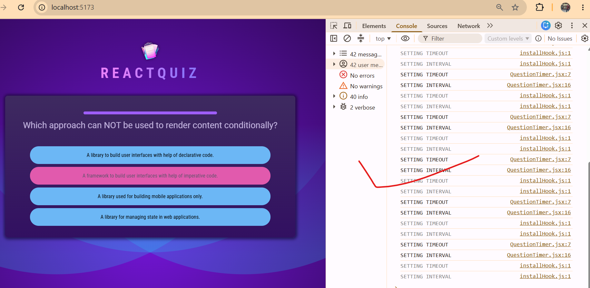
, and if I pick an answer, it still works as before, but as we move to a new question, it's reset, and we also don't get any errors here and we can continue selecting and picking answers and move through those different questions, and that's now working as it should here.
</details>