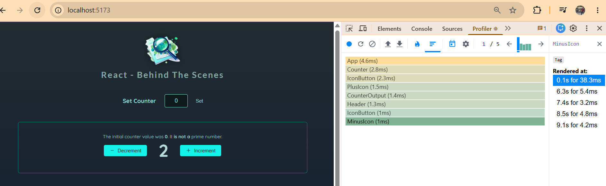

Module Introduction

Now this course section here is a little bit of a more advanced course section because in this section here, we are going to take a look behind the scenes of React so that you fully understand how React actually works, which will help you write correct and optimal React code.

And therefore, in this section we will take a closer look at how React updates the DOM, how it executes your component functions, how you can use that knowledge to avoid unnecessary updates.

And we'll also take a closer look at keys. This thing which you had to add in your lists to all the list items, we'll take a closer look at them and why they're important.

And in this section we're also going to explore a state in greater depth. And we're going to take a look at how React schedules state updates and how it batches multiple state updates. So plenty of important concepts.

Let's dive in.

React Builds A Component Tree / How React Works Behind The Scenes

Now, for this course section, I prepared a pretty basic demo project which will allow me to dive into all these more advanced behind-the-scenes topics I mentioned in the previous lecture. It's a basic counter project, and parts of that project like setting the counter actually don't even work yet, but of course, we'll get there throughout the section. And we'll use this project which you, of course, as always, find attached in a local and a CodeSandbox version, we'll use this project to explore all these advanced and important topics I mentioned in the previous lecture.

Now, I wanna start exploring these important topics by answering one of the most important questions, which is how does React update the DOM? How does React update what the user sees on the screen? And related to that, how are component functions executed? Because of course, it's the content of the components that ends up on the screen, but having a good understanding of how React actually checks your components and derives the actual DOM from those components, having that understanding is crucial as a React developer because it will allow you to write better code and better applications.

So let's dive into this demo application which I prepared for you. And I got my development server up and running here in this local project. On CodeSandbox, you, of course, don't need to install or start anything there, everything works.

And in this project here, we get a bunch of components, a bunch of components working together as always. And definitely feel free to explore this project code and this component structure. But in the end, we just have a bunch of components that are responsible for rendering these buttons, these icons on the buttons, the counter values, the header here, and so on.

Now, of course, all these components that we have here, for example, the App component, are being rendered to the screen, otherwise, we wouldn't be able to see them. And as you already learned in this course, rendering a component to the screen in the end simply means that React goes ahead and executes this component function.

So the App component function, for example, and it starts with the App component function in this project because the App component is the first component and the only component that's being referenced here in the main JSX file, which is the first code file to be executed when the website loads. And here, we're creating this root object and we're rendering the App component to the screen. And it's because of this code here that this App component function gets executed by React.

Now, as I explained before in this course, this then means that all this code in there gets executed step-by-step. And in case of the App component function, that, for example, means that two pieces of state are registered for this component and then all the other code gets executed, so these functions here get created, for example. Important, they get created, not executed yet, just created.

And then this JSX code here gets executed so that, in the end, it can be returned by this component. And as you learned, every component function must return something that can be rendered, typically JSX code, sometimes also a portal or something like this, but here, it's some JSX code. And therefore, of course, this JSX code is, in the end, translated to JavaScript code and translated to actual elements that can be rendered on the screen, that's what React is doing.

Now, in this JSX code here, we see a bunch of built-in components, some native HTML elements like main, section, h2, and so on. So all these blue components that start with the lowercase characters, as you learned. And then we also have some custom components in there that start with uppercase characters, Header and Counter.

And whenever such custom components are encountered in JSX code that's being executed, like here, this code that's returned, React goes ahead and also executes those component functions from top to bottom, so starting with the Header component function. Before executing the rest of this code, React will reach out to this Header component function and execute this function and all the code that's in there.

Now, in this case, it's a very simple function which then just returns some JSX code that consists only of built-in elements and therefore, at this point, React is done with this part of the component tree because as you also learned, React constructs a component tree.

And for example, for this application, this means that, at the top, we have the App component, and then as one child, we have this Header component. But since this Header component then does not contain any other custom components, this branch of the tree ends here.

But it's not the tree overall that ends because in the App component, we also have this Counter component. So therefore, React, of course, also goes ahead and executes this component, and since this component also receives a prop, React also forwards this value here, chosenCount, which is some state I'm managing here in the App component. React passes this value through this prop to this component when executing this Counter component function.

So it's this Counter component function that's being executed, this function here, and again, it's executed from top to bottom. For example, this function here, which determines whether this initialCount is a prime number or not, is being executed. Some state is registered, some functions are created but not executed yet. And then this JSX code here is executed.

So the Counter component was added to the component tree, but of course, this Counter component in its JSX code then also contains more components which, of course, also are executed by React and which are added to the component tree.

So these two buttons here, these two IconButton components, are added to the tree below the Counter component, and the CounterOutput component is added.

Now, these IconButtons actually receive another component through a prop as an input. And then inside of these IconButton components or in this component file, this then gets rendered as a custom component, so this icon that's received gets rendered as a custom component here. And therefore, of course, this Icon component also gets added to the component tree.

But then the tree ends here, and if we take a look at the CounterOutput there, the tree also ends because in there, we also got no more custom components.

But as you see, we got a bunch of components being executed, and I added some logging functionality to all these components here. And therefore, if you reload this app and you open the developer tools, you will actually see this log here where you can see that we start with the App component. Below it, we got the Header and the Counter component. Then in the Counter component, we got the IconButton, the CounterOutput, and another IconButton. And below the IconButtons, we got these Icons.

And that's, in the end, exactly that component tree I showed you over the last minutes.

Now, this is all probably not new, but it is crucial to understand how this all generally works.

**Behind The Scenes**
*Understanding & Optimizing React*
- How React *Updates The DOM*
- *Avoiding* Unnecessary Updates
- A Closer Look At *Keys* 
- State *Scheduling* & State *Batching*

Analyzing Component Function Executions via React's DevTools Profiler

So understanding that React builds this tree of components and how it executes these different component functions is crucial.

And you can of course go through the code on your own to understand how that looks like and how these different components are related. You can also log stuff to the console, as I'm doing it here, but you can also use the React Developer Tools.

I did show you these tools earlier in the course already, in the debugging section. The React Developer Tools are simply an extension which you can, for example, install in Chrome. And if you've got them installed you can open up your developer tools and there if it's not an incognito tab, you should find this profiler tab.

And this profiler tab can also be used to understand which components are updating and are being re-rendered. You could say, under which circumstances.

For this you can start profiling by clicking this button here and then you can interact with the page and for example, increment the counter. And if you then stop profiling you will see a graphical representation of which component functions were executed for which reason.

And you can switch between different representations depending on what you prefer.

So let me walk you through what this means.

If you're in this flame graph chart mode here, you in the end get a representation that also shows you the order in which component functions were executed. And you also get a relation between component functions.

For example, here you see that the app component is the root component, since it's at the top, and that it has this header and the counter components as children.

Now you also see if you hover over 'App', or 'Header', that for one, they are highlighted on the left, but that they also did not render. So that clicking this increment button here did not cause the app or header component functions to be executed again.

And that makes sense because if you take a look at the application code, you see that the app component is not rendering any state that would be changed by incrementing the counter. It does manage some states that can be changed through this input here, but that's not what we changed here in this example.

Instead, I clicked this button below, therefore the change that occurred happened in the counter component, because it's in there where I clicked this increment button, which led to this counter state being changed. Therefore, it was the counter component that was re-executed.

But as you also learned earlier in the course already, such component reevaluations then don't propagate up. So React executing this counter component function again has no impact on the parent component, the app component.

It does have an impact on the child components though, because as I explained before, of course all these custom component functions are executed again, and they do receive those prop values again, and so on.

And you also see this here, in this flame graph chart, because here you can see that we got four components that were executed again. Basically all components that are colored here were executed again.

So in this case, the icon button and the icon that's displayed by this button, this icon button and the counter output.

And actually it's not just the minus icon that was executed again, but also the plus icon.

And we can actually see that here, if we switch to the ranked chart mode, where we only see the components that were re-rendered. And where we then see the component that in the end cost the re-render cycle, the counter component in this case because it's state changed, and then other nested components below it, like the minus icon, the counter output, the icon button, the other icon button and the plus icon.

So we see that here.

But of course the idea is the same, that we can see which components were executed again and how they're related.

You can also go to the settings here and under profiler, enable 'Record why each component rendered'.

And if you do enable this and you then clear this output and you start another recording session, which sometimes doesn't work, so I'll just reload here, and you then increment again and stop this.

You'll now of course see the same result as before, basically.

But now if you hover over a component, you also see why this did change. And if you click on it, you can also see some details here to the right. You see that this rendered again because one hook changed. In this case, this simply means that the underlying state changed.

So these dev tools can be another nice tool to understand how components are executed and why they were executed.

And it is really crucial to understand this fundamental concept because this also allows you to optimize your application in various aspects.

